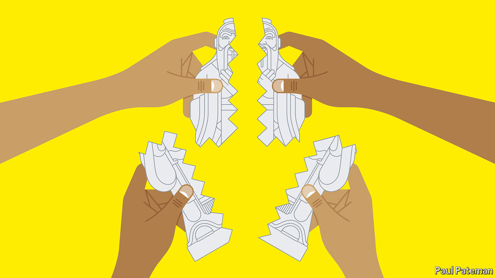

###### Banyan

# Confucianism has become a political punching bag in South Korea 

##### The ideas of the Chinese sage are blamed for everything from sexism to corporate corruption 

 

> Jan 2nd 2021 


“CONFUCIAN LAND” is a cultural exhibition in the South Korean city of Andong. It first asks visitors to reflect on the horrors of contemporary society, including war, consumerism and sexual licence. It then invites them to travel through a “tunnel of time” to 16th-century Korea, when Confucianism was the official philosophy of the royal court. The Korea of yore is portrayed as a harmonious Utopia, save for the occasional battle against Japanese invaders. Virtuous conduct, imply the displays charting the daily life of a Confucian scholar in a humble village, underpinned perfect social cohesion.


Some observers, including both Koreans and foreigners, are inclined to attribute all the successes of contemporary South Korea to the lingering influence of Confucianism. Rapid economic development, the academic prowess of Korean students, even the largely successful curbing of covid-19—it is all thanks to the ancient Chinese system of thought imported to Korea two thousand years ago. Others go to the opposite extreme, blaming Confucianism for all manner of latter-day blights, including authoritarianism, sexism, stifling workplace hierarchies and entrenched corruption in industrial conglomerates.


To attribute all that is good or bad to Confucianism more than a century after it ceased to be Korea’s official state ideology is, at best, absurdly reductive. Yet it is invoked in part because it remains so visible. Kwon Seok-hwan shows visitors around the school in Andong founded by Yi Hwang, the 16th-century Confucian scholar who graces the 1,000-won bill. He insists that Yi Hwang continues to be a role model, for his renunciation of worldly concerns in the pursuit of knowledge. Long-suffering pupils across the country are taught classical poetry and calligraphy, all with a Confucian bent. Confucian ceremonies to revere ancestors remain common practice among many Korean families.


Inevitably, Confucian tradition has taken on a political tint. “It’s often used as a label whenever people want to praise or criticise society,” says Kim Do-il of the Institute of Confucian Philosophy and Culture at Sungkyunkwan University (the successor to a Confucian academy set up in the 14th century). What people say about Confucianism often provides a clue to their contemporary political convictions.


One notable example is Park Chung-hee, a military dictator in the 1960s and 1970s, who redefined the Confucian virtues of filial piety and loyalty in a way that legitimised his authoritarianism, says Ro Young-chan of George Mason University. Park wanted citizens to identify with the state. In effect, he sought to create the “obedient Asians’’ of racist stereotypes, a trope that has resurfaced during the pandemic to explain more conscientious mask-wearing and social distancing in South Korea than in America or Europe.


Park is not the only one to have used Confucianism. Feminists invoke the term to grumble about women’s outsize domestic duties, or the expectation that they will pour drinks for male friends. Twenty-somethings cite it when lamenting parental meddling in their personal affairs. Conservatives say that deference to elders and humility towards strangers are national traits based on Confucian values, which are sadly being eroded by modern ideas. One told your correspondent that Confucius wanted to live in Korea because its inhabitants were so polite—a claim that is hard to verify 2,500 years after the sage’s demise.


But even if the invocation of Confucianism says more about the invoker’s disdain for social convention or nostalgia for a non-existent past than about the tradition itself, that still reflects its enduring influence. Mr Ro of George Mason University argues that Confucianism forms part of South Korea’s social subconscious, which leads people to assume (and chafe against) certain social norms even if they rarely think about their origins. “If you ask a random stranger in the street, they won’t say they’re Confucian,” he says. “But they’ll still be aware of certain expectations about how to behave—as a sibling, a child, an employee—which are connected to those ideas.”


Mr Kim agrees that Confucian values are a living influence on Korean society. But they are increasingly in conflict with newer ideas about individual freedom, personal autonomy, sexual equality and the like. As elsewhere, sublimating disputes about how liberal a society should be into blanket reverence or disdain for “traditional values” does not make the underlying argument any easier to resolve.

