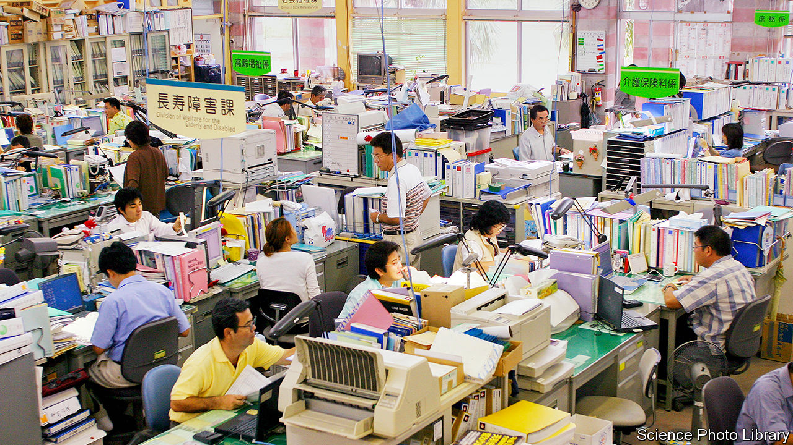

###### Update required

# Japan’s new prime minister drags government into the digital era 

##### Suga Yoshihide is setting up an agency to help move government online 

 

> Jan 2nd 2021 


HIRAI TAKUYA keeps a tablet computer propped on his desk and an Apple Watch on his wrist. It is an unusual look for a Japanese politician. As Japan’s new minister of digital reform, his task is to make the stubbornly analogue Japanese government work a bit more like him.


Japan has some of the world’s best digital infrastructure, with top-notch mobile and broadband networks. Yet interacting with government agencies often involves slogging through labyrinthine offices and leafing through paperwork. In a survey of 30 countries in the OECD, a club mostly of rich countries, Japan ranked last in terms of providing digital services: only 7.3% of citizens requested anything from the government online in 2018, a fraction of Iceland’s 80%, and behind even countries considered relative technological backwaters, such as Slovakia and Mexico.


Suga Yoshihide, Japan’s prime minister since September, has vowed to “advance digitisation in government”. He is not the first to make such a promise: an e-government strategy announced in 2001 set the goal of putting all of Japan’s administrative procedures online by 2003. Yet as of 2019 just 7.5% of the nearly 56,000 processes handled by the national government can be completed online. Mr Suga, however, is putting more weight behind the drive to digitise than any of his predecessors. A new “digital agency” is being set up to oversee reforms. The creation of such a body not only signals the commitment of the prime minister, argues Nomura Atsuko of the Japan Research Institute, a think-tank in Tokyo, it also protects the project from the political winds.


Covid-19 exposed Japan’s “half-baked digitalisation”, Mr Hirai says. Whereas South Korea got cash relief to 97% of households in two weeks, Japan’s payments took months and in many cases required in-person visits or handwritten forms. Even applications for subsidies to buy equipment for teleworking had to be completed largely by hand. Such failures shook bureaucrats out of a long slumber. “These are things people need to do, that they know they need to do, but kicked the can down the road,” Mr Hirai says. “All of a sudden they’re willing to do it.” The ruling Liberal Democratic Party recently purchased 400 tablet computers for MPs to encourage them to go paperless, Mr Hirai smiles.


The new agency, which will be launched soon, is meant to act as a “control tower” for the government’s IT policies. “The national government has its own digital architecture, each ministry has its own unique digital architecture, and then each local government has its own unique architecture, so there’s no interoperability within the government,” laments Sato Motohiko of the Japan Association of New Economy, an e-business lobby group. The agency will consolidate control over IT procurement previously devolved to different arms of government. Mr Hirai aims to shift the bureaucracy to cloud-based systems to make it easier to share data. The Daiwa Institute of Research, a think-tank, reckons that digitisation of government services could boost GDP per person by more than 1%—a hefty improvement.


The first step involves ending archaic habits. Kono Taro, Japan’s minister for administrative reform, catalogued some 15,000 circumstances in which a hanko, or personal seal, was required to carry out a bureaucratic procedure; now, he says, only 83 remain. Fax machines, still a staple of the Japanese office, have come under fire. So too has the custom of sending email attachments as zip files with a password in a separate message, which does little to enhance security but causes untold inconvenience. After that come harder tasks. “We need to take the second step: from digitising data to utilising data,” says a former senior official. That, in turn, will involve breaking down the barriers between ministries, says Robert Ward of the International Institute for Strategic Studies, a think-tank in London.


According to Goldman Sachs, an investment bank, goods consisting of intellectual property, such as software, account for less than 3% of the Japanese government’s fixed assets, compared with 8% for America’s. Wider adoption of the national ID card, known as “My Number”, would make it easier to put services online, but many Japanese have resisted because of privacy concerns. Going digital also threatens to alienate the elderly. Mr Hirai envisions turning bureaucrats who now sit behind windows at counters receiving forms into “digital-support” workers to help ageing residents learn to apply for services on smartphones.


Finally, for the digital agency to make a difference, Mr Hirai will have to find the talent to staff it. The government lacks engineers and IT specialists. Competition is already fierce in the private sector. Mr Hirai hopes to make the agency feel more Silicon Valley than Tokyo ministry. His slogan is “Government as a startup”. He points to Taiwan’s popular digital minister, Audrey Tang, as a model. “Jeans will be fine,” he says, a radical departure from the suit and tie that are de rigueur in Japanese government offices. Engineers will be paid at competitive rates and allowed to work remotely. A tech leader from the private sector will be tapped to head the agency. “The challenge of changing a national system is attractive,” Mr Hirai says. That may be so—but it will not be easy. ■

