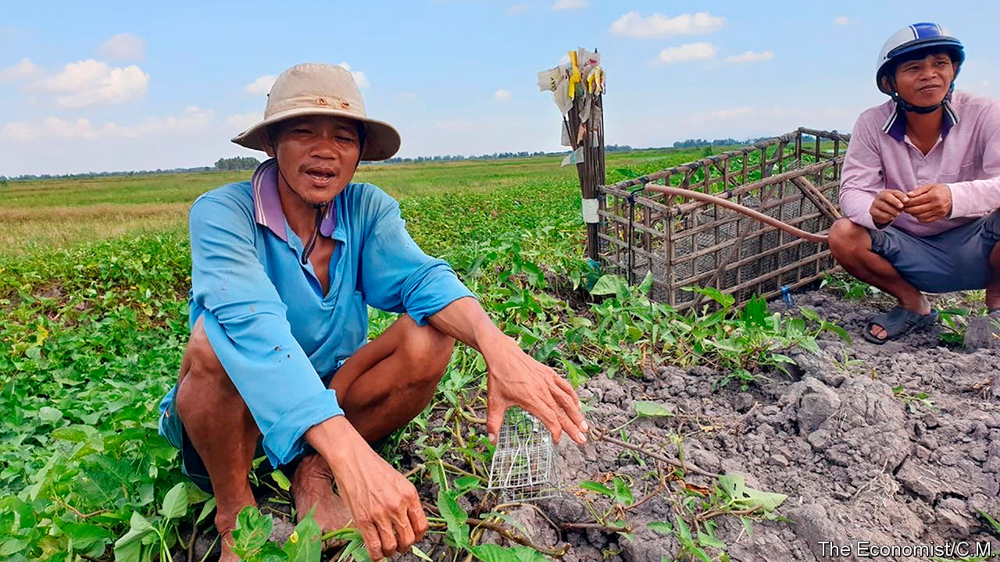

###### Hamper scamper

# Jobless Cambodians are catching rats to feed Vietnamese city dwellers 

##### But it is hard to slip the creatures across the border 

 

> Jan 2nd 2021 


SLUNG OVER Pen Keo’s shoulder is a big wicker basket containing wire-mesh traps, which he lays, one by one, on a rice field where rats are known to scamper. There are so many traps there already, it is difficult to find space for his. In Takéo, a rural province in southern Cambodia, rat-catching serves two purposes. The creatures would otherwise ravage crops, and can also be sold for tidy sums in neighbouring Vietnam. There rats nourished on a free-range diet of rice stalks and roots are a delicacy. 


For a growing number of Cambodians, rat-catching is a full-time job. The covid-19 pandemic has hurt the formal economy. Unemployment is on the rise. The Asian Development Bank thinks that Cambodia, with a working-age population of 9m or so, lost around 500,000 jobs in 2020. Many who worked in the city have gone home to the countryside, but work there is scarce, too. Between January and April farmers’ wages dropped by a third, according to Angkor Research and Consulting and Future Forum, a think-tank. Mr Pen Keo says he no longer earns enough from tilling his fields because rice is too cheap. Like many hard-up Cambodians, he has exchanged his plough for rat-traps. 


Yet chasing tail, too, is no longer as profitable as it was. On a good day Mr Pen Keo catches 15kg, or about 130 of the pests. But whereas he used to get 6,000 riel ($1.48) for every kilo he caught, now he makes two-thirds of that. The slump in prices is being felt further along the supply chain as well. Ton, a rat-broker from Bourei Cholsar, the same district as Mr Pen Keo, now earns 50,000 riel a day, half what he used to get. Mr Pen complains of too much competition. Since April the number of rat-catchers in his village of 500 has doubled to 100, he says. The headman of the group of villages to which Bourei Cholsar belongs reckons that a third of locals now trap rodents.


Even as the supply of Cambodian rats has shot up, demand from Vietnam has tailed off. Officially, the border has been closed since March, making it harder to take the rats to market. Brokers have to pay off Vietnamese border guards and smuggle their catch across a river, risking fines and imprisonment. Another Cambodian catcher, Chhoeun Kha, suspects the pandemic has made Vietnamese less enthusiastic about eating rats, for fear they harbour diseases. It is not an absurd concern. A study conducted a couple of years ago in southern Vietnam found that 56% of field rats served in restaurants tested positive for a raft of coronaviruses.


Mr Chhoeun Kha would be heartened by the scene at Chuot Dong (“Field Rat”), a working-class restaurant on the outskirts of Ho Chi Minh City, in southern Vietnam. It does a roaring trade in field rats, which are butchered on the spot, marinated in garlic, chilies, lemongrass, and fish sauce, and then fried or delicately grilled. Giao and his colleagues eat there two or three times a week. For him, eating field rat is as normal as slurping up a bowl of noodles. “Whenever I see a fat rat on a grill,” says Xuan, a colleague, “I cannot hold my saliva.” But do they ever worry that the rodents will make them ill? “Sewer rats and house mice eat everything in the city, which is poisonous,” says Giao. But field rats? They are perfectly safe, he insists.

