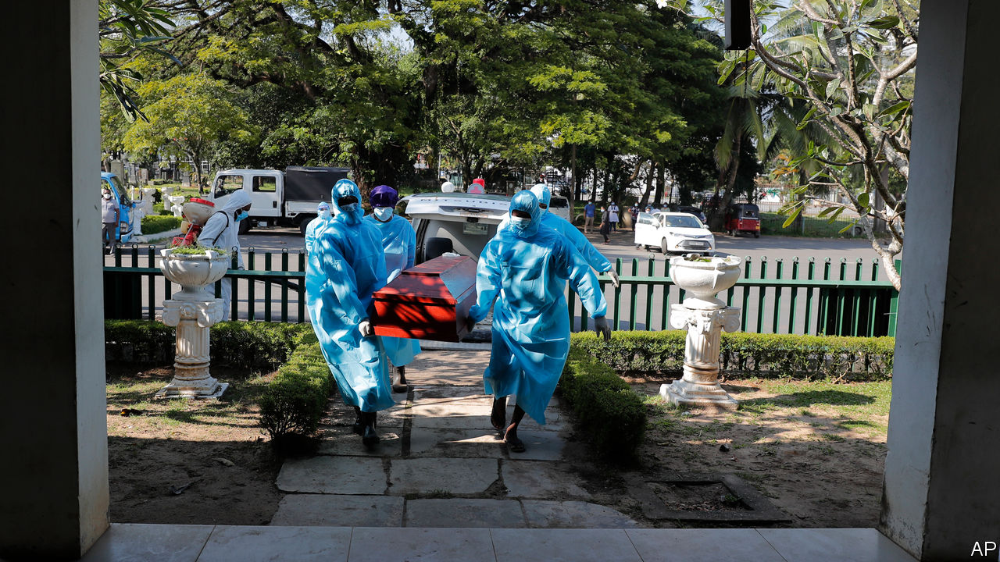

###### Unwanted, dead or alive

# Sri Lanka is forcibly cremating Muslims who die of covid-19 

##### The objections of victims’ relatives are being ignored 

 

> Jan 2nd 2021 


OUTSIDE A HOSPITAL in southern Sri Lanka on December 22nd, a handful of Muslim men bowed their heads against the rain, chanting prayers as an unpolished coffin was loaded into an ambulance. They were given just minutes to pay their respects to the deceased, who, doctors said, had tested positive for covid-19. But that was not the most distressing part of it. Against the wishes of his family, his body was being rushed not to a cemetery, but to a crematorium.


Muslims make up nearly one in ten Sri Lankans. Their religiously ordained practice of burying the dead has rarely caused problems, even though the island’s two biggest religions, Buddhism (the faith of some 70% of Sri Lankans) and Hinduism (13%) practise cremation. With the pandemic approaching last spring, the government issued guidelines that permitted burial of those infected provided the grave was at least six feet deep and the water table low enough not to get contaminated. However, when the disease claimed its first Muslim victim on March 31st, hospital workers defied the victim’s family and had him cremated.


Soon afterwards, the health ministry issued new rules making it compulsory to cremate everyone who had died of covid-19—for the greater good. Burials attract crowds, it argued. Pro-government media also cited “experts” who claimed the virus could leech from bodies into the soil and contaminate groundwater. A government doctor warned that “unwanted persons” might gain access to a corpse and use it as a biological weapon.


The new rules prompted an outcry, not just from pious Muslims but from scientists, human-rights groups, diplomats and even the United Nations. Yet the authorities are unsympathetic. In December the courts dismissed a batch of petitions from Muslim families without explanation. The government has offered nothing more than a review of the policy by an unnamed “expert panel”.


In the meantime, the forced cremations have continued. On December 9th a state-run children’s hospital in Colombo, the capital, cremated Mohamed Shaykh, a 20-day-old baby, over the objections of his parents and despite questionable evidence that he had covid-19. The Shaykhs have declined to collect their son’s ashes. Other Muslim families, too, have refused to sign cremation orders, to claim bodies from hospitals or to pay bills for cremation. One Muslim group has bought a refrigerated lorry to hold bodies until the government’s review is completed. On December 28th officials are said to have forcibly removed five corpses from the lorry for cremation. More than a dozen are thought to remain.


Hilmy Ahamed of the Muslim Council of Sri Lanka claims that more than 80 Muslim victims of covid-19 have now been forcibly cremated. Muslim offers to bury the bodies in specially sealed concrete graves have been ignored, he notes. He blames anti-Muslim prejudice on the government’s part. Such abrupt dismissal of Muslim concerns, he argues, is pushing young Muslims towards militancy.


Ironically, it was co-ordinated suicide bombings by Islamist extremists in 2019 that have heightened other Sri Lankans’ suspicion of Muslims. The trauma of the bombings helped propel the double election victory of the Buddhist nationalist Rajapaksa family, with two brothers, Gotabaya and Mahinda, serving as president and prime minister respectively.


In a statement to Parliament a year ago, Gotabaya Rajapaksa promised to make sure Sri Lanka had only “one law for all the people”. This has since become a slogan, widely repeated on social media. On December 29th a large crowd led by chauvinist Buddhist monks marched to the office of the president in Colombo and presented a petition arguing that allowing Muslim victims of covid-19 to be buried would violate the president’s clearly stated policy. There cannot be religious laws for some, one prelate shouted: “After running the government so well for one year, will you ruin it all for a dead body?” ■


Editor’s note: Some of our covid-19 coverage is free for readers of The Economist Today, our daily . For more stories and our pandemic tracker, see our 

