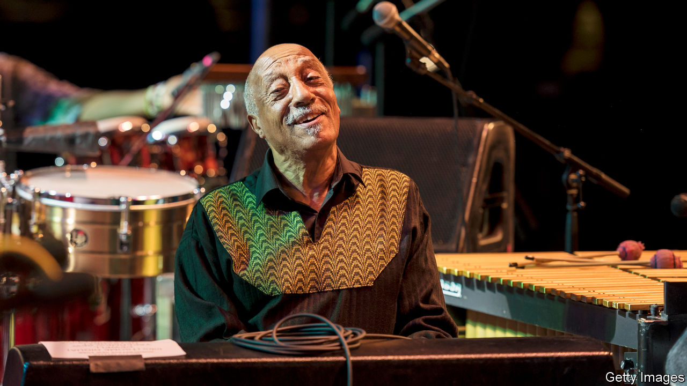

###### The beat goes on

# Ethio-jazz is a product of migration and heroic ingenuity 

##### The hybrid genre is both international and inimitably Ethiopian 

 

> Jan 2nd 2021 


TO WESTERN EARS, the music seems both foreign and familiar. Its mood stretches from sultry and haunting to upbeat and vibrant. Soulful Western undertones are audible, yet the overall impression is distinctly and inimitably Ethiopian. Now a rich musical export, the evolution of “Ethio-jazz”, as this hybrid genre is known, and its growing global renown are a tale of back-and-forth migration and the alchemical fusion of ideas. The dramatic saga involves political upheaval, accidental epiphanies, a series of dogged and inspired individuals—and Hollywood.


Today, says Samuel Yirga, a pianist and composer, Ethio-jazz is a calling and way of life for many Ethiopian musicians. In 2020 there were new releases from stars of the genre including Mulatu Astatke (pictured), a visionary percussionist and keyboardist, and Hailu Mergia, an accordionist and band leader. “Sons of Ethiopia”, a cult classic of 1984 by the band Admas that mixes pop, funk and jazz, has just been re-released. Yet the story of the mesmeric sound began almost a century ago, in Jerusalem.


Visiting that city in 1924, the leader who would later become Emperor Haile Selassie was greeted by a brass band, which was made up of orphaned survivors of the Armenian genocide. He was impressed, and promptly invited the musicians to live in Ethiopia, along with their band leader, Kevork Nalbandian. There the group was known as “Arba Lijoch”, Amharic for “The Forty Children”.


The arrival of Arba Lijoch in Addis Ababa was a revolutionary moment in the country’s cultural history. An indigenous musical tradition based on stringed instruments began to morph into one revolving around large brass bands. Nalbandian went on to compose the Ethiopian national anthem and to teach musicians from around the country. Later his nephew, Nerses Nalbandian, took on his mission, training performers including future giants of modern Ethiopian music such as Alemayehu Eshete and Tilahun Gessesse, both renowned singers. In Addis Ababa, says Aramazt Kalayjian, a film-maker, the younger Nalbandian is known as “the godfather” of modern Ethiopian music.

World music


This formative period was the overture to the pivotal career of Mulatu, the next key figure in the story. Unusually for the era, in the late 1950s Mulatu was educated not in Africa but in Wales, afterwards studying music in London and Boston. But it was in the mid-1960s in New York, where he encountered John Coltrane and other musicians, that he honed a new sound that he called Ethio-jazz—a marriage between the distinct pentatonic scales that define most traditional Ethiopian music and the kind that are the basis of most Western music. The result, as summarised by Ermanno Becchis, a producer, “is sinuously scientific, but truly magical”.


Mulatu returned home to Ethiopia—and in the late 1960s and 1970s its capital earned the nickname “Swinging Addis”. Nightlife flourished in a musical golden age, as did pioneering record labels such as Amha Records. “People were having the time of their lives,” Amha Eshete, the label’s founder, recalls in a documentary about the period. Then, in 1974, Ethiopia’s monarchy was overthrown by a Marxist junta known as the Derg, which imposed new rules and curfews.


“The Derg’s policies shut down most musical performances in Ethiopia between 1974 and 1991 and cut off contact with European and American popular-musical styles,” explains Kay Kaufman Shelemay of Harvard University. Many artists went into exile; the emerging scene was quashed. Or so it seemed.


Like its birth, the revival of Ethio-jazz came about through travel and serendipity. At a party in Poitiers in the mid-1980s Francis Falceto, a French producer and musicologist, happened to hear the recorded voice of Mahmoud Ahmed, an Ethiopian singer. The Derg regime was “a musical nightmare”, laments Mr Falceto, the tale’s next hero. But in 1991 the junta was overthrown—and Mr Falceto could embark on his self-appointed mission to share modern Ethiopian music with the world. In 1997 he released the first volume of an anthology called “Éthiopiques”.


Thirty more volumes have followed; the next, number 32, will be called “Nalbandian the Ethiopian” and commemorate Nerses Nalbandian, Mr Falceto says. Although, by his own account, he is “getting old and a bit tired”, he hopes to put out four or five more volumes. But his series has already transformed the fortunes of Ethiopian artists. The fourth volume, featuring Mulatu, definitively put Ethio-jazz on the world map. After its release, Jim Jarmusch, a film director, used Mulatu’s music on the soundtrack for “Broken Flowers”, an award-winning film of 2005. The movie, says Ms Kaufman Shelemay of Harvard, brought Ethio-jazz to the ears of an even wider international audience.


For some outsiders, Ethiopia is predominantly associated with political strife—such as the bloody military action recently launched by the government in the Tigray region—and humanitarian crises. But another version of the country still thrums from the bars of Addis Ababa to the stages of Glastonbury. Hip-hop artists such as Kanye West have sampled Ethio-jazz on their tracks; the country’s music schools continue to produce innovative performers. And a new generation of expatriate musicians has helped popularise a genre rooted in Africa but nurtured around the world. “For people newly coming to it,” says Berhana, a singer based in America, “I love that it serves as an introduction to a music and culture that runs so deep.” ■

