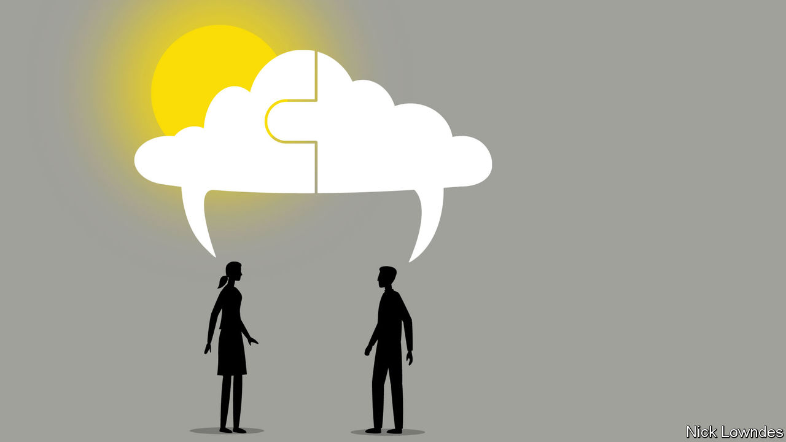

###### Johnson

# The secret virtues of small talk 

##### With luck, there will be more mindless chat about the weather in 2021 

 

> Jan 2nd 2021 


FORD PREFECT, an alien passing for a human in “The Hitchhiker’s Guide to the Galaxy”, wonders about earthlings’ peculiar “habit of continually stating and repeating the very very obvious, as in ‘It’s a nice day,’ or ‘You’re very tall’.” He considers, then rejects the theory that human mouths seize up if not continually utilised, before concluding that if human beings “don’t keep on exercising their lips…their brains start working.”


With this observation the late Douglas Adams expressed a common high-flown opinion about small talk: it is trivial, or perhaps worse, a substitute for real speech and thought. “Should we talk about the weather?” sings Michael Stipe of REM in “Pop Song 89”. “Should we talk about the government?” Listeners are given to understand that little could be emptier than “Hot out today, isn’t it?”, or a casual political gripe.


Yet at the end of a year in which people around the world have mostly been deprived of face-to-face banter—and were forced under lockdown to concentrate on work, or on more intense conversations with family and close friends—many report feeling tired, bored, alienated and lonely. With luck, in 2021 more people will be back on trains and buses, and in offices, shops and restaurants—places where they will again engage in empty chatter. Research suggests they will benefit.


Nicholas Epley, a psychologist at the University of Chicago, undertook a study in the city in which a third of subjects had to strike up conversations on their commutes. (Two other groups were to stay silent or, acting as a control, to behave as normal.) Though many expressed horror at being required to disturb a stranger, those who did were happier than the other two groups. Lest you think this applies only to the garrulous, the moods of both self-described introverts and extroverts were boosted by a chat. A repeat of the experiment found almost exactly the same effects in England, supposedly an emotionally repressed sort of place. Mr Epley points out that even those who say they would themselves benefit from a friendly natter tend to underestimate how much others would enjoy one, too—meaning such chats are less likely to happen, a loss for everyone.


One reason for small talk’s bad reputation is that it tends, for obvious reasons, to aim for the lowest common denominator. In ritualised dialogue, little information is exchanged. “Hello” signals nothing at all. “How are you?” rarely yields a fully honest answer. A perfectly logical or instrumental exchange, perhaps on Ford Prefect’s planet near Betelgeuse, would jump right into a debate about string theory or the riddle of consciousness.


Back on Earth, linguists call that crucial “hello” talk “phatic”. Bronislaw Malinowski, who coined the term in the 1920s, explained that in phatic talk “ties of union are created by a mere exchange of words.” If you know literally nothing about someone you can still safely presume they prefer sun to rain, and begin to establish a connection on that basis. If your bus or train is suddenly stuck, an even better opportunity arises. You can be sure your fellow passengers are not happy about it, and a shared grousing session makes them—and you—feel less alone with your inconvenience.


At work, small talk may seem a distraction from what employees are paid to do. But there is a spectrum between empty talk (“Hello”), social talk (“How was your holiday?”), social talk relevant to work (“Is Sarah still on holiday?”) and pure business talk (“Has Sarah finished that report?”). A study of government departments in New Zealand by Janet Holmes shows how frequently people switch between those modes, even in brief conversations. That suggests a function beyond filling awkward gaps. Among other things, such chatter can bond equals together in a shared task. She also finds that bosses are more likely to initiate small talk with subordinates than the other way round (as well as to cut it off). This is because, even without being told, a good manager realises that it can soften a subsequent instruction.


Fans of “Star Trek” know that the Vulcans, even more than Adams’s Betelgeusians, are the most logical beings in the known universe. But how do they take leave of each other? Not by coldly walking away, their business done. They exchange a ritualised “Live long and prosper.” This is, strictly speaking, meaningless: the other Vulcan would naturally aim to do so without being told. But well-wishing binds people together, and thus has a value that even a Vulcan can see. Not so illogical after all.

