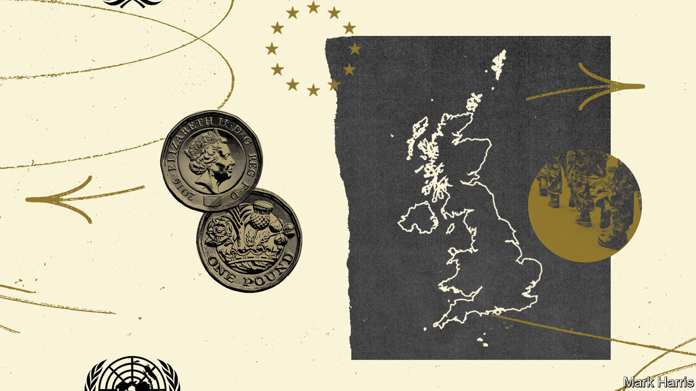
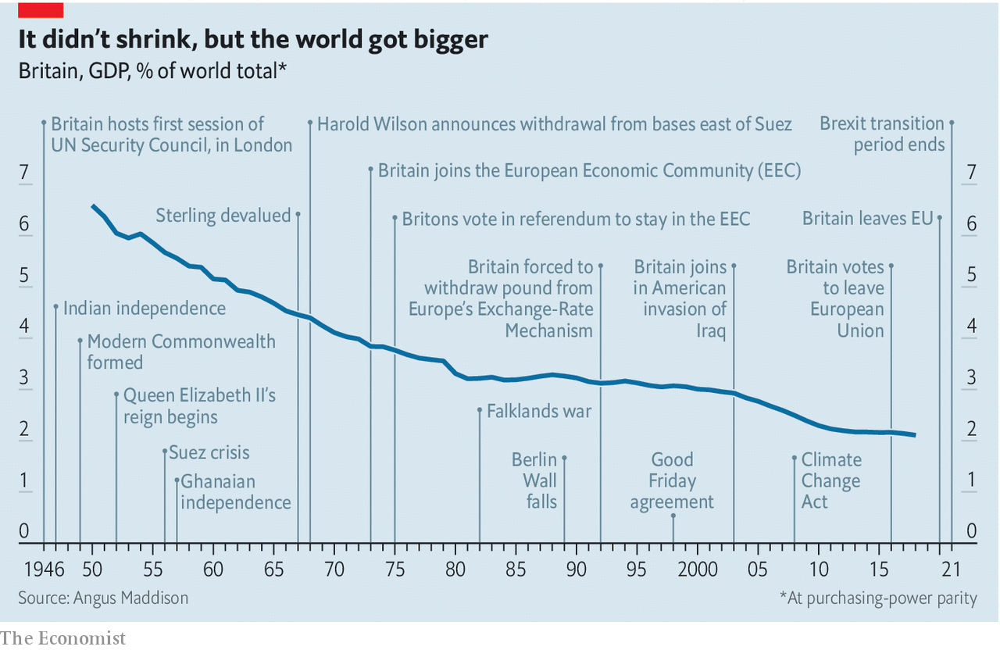
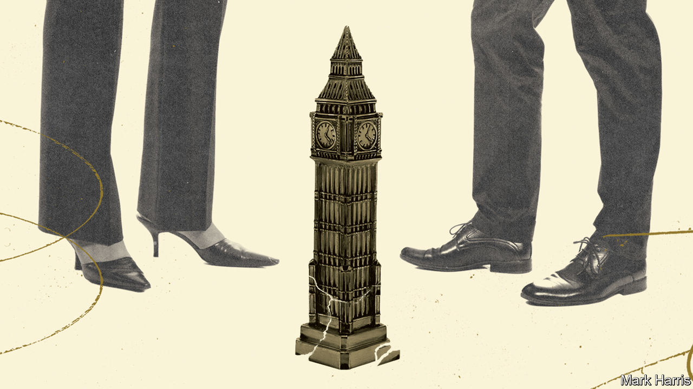

###### Very well, alone!

# Britain needs a post-Brexit foreign policy 

##### It may well be hard to find 

 

> Jan 2nd 2021 


“GOT A FEELING ‘21 is going to be a good year,” the stepfather in “Tommy”, a rock opera by The Who, tells his family. The British government is trying to give a similar impression of optimism. After its year of post-Brexit transition, and with a last-minute trade deal that staves off some of the worst effects of leaving the European Union, the new year offers the country a number of opportunities to cut a dash on the world stage. It will take the presidency of the G7 club of big rich democracies, allowing it not just to set the agenda for the group’s annual summit, but also to invite Australia, India and South Korea to come along—an invitation that might be the groundwork for a “D10” of democracies. In November the most important diplomatic event of the year, the COP26 climate conference, will open in Glasgow.


Within weeks Boris Johnson, Britain’s prime minister, will be visiting India, where on January 26th he will be Prime Minister Narendra Modi’s guest of honour for Republic Day. His visit will be part of a much-touted “tilt to the Indo-Pacific”. Britain has opened discussions on joining the Comprehensive and Progressive Agreement for Trans-Pacific Partnership, a free-trade area of 11 countries. The foreign secretary, Dominic Raab, is pushing for it also to become a “dialogue partner” of the Association of South-East Asian Nations. The Royal Navy’s flagship, the spanking new aircraft-carrier HMS Queen Elizabeth, will soon be Asia bound.


Freed from an endless round of EU gatherings, British diplomats expect to have more time for globe trotting. Alexander Downer, a former Australian foreign minister, has pointed out that there was a period of 17 years when no British foreign secretary visited Australia; such slights are unlikely to be repeated. Over the year since Brexit various nimble moves—from offering people in Hong Kong a path to British citizenship after China’s crackdown there, to sanctions on Belarus while the rest of Europe dithered, to rapid approval for a covid vaccine—have shown that Britain can stand out. “It’s exciting to see the British government making creative choices in its national security,” says Kori Schake of the American Enterprise Institute, an American think-tank. “That’s a really important way to signal that Britain outside of the EU sees itself as a leader in national security and is willing to take the risks and the consequences of leading with its values.”


For all these tokens of real potential, though, there are serious impediments to the creation, or recreation, of a “Global Britain”—a project with which many of those who brought about Brexit are enamoured. Through leaving the EU the country weakened its economic prospects; since then covid has hit it hard. The economy has longer-term problems, too. Since 2005 British firms’ share of world market capitalisation has fallen from over 7% to 3%, a much greater slippage than any other large European economy. Over the same period the share of the stock of global cross-border investment attributable to British-headquartered multinationals has fallen from 10% to 6%, also a bigger drop than for any other major economy.


At the same time the world is returning to an era of great-power competition: deepening rivalry between America and China, Russia’s brazen opportunism, the EU’s stubborn assertiveness, at least in economic policy. “The next chapter of world affairs will be about the political, economic, regulatory, technological and military interplay between the US, China and Europe,” says Sir Simon Fraser, one of Britain’s former top diplomats. “The task for the UK is finding our place in this.”


To do so will require a clear strategic vision and coherent implementation. Yet these are just the things which, according to a recent report by the House of Commons Foreign Affairs Committee, British foreign policy currently lacks. Unless Britain applies itself to acquiring those necessities, good years will prove hard to find.

No reason to be over-optimistic


It is easy to dismiss Britain’s strengths, and many of its inhabitants delight in doing so. But though Britain is no longer the leading power it was in the first half of the 20th century (see chart) it is still a manifestly significant one. It has the world’s fifth-largest economy, according to the IMF, and is one of the five nuclear-armed states with a permanent seat on the UN Security Council. It is a muscular member of NATO and its signals-intelligence service, GCHQ, makes it a potent part of the “Five Eyes” intelligence-sharing elite, together with America, Canada, Australia and New Zealand.

 


Its imperial past has left it one of the few countries to have a number of overseas territories, which extend its presence while also adding to its obligations. Its head of state is the head of state of 15 other countries, too, as well as leader of the 54-nation Commonwealth. The Anglican Communion is the world’s third-largest Christian church. Britain is rare among rich countries in spending a hefty chunk of its national income on foreign aid and doing so well. It is the biggest voluntary contributor to the World Health Organisation and to Gavi, the global vaccine alliance.


Britain has a high profile in sport, thanks in large part to the Premier League’s global following among football fans, and is one of the most popular destinations for international tourists. It has the world’s most respected public broadcaster, the BBC, and some of its best universities. Though the British government, like many others, botched its response to covid-19, its scientists have excelled themselves, as they do in many fields. They have helped to develop what may prove to be the most widely used vaccine (the one from Oxford-AstraZeneca) and to identify the most effective treatment for those who get ill (the steroid dexamethasone).


But none of these advantages is new. Britain enjoyed them all when it was a member of the EU—while also benefiting from being part of the world’s largest trading bloc and its most important grouping of democracies. To have any chance of getting more out of its native strengths now than it did then, it will need a foreign policy which understands both how to build on them and what that requires. Rory Stewart, who resigned from his ministerial post running the Department for International Development (DfID) when Mr Johnson became prime minister in 2019, says that the self-examination needed has so far been lacking. “We do these things, but we have no very settled, confident idea about why we’re doing these things.”


The delayed but now imminent report of the government’s “Integrated Review” of foreign policy, security, defence and international development should provide some of the foundations required; it has been billed by Mr Johnson as the biggest rethink of Britain’s international stance since the end of the cold war. But several key decisions on the direction of policy have already been taken. In June 2020 Mr Johnson (himself a former foreign secretary, if not a terribly good one) announced that DfID would henceforth be subsumed into the Foreign Office.


In theory, that will make British policy more co-ordinated, combining the diplomats’ lobbying power with DfID’s technical expertise. It may also go some way to reversing the decline of Britain’s diplomatic representation around the world. In the 1990s, says Mr Stewart, Britain had perhaps 25 diplomats in Zambia. Over the decades that dwindled to an ambassador, one other diplomat and local employees. Bringing in DfID may make representation more beefy. But many fear that any such benefits will come at the expense of lasting damage to the capabilities that made Britain an “aid superpower”. “It’s not a merger, it’s the demolition of DfID,” Andrew Mitchell, another former head of the department, has lamented. In November new legislation reduced foreign-aid spending from 0.7% of GDP—an established benchmark—to 0.5%.


Military spending has fared better. It is set to rise by £6.5bn more than previously planned over the next four years, reversing a decade of cuts and confirming Britain’s status as the leading military spender among European members of NATO, with an annual budget of some £47bn. The pattern of spending leans heavily towards the maritime; there is also spending on technology, with the creation of an agency for artificial intelligence and a new emphasis on mounting attacks in cyberspace.

Freedom tastes of reality


Defence spending up, aid outlays down, the Foreign Office and development departments merged: the resources and institutions with which Britain’s new strategy will be implemented seem set. The strategy which informs these choices, though, has yet to be clearly enunciated.


The government will want to remain as close as possible to America. Marta Dassù, a foreign-policy expert at the Aspen Institute Italia in Rome, sees the increased investment in security as “a sort of down-payment to the US, to show the incoming American administration that the UK is still very relevant”. The government will take heart from the idea that the administration led by Joe Biden, the president-elect, will emphasise allies rather than “America First”. Yet the degree to which Donald Trump’s dramatic turn away from global leadership was accepted by the American people will not be forgotten. Nor is Mr Biden likely to favour aggressive interventions like those which Britain has been willing to back in the past.

 


What of the world’s other major powers? There was a time when Britain’s Conservatives saw Chinese investment as playing a big part in Britain’s economic future and went out of their way to court it. The authoritarianism of President Xi Jinping, the clampdown on Hong Kong and a toughened American stance—one that Mr Biden will not reverse—have forced a rethink. British policy towards Huawei, a Chinese telecoms giant, diverged from America’s for some time; but in 2020 the company was barred from involvement in Britain’s 5G plans. There are still some in Mr Johnson’s party who want to see a deeper relationship with China. But the Sinosceptics seem to have the upper hand.


And then there is Europe. Britain is keen on its continuing “E3” security discussions with France and Germany (despite covid-19, the troika met five times in 2020 to discuss Iran and other matters). But it insisted that foreign policy, external security and defence co-operation be excluded from the negotiations which led to the deal reached on December 24th. Britain “can’t actually tackle Europe in an entirely rational way at the moment,” says François Heisbourg of the Foundation for Strategic Research, a French think-tank. “Although it’s an integrated review, it’s integrating everything except Europe.”


Mr Johnson’s government has avoided almost any mention of the EU in its foreign-policy discussions; but relations with the rest of Europe will play a crucial role in the success of any such policy, both directly and indirectly. Directly because Britain is still, physically and militarily, part of Europe. The adventurism of Russia under Vladimir Putin means that global Britain’s military commitments will remain concentrated in its own European region, handled through NATO and in concert with its former EU partners.


What is more, many of Britain’s global goals will be shared by the EU, and best pursued in partnership. Sometimes, though, the two parties’ goals will clash. Ms Dassù warns that Britain will find itself competing with the EU in its relationship with the Biden administration, which “will look to Germans first and the UK second.”


The deepest influence may well be the effect that leaving the EU will have on Britons themselves. If the divorce with the EU leads to ever greater internal tensions, Britain will remain hopelessly distracted and potentially diminished. A particular worry in strategic circles is that, were such divisions to extend as far as independence for Scotland, the future of the British nuclear-armed submarine force, which is based there, would be in doubt. Though independence will not easily be won under a British government which will not grant the people of Scotland the necessary referendum, it is not the unthinkable outcome it once was. Even without such a rupture, according to Sophia Gaston of the British Foreign Policy Group, a think-tank, Brexit has produced, or revealed, “an enormous amount of volatility” in public attitudes to foreign policy.

All alone, cousin


The prime minister, whose hero is Winston Churchill, frequently claims Britain to be “world-beating”. A nostalgic devotion to such ideas is likely to be evident in the Integrated Review. Peter Ricketts, a former national security adviser, expects it to exhibit a tension “between the sort of exceptionalism that seems to be very much the leitmotif of the whole Brexit saga, and the reality that Britain will only make a difference in the world in partnership with other friends and allies.” Karin von Hippel of RUSI, a British think-tank that specialises in military affairs, warns that the review risks resembling “a Christmas tree” with “a bit of everything” hanging off it. Britain could find itself overstretching and underachieving in a number of areas.


Take the tilt to the Indo-Pacific. Sceptics question how central this is to British policy, and what the country can hope to achieve. They view the idea of Britain as anything other than a secondary player in Asian security as “fanciful”. There also appears to be little public enthusiasm for it. “The British people don’t fundamentally buy into the argument of us having a specific role in the Indo-Pacific region at the moment,” says Ms Gaston. And spending on a military presence well beyond Europe and the Atlantic may prove hard to justify. “I’m a great fan of the British military, but much of it is symbolic,” says Mr Stewart. “They’re going to end up with maybe 25 fighting vessels, at incredible expense. Are we actually going to go to war with China to stop them from taking Taiwan?”


In general, Britain has not looked like a very effective power over the past few years. Observers overseas have not just puzzled over its willingness to inflict harm on itself by leaving the EU. They have also marvelled at its lack of a plan for doing so and the years of political chaos that ensued. Britain’s credibility as a champion of the rules-based international order plummeted when its government showed itself to be willing to break part of the withdrawal agreement it had just signed with the EU. And Mr Johnson’s handling of the pandemic has hardly inspired faith in British pragmatism and competence.


That recent experience leads to doubts about whether the government is deploying sufficient resources on the projects that it most needs to succeed. Lord Ricketts, who was ambassador to France in the run-up to COP21, which produced the Paris agreement on climate change, worries that COP26 may be an example. He recalls that France’s foreign minister at the time, Laurent Fabius, “spent a year travelling the world and putting it together, and we’ve got a part-time Alok Sharma [the business secretary] as our special envoy for climate change.” He suggests Britain is “underweight” in preparing for it.


The common thread in all these doubts is whether Britain is fundamentally serious in what its leaders talk of achieving. Can it prioritise a few areas and devote sufficient attention and resources to make a real difference? And can it find a way to develop a proper policy towards Europe? Until it does so, the suspicion will remain that there is too much symbolism and too little substance in its thinking on foreign policy. Britain’s accumulated assets in the game of nations will not make up for a failure to take that game seriously. ■

