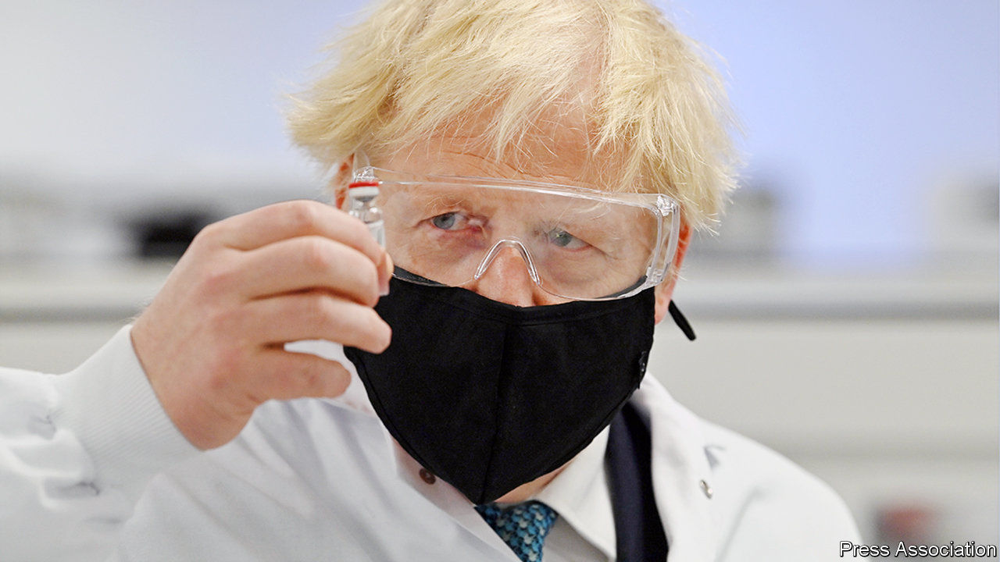
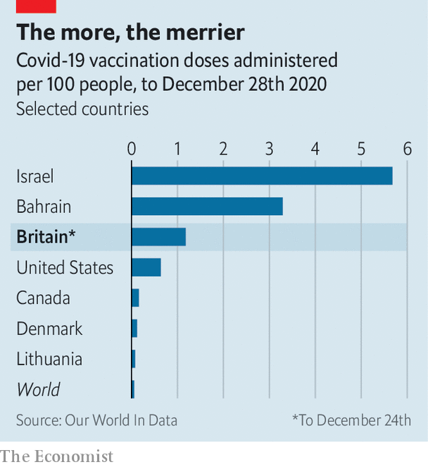

###### Covid-19 vaccines

# Britain approves AstraZeneca’s covid-19 jab 

##### It is cheaper, easier to distribute and more plentiful than rival vaccines. India is watching closely 

 

> Jan 2nd 2021 


THIS YEAR more than 600,000 Britons received an early Christmas present: a Pfizer covid-19 vaccine. The early start of the roll-out—enabled by the speedy work of the country’s regulator, the MHRA—puts Britain near the front of the global pack. Only Bahrain and Israel have delivered more doses per person (see chart).


The government had hoped things would be faster still, only for delays at Pfizer to put a spanner in the works. January will be a different story. The firm’s factories are now up to speed. And on December 30th, the MHRA gave emergency authorisation to another vaccine, from AstraZeneca and Oxford University.


This one is cheaper, easier to distribute and more plentiful. The plan is for mass vaccination centres to dish out hundreds of thousands of doses a day, quickly reducing the number of deaths. Distribution will begin on January 4th.

 


One of the big debates was around the dosing strategy. The original trial showed two doses of the vaccine were more than 62% effective, but also offered tantalising evidence of protection as high as 90% when the first dose was halved. (As with all the covid-19 vaccines, it is completely effective at preventing death however it is given.) The question was if there were the data to support a half-dose strategy.


In the end, the MHRA went for a two-dose strategy—but with a twist. Some, including a former prime minister, Tony Blair, had argued that single doses of the AstraZeneca vaccine should be rolled out immediately, rather than holding back supply for a second dose. That would allow for speedier vaccination. Yet the concern over giving only one dose of any two-dose vaccine is that individuals do not get the full benefit of vaccination, even if it helps the population at large.


A potential solution lay hidden in the AstraZeneca data. The firm says that a longish gap between doses, of as much as three months, is fine. Having analysed the data, the MHRA agreed, deciding to give single doses to everyone, with follow-up jabs as far as three months down the line. That could double the number of people who can be vaccinated in the next few months.


The call is of international importance. Now the MHRA has authorised the AstraZeneca vaccine, other countries will probably follow suit. One watching closely is India, which started producing the vaccine in April, and has about 40m doses ready to go.


The government is tight-lipped about how many are ready in Britain. But in November AstraZeneca said it would have enough bulk substance for 20m doses, and that 4m would be in vials by the end of the year. That would be enough substance to give a first dose to every front-line health- and social-care worker, everyone in a care home, everyone who is clinically vulnerable, everyone with underlying health conditions and everyone over the age of 60.


Because fatalities are concentrated among the old and vulnerable, doing so would prevent almost all deaths. Given that the health service vaccinates 15m or so people in a normal flu season, and does so without mass vaccination centres, it ought to be doable in the next few months. Matt Hancock, the health secretary, said he was confident that enough vulnerable people will be vaccinated by spring that there would be a “route out of this pandemic”. So long as neither vaccine-resistant strains nor supply problems emerge, covid-19 will soon be a much less deadly disease. ■


Editor’s note: Some of our covid-19 coverage is free for readers of The Economist Today, our daily . For more stories and our pandemic tracker, see our 

