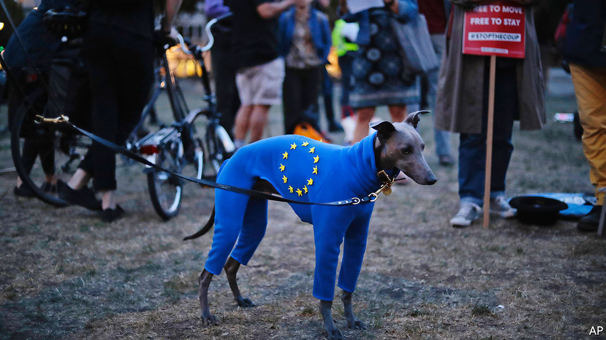

###### The Brexit deal

# How Brexit will change Britons’ lives 

##### Working, travelling and retiring in the EU could get complicated 

 

> Jan 2nd 2021 


A  ROMAN TRAVELLING anywhere in the empire from modern-day Carlisle to Damascus was said to have his safety guaranteed by declaring: “Civis Romanus sum.” The Maastricht treaty of 1992 created a similar notion of European citizenship, affording the bearer rights superior to domestic law throughout the bloc, which compel officials, bosses and judges to treat all Europeans as the equals of their compatriots.


From this grand idea spring a thousand small perks, making going on holiday or serving a client abroad effortless. Britons will have plenty of time to consider them as they finger their new dark-blue passports in the non-EU queues at European airports.


Britons who settled on the continent before Brexit will have the rights of citizenship preserved under the Brexit withdrawal agreement. For everyone else, they will drop away as Big Ben strikes 11pm on December 31st. How Britons are treated thereafter will depend on the rules agreed in Mr Johnson’s new deal, the long-standing provisions of European law which apply to all “third-country nationals” from Americans to Zimbabweans, and the migration laws of individual EU states, which change with the political weather. Those holidaying on the continent for a fortnight a year may notice a little more hassle. Those who wish to go for longer—to study, or spend the summer in a second home—will find their rights and options curtailed dramatically.


EU citizens face almost no restrictions on moving to another state for work or leisure, and can cross borders more or less as they please. After Brexit, Britons will be limited to up to 90 days travel at a time without a visa within a six-month period. Border guards may demand proof of their plans, a return ticket, and that they have enough money for their stay. (Eurostar has urged all travellers to the continent after Brexit to arrive earlier than they used to.) Britons will lose the right to use automatic passport gates, and will receive rubber stamps in their passports.


Doing business will be much trickier: no longer will Britain be able to treat the EU as its home market. Business travellers will be able to visit for up to 90 days for meet-and-greet activities, such as attending sales meetings, trade fairs or conferences. But generally speaking, delivering a service—such as auditing accounts, playing in a concert or working as a chef—will require a work visa, and in many regulated sectors getting registered as a local professional too. Visa policy is largely a matter for national governments, which have their own criteria of skills, language requirements and fees that vary depending on the needs of the labour market. British students, no longer entitled to equal treatment, are likely to pay much higher fees for places at European universities.


Motorists will need to carry a green card, showing their insurance is valid. EU laws that prohibit customers from being hit with roaming charges when they use their mobile telephones abroad will drop away. Whether fees return depends on the deals that operators strike with their European counterparts; big operators, such as Vodafone, will have more clout than smaller ones. Britain will drop out of the EU’s pet-passport regime, which documents animals’ vaccinations and allows holidaymakers to take dogs and cats abroad; owners will instead need to obtain an animal health certificate from their vet each time they travel. Not all is lost, however. Under Mr Johnson’s plan, Britain hopes to retain a variant of the European Health Insurance Card, which grants holidaymakers emergency health care when on the continent.


Retiring to a place in the sun will be a trickier affair, particularly for those on tight budgets. Each country has its own rules for foreign pensioners who want to stay. They typically need a minimum income and medical insurance. British owners of property abroad will be more vulnerable to tax raids too: in 2015, the European Court of Justice struck down a French tax on properties owned by other European nationals as incompatible with European Union law. Such protection against official whim is the difference between being a guest in a foreign land, and being someone who can declare: “Civis Europaeus sum.” ■

