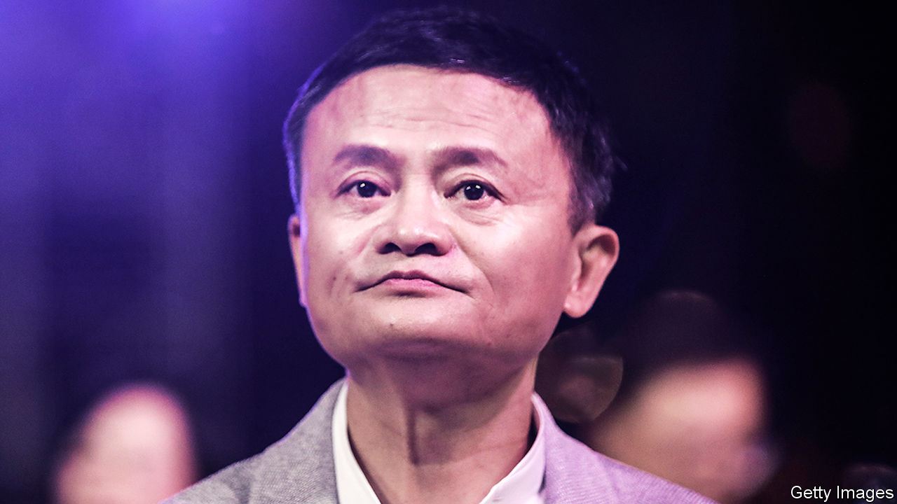

###### Mo money, Ma problems

# Chinese trustbusters’ pursuit of Alibaba is only the start 

##### Beijing has put online giants on notice 

 

> Jan 2nd 2021 


“ACTING ON INFORMATION, China’s State Administration for Market Regulation [SAMR] has started investigation [into] Alibaba Group for alleged monopoly conduct including implementing an ‘exclusive dealing agreement’.” This brief note, posted by Xinhua, the state news agency, on December 24th, was all it took to cut China’s mightiest online titan down to size. Not even the announcement three days later of an extra $6bn in share buy-backs arrested the slide in its market value. By December 28th it had fallen by 13%, or $91bn. By comparison, American regulators’ detailed charge-sheets against tech giants such as Facebook and Google in recent weeks elicited a yawn from investors.


The Alibaba investigation is the first of its kind into Chinese e-commerce. Its timing—a month after authorities suddenly halted the $37bn initial public offering (IPO) of Alibaba’s fintech affiliate, Ant Group, and days before regulators told Ant to curtail lending and wealth-management activities—hints it is China’s way of chastening the two firms’ flamboyant co-founder, Jack Ma.


That could be. Ant’s IPO was put on ice after Mr Ma likened China’s state banks to pawn shops. Chinese watchdogs often launch lightning crackdowns to deter others from misbehaving, says Angela Zhang of the University of Hong Kong. But the probe also signals concerns over the online economy, which is effervescent but also ever more concentrated. As investors parsed the Xinhua note, share prices of other internet giants, such as Tencent and Meituan, fell nearly as steeply as Alibaba’s.


The complaint against Alibaba centres on the practice of having merchants or brands sign contracts to sell products exclusively on its platform. Those that do business on rival marketplaces risk having internet traffic diverted from their online shopfronts on Alibaba’s Tmall emporium to other sellers.


Such arrangements aren’t new. In 2015 JD.com, a smaller e-emporium backed by Tencent, filed a legal claim against Alibaba over a similar issue. Nor are they unique to Mr Ma’s firm, which launched a competing complaint against JD.com the same year. These and other complaints since have been largely ignored by regulators. Why the about-turn?


Chinese trustbusters long resisted hobbling an industry seen as world-beating, and backed in Beijing. Now, as in the West, they fret that a few giants control indispensable services—e-commerce, logistics, payments, ride-hailing, food delivery, social media, messaging. Common practices, such as selling products below cost to lure customers, look more troubling in an industry where the top three firms control over 90% of the market than they would in a less concentrated one. In November SAMR said offering shoppers different prices based on their spending power, divined from user data, may be unlawful. 


Another reason for China’s newfound zeal (Mr Ma’s jibes aside) is greater trustbusting capacity. SAMR was formed only in 2018, by combining the offices of three regulators. It still struggles to keep up with the fast-changing online market; most staff are busy assessing mergers and acquisitions. But it has more know-how and manpower than it used to—and looks eager to deploy them.

