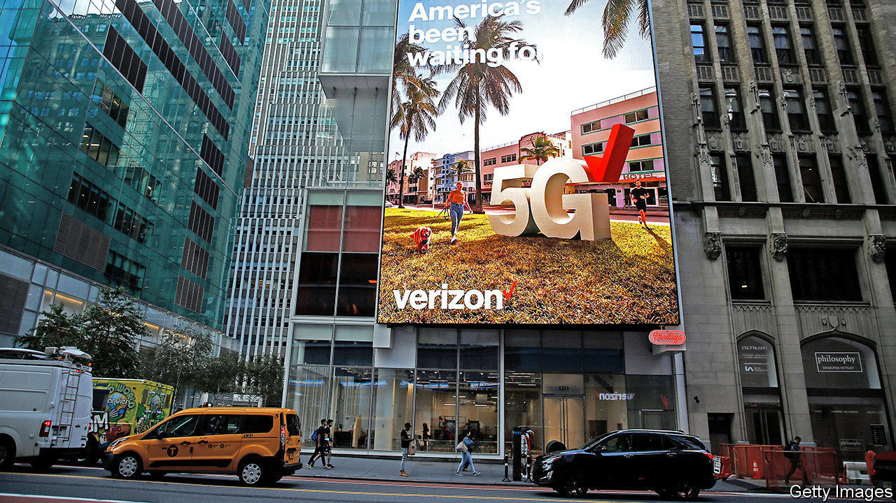

###### The $90bn prize fight

# Why American telecoms firms are splurging on 5G spectrum 

##### An auction of mobile frequencies is turning a blockbuster 

 

> Jan 2nd 2021 


IT MAY BE the most hyped technology since blockchain. But even sophisticated telecoms giants are now placing huge bets on 5G. In early December American regulators started the process of auctioning off radio-frequency bands needed to roll out superfast fifth-generation mobile networks. Industry experts had expected bids to come in at $25bn-30bn between them, less than the $45bn fetched in the last big 4G spectrum sale in 2015—but a tidy sum nonetheless.


In fact, when the first part of the auction was concluded on December 23rd, the bids had reached a staggering $70bn. The winners will be on the hook for “clearing costs” of another $13bn-15bn, in part to compensate satellite firms for giving up some of their spectrum that is particularly well-suited for 5G. The auction will resume on January 4th. By the time it ends, the proceeds may exceed $90bn.


At first blush, this seems like a classic case of overbidding by zealous telecoms firms chasing a shiny new technology. It could leave AT&amp;T and Verizon, America’s mobile-telephony giants, saddled with huge debts. New Street Research, a firm of analysts, reckons that the industry’s overall debt will be between $45bn and $60bn higher than previously forecast.


There is an alternative view, however. As Jonathan Chaplin of New Street puts it, “it is almost impossible for carriers to overpay for this spectrum.” This case rests on three arguments.


First, the specific frequencies on offer give firms their best chance to get “large swathes of contiguous spectrum needed for 5G to realise its full potential”, points out Tom Wheeler, former chairman of the Federal Communications Commission, the agency supervising the auction. These frequencies, clustered around 3GHz, enable transmission speeds ten times higher than 4G. The current, pseudo-5G offerings in lower frequencies are often barely faster than 4G connections. The new spectrum also supports 20-25% more capacity than bands of 2GHZ or lower.


The second justification for splurging on spectrum is to defend market share. T-Mobile, America’s third-biggest provider, leapt ahead in 5G thanks to its recent acquisition of Sprint, a smaller rival endowed with desirable frequencies. For AT&amp;T and Verizon the auction was “do or die”, as one analyst puts it. For its part, T-Mobile may be entering stalking-horse bids to ensure bigger rivals do not win chunks of spectrum for a pittance. As Mr Wheeler notes, firms are asking “How do I keep my competitor from getting an advantage over me through his spectrum position?”


And competition is not confined to wireless rivals. Comcast and Charter, two large cable-television firms, have formed a joint venture to bid on 5G spectrum in the hope of taking on the incumbents. Dish Network, a big satellite-TV provider, is also taking part in the auction. Walter Piecyk of LightShed Partners, a research firm, adds that the bids are soaring because earlier, futile efforts at using inferior frequencies have left America far behind China, its main strategic rival, in the 5G race.


The final factor fuelling the bidding war is cheap money. Mr Piecyk reckons an extra $10bn in bids costs just $500m a year to finance at today’s rock-bottom interest rates, which telecoms giants can easily afford. Or as Dish’s boss, Charlie Ergen, puts it more colourfully: “They are printing money, but they aren’t making more spectrum.” ■

