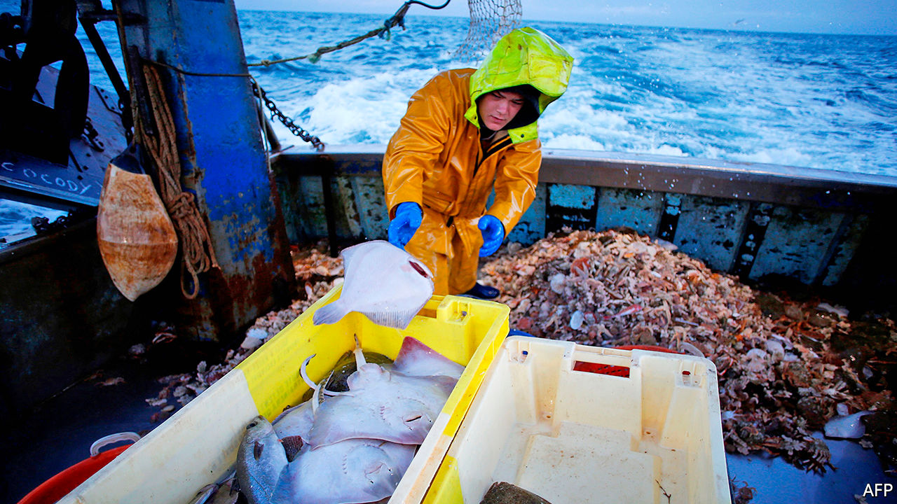

###### How was it for EU?

# For Europe, the Brexit deal makes the best of a bad business 

##### The EU got an orderly transition that leaves Britain worse off than membership 

 

> Jan 2nd 2021 


WHEN THE trade deal between the EU and Britain was done, there was little celebration in Brussels. Instead, the moaning began. “This is a dark day for the European fishing industry,” declared Gerard van Balsfoort, chairman of the European Fisheries Alliance, a lobby group for fishermen. Indeed, conflict over matters piscatorial dominated the final stages of the negotiations, leaving economists flabbergasted that such a tiny sector could hook so much attention.


Yet there is more to life than mackerel. On the whole, the EU is content if not happy with how things turned out. From the union’s perspective, it was important that Britain’s departure was orderly; that it left Britain with worse trading access than the status quo; and, consequent to that, that it removed any temptation for other countries to follow the Brexiteers out. The EU has a good claim to say it managed all three.


Britain’s exit followed a rigid process dictated by the EU. Although the Vote Leave campaign had pledged not to use Article 50, the official process for leaving laid out in the EU’s founding treaty, the British ultimately triggered it. (EU officials privately claimed credit for goading them to do so.) Negotiations took place according to the EU’s schedule. The remaining 27 member states were not divided, which back in the mists of 2016 had been a worry for diplomats. The things the EU cared most about were dealt with in both the withdrawal agreement reached last January (which sorted out citizens’ rights, the Irish border and how much money Britain owed the union) and the trade agreement reached over Christmas (where a deal was struck over EU fishing rights in British waters, despite griping from Mr van Balsfoort’s constituents). By contrast, big British interests, such as the rights of the country’s enormous financial sector to do business in Europe, have still to be decided.


To anyone not obsessed with romantic notions of sovereignty, it is clear that the deal leaves Britain worse-off than with EU membership. European officials distributed graphics explaining what Britain would miss, ranging from the big stuff (financial passporting for banks, Britons losing the right to live and work in 27 countries) to the small (no more pet passports, no guaranteed cheap mobile-phone roaming). In public, officials made clear that the negative effects of Brexit were the inevitable consequence of leaving the bloc. In private, they spoke of the need to drive Britain’s face into the mud. The EU does not want a successful rival on its borders, and the threadbare deal agreed will not help Britain become one. After the four years of political chaos during which Britain laboured to extricate itself, Euroscepticism in other EU countries has gone off the boil. The British showed that there is a path for anyone wishing to leave the union. But it is costly, arduous and leads to a backwater.


Brexit is still bad for the bloc, even with a deal. Given that its claim to being a superpower relies on its economic clout, watching GDP equivalent to 18 of its 27 countries walk out of the door is not good. About a quarter of EU defence spending went as well. The fact that it was on amicable rather than chaotic terms only slightly sweetened the pill. Instead, Britain joins the club of the EU’s awkward neighbours. The deal provides a rather wobbly foundation for a new relationship between Britain and the continent (see ). As a result, the EU faces years of tweaks to its relationship with a country whose population is nearly eight times that of Switzerland, with which it has similarly frustrating ties.


Brexit is not an existential concern for the EU, as some feared it would become. The EU will enjoy a strained relationship with a neighbour too small to worry much about, but too big to ignore. Given that the EU is seven times the size of Britain, it should be able to handle it as it does the rest of its fragile frontier. But it is a problem the union, surrounded by instability on its borders from north Africa to Turkey to Russia and challenged from within by democratic backsliding in Hungary and Poland, would rather not have. When it comes to Brexit, there is no such thing as a good deal for the EU. ■

