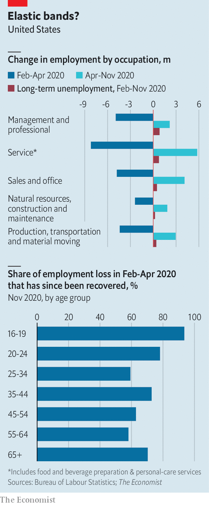

###### Speed limits

# How quickly will America’s labour market recover? 

##### Long-term unemployment is high, but pent-up demand could help bring it down 

 

> Jan 2nd 2021 


ONE OF THE biggest questions facing the world economy in 2021 is how fast America’s labour market will recover. Optimists point to the rapid decline in the unemployment rate after the first wave of the pandemic—from nearly 15% in April to 6.7% in November—as a reason for a speedy recovery. Pessimists’ go-to statistic is the high and rising rate of the long-term unemployed, those who have been out of work for more than six months. It has risen from 0.7% of the labour force in February to 2.5% today. The last time the figure was that high was in December 2013, when the labour market was recovering from the global financial crisis of 2007-09.


On average, the longer someone is unemployed, the harder it is for them to find work. In part that may be because the least productive workers, for whom the labour market is always an unwelcoming place, are more likely to experience long spells of unemployment during downturns. But spending months on the sofa also causes people’s skills to atrophy. As a result, recessions inflict lasting scars on both workers and the economy.


How deep are the scars likely to be this time? Unemployment fell rapidly in 2020—and much more quickly than after the financial crisis—because millions of laid-off workers were recalled to their jobs in the summer and autumn. This was particularly true of jobs requiring face-to-face contact. Analysis by The Economist suggests that service occupations accounted for about a third of the jobs lost in the spring and about a third of the subsequent rebound. Employment among those aged 20-24, who might often work as waiters and bar staff, has recovered nearly 80% of its losses (see chart).

 


The picture for the long-term unemployed is less rosy, though. Nearly 30% of them say they are only temporarily laid off, but with each passing month it seems less likely that their jobs will return. The long-term unemployed are also more evenly spread across the economy. Service workers make up just over a quarter of the rise in long-term unemployment since February. Remarkably, though, they are outnumbered by professionals and managers. These account for a third of the recent rise in long-term unemployment, even though they are often said to have been immune to the downturn. Nor are the newly long-term unemployed especially young. More than half are over 45. Most are men. They look like a group that has suffered a normal recession rather than a service-sector hiatus.


Things appear gloomier still when you consider those who left the workforce altogether in the spring, meaning they stopped working and did not look for new jobs. Such “inactive” workers are not counted as unemployed. Jason Furman and Wilson Powell III of Harvard University reckon that a “realistic” unemployment rate, which adds many of them back in, is 8.5%. A study of the long-term unemployed by Alan Krueger of Princeton University, Judd Cramer of Harvard University and David Cho of the Federal Reserve in 2014 found that, counterintuitively, the long-term unemployed leave the workforce more readily during recoveries than in downturns; they seem to discover they are missing out on the rebound, and give up looking for work. If the same holds in 2021, labour-force participation could fall further.


The pessimists therefore have plenty of ammunition. Yet the optimists can fire back. Some 3.9m of the 5.7m people who have left the labour force since January cite the pandemic as the reason they are not looking for work, calculates Joseph Briggs of Goldman Sachs, a bank. Once it ends, they may return. In the years after Messrs Krueger, Cramer and Cho published their study, America’s labour market heated up so much that employers searched far and wide for willing workers, hiring even ex-convicts, and the labour-force participation rate for 16- to 64-year-olds went up. If the economy recovers quickly enough, then its scars will probably heal. Some economists predict a spending spree in 2021 as the economy reopens fully and pent-up demand is unleashed.


But what must come first, the consumer-spending rebound, or labour-market healing? Lawmakers may have solved the chicken-and-egg problem. On December 27th President Donald Trump signed a bill that will inject $900bn (4.3% of GDP) in stimulus, sending cheques to households and extending benefits for the long-term unemployed (see ). The replacement of lost incomes could allow the unemployed to spend even as they search for work. And a rapid rise in consumption in 2021 should bring the labour market back to the boil—even, eventually, for the long-term unemployed. ■


Editor’s note: Some of our covid-19 coverage is free for readers of The Economist Today, our daily . For more stories and our pandemic tracker, see our 

