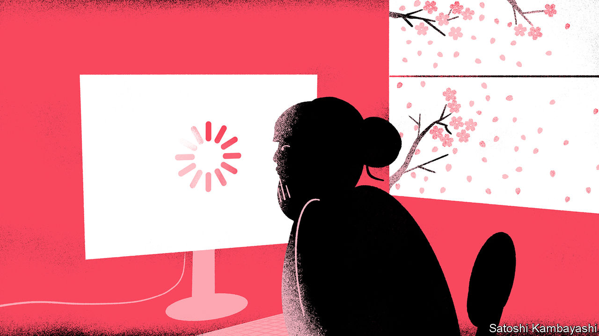

###### Online onslaught

# Few reforms would benefit Japan as much as digitising government 

##### It is one of the world’s most wired countries. Yet its public sector lags behind Mexico’s 

 

> Jan 2nd 2021 


IT IS A ritual almost as frequent and as fleeting as observing the cherry blossoms each year. A new Japanese government pledges to move more public services online. Almost as soon as the promise is made, it falls to the ground like a sad pink petal. In 2001 the government announced it would digitise all its procedures by 2003—yet almost 20 years later, just 7.5% of all administrative procedures can be completed online (see ). Only 7.3% of Japanese applied for any sort of government service online, well behind not only South Korea and Iceland, but also Mexico and Slovakia. Japan is an e-government failure.


That is a great pity, and not just for hapless Japanese citizens wandering from window to window in bewildering government offices. Japan’s population is shrinking and ageing. With its workforce atrophying, Japan relies even more than other economies on gains in productivity to maintain prosperity. The Daiwa Institute of Research, a think-tank in Tokyo, reckons that putting government online could permanently boost GDP per person by 1%. The failure to do so is a missed opportunity.


The lapse is all the more remarkable given Japan’s wealth and technological sophistication. Indeed, that seems to be part of the problem. Over the years big local technology firms have vied for plum contracts to develop IT systems for different, fiercely autonomous, government departments. Most ended up designing bespoke software for each job. The result is a profusion of incompatible systems.


Happily, the government of Suga Yoshihide, who became prime minister in September 2020, seems to be making more than the typical ritual stab at resolving the problem. It is creating a new government agency intended to drag the old ones into the digital world. This new office will be in charge of procurement of IT systems for the government as a whole, giving it real clout. It will be headed by a tech executive, not a bureaucrat.


As a laggard in the rich world in the adoption of digital public services, Japan does at least have the advantage of being able to learn from the experience of other countries. It could look to Estonia for advice on imposing data standards across government departments. Estonia also operates a model digital-ID system (Japan’s is used by less than 20% of the population, and the pandemic has highlighted its shortcomings). It could follow South Korea’s example in making more of its public data, processes and services “open by default”, and being transparent about its use of data when devising policies and designing services. And to boost take-up it could learn from Denmark, where applications for 95% of state pensions and 100% of maternity benefits are now handled digitally.


These successes were achieved in part by pressing ahead despite the predictable misgivings of hidebound bureaucrats and techno-nervous pensioners. Japan has tended in the past to placate such people by building parallel digital systems and making use of them voluntary. It will have to get tougher with its citizens and civil servants as well as its IT contractors if take-up of digital services is to increase. In fact, officials may find that if they make digital government work more smoothly, much of the resistance to it melts away, as the advantages and cost savings arising from doing paperwork online become more obvious.


The potential gains in productivity, if Japan’s administrators get their act together, would be enormous. The older the population becomes, the greater the benefit, to them and to the government, of doing away with queues and forms. The savings of time, money and effort will only grow. And unlike the transient beauty of the cherry blossom, the blessings of more efficient government would be lasting.■

