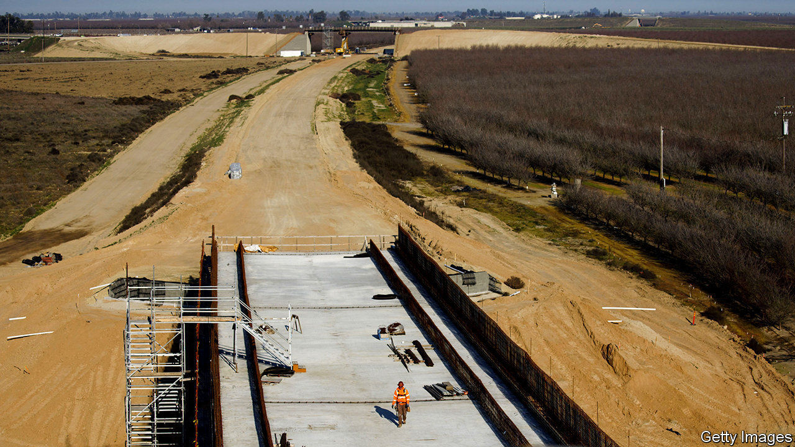
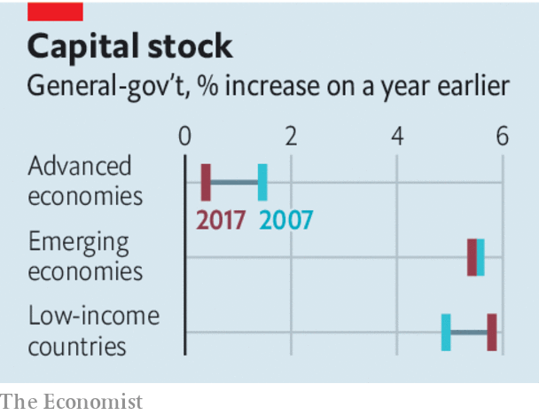

###### Public investment

# How to get infrastructure right 

##### Every country wants to build more bridges, roads and renewable-power grids. It won’t be easy 

 

> Jan 2nd 2021 


IN 1916 CINCINNATI decided to construct a magnificent new subway system. After decades of cock-ups it was abandoned in 1948, and today there are two miles of tunnels beneath the city that have never been used. That cautionary tale is still relevant. Politicians everywhere are calling for more infrastructure spending (see ). Yet few industries have a worse record of coming through on time and on budget. If the incipient boom is to produce better results, governments and firms must learn to adopt best practice from around the world.


Most countries have enacted short-term stimulus plans to deal with the pandemic. On December 27th President Donald Trump signed a $900bn spending bill (see ). But there is also appetite to binge on infrastructure. Joe Biden wants to spend $2trn on roads, power grids and railways, and hopes to win bipartisan support for his plans. The European Union has just approved a €1.8trn ($2.2trn) budget, a slug of which is for digital and energy investments.


The new infrastructure infatuation is understandable. Public and private investment has stagnated at 3-4% of GDP worldwide. That is too little to maintain ageing assets in developed countries—a third of American bridges are creaky—or to provide enough clean water and electricity in the emerging world. Low interest rates mean financing is cheap, and many economists think that the payback from infrastructure is attractive. Meanwhile, climate change and the digitisation of the economy are creating vast demand for renewable-energy systems and connectivity, including 5G networks.

 


In practice, however, infrastructure’s record is as potholed as a Mumbai motorway. Cost-overruns often exceed 25%. Two-thirds of foreign bribery cases involve infrastructure deals. China spends more than anyone else, but perhaps half of its investments have destroyed economic value. India had a boom in the 2000s which ended in a mire of debt. Even Germany struggles to get it right. All this reflects some deep underlying problems. Most projects have a time horizon beyond that of politicians and voters. Often they are one of a kind: China has just Three Gorges to dam, not six. And the full economic benefits created by a road, say, are not captured by the organisation paying for it.


Yet bitter experience does at least suggest two universal lessons. First, governments should select projects systematically by creating a single list and picking those with the highest payback. This assessment should factor in externalities, including the impact on carbon emissions, and delays, which are a big source of cost overruns. And it should be carried out by bodies that are independent from those that build and run assets. Often the projects selected will not be the glittering new temples that politicians like their names on, but humble repairs and maintenance.


The second lesson is to harness the private sector. Not only is it a source of capital—global infrastructure funds have over $200bn waiting to be deployed—but projects with private investors also tend to be managed better. That means developing standardised contracts and independent regulators that protect taxpayers but also give investors reasonable certainty of an adequate return.


Both lessons might seem obvious. A few places, such as Chile and Norway, get infrastructure right. But over half of the countries surveyed by the IMF do not maintain a national pipeline of projects. And in most the record is staggeringly erratic. America is splurging on 5G (see ) but has squalid airports and too little renewable energy. Europe has shiny airports and wind farms but is in the stone age on 5G. Infrastructure is one of the last local industries left where easy gains are still to be had by copying others around the world. If you benchmark public investment in over 100 countries, adopting best practice could make spending 33% more efficient. The prize is huge. Just don’t expect a subway in Cincinnati.■

