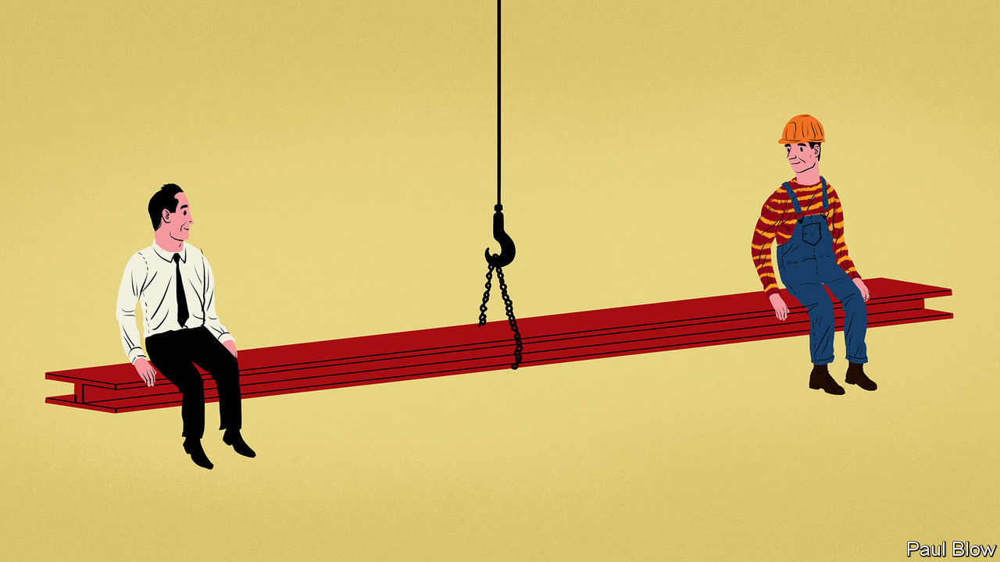
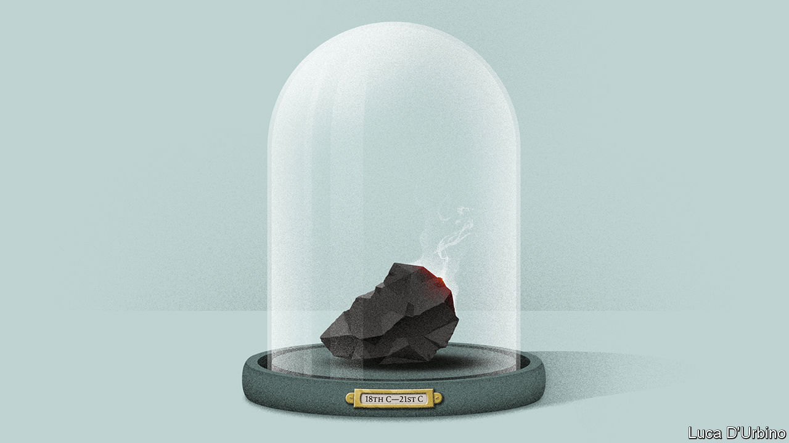

###### On Eastern Airlines, families, coal, potholes, Bob Dylan

# Letters to the editor 

##### A selection of correspondence 

> Dec 30th 2020 


 


The tale of Eastern Airlines


summarised a new book by David Bodanis on fairness in business (December 12th). The column narrated the story of Eastern Airlines by describing it as a corporation built by Eddie Rickenbacker, “who had granted mechanics a 40-hour week, profit-related pay and a pension”, but “when Frank Lorenzo took over the company in the 1980s, he cut wages, alienated the staff and pursued a policy of asset-stripping the company. The workers went on strike in protest and Eastern went bankrupt.”


However, Rickenbacker operated during a lush golden era of air travel. The government regulated air fares, and kept them high. Competition was genteel. Then along came the Deregulation Act of 1978, a sea change in the airline industry. New discount airlines sprouted up and airlines added flights to Eastern’s tourist-oriented routes to Florida. Ticket prices plummeted. Yet the unions refused to recognise these new financial realities. By 1986 Eastern Airlines was on the brink of bankruptcy. That’s when Frank Borman, a former astronaut and Eastern’s chief executive, asked me about a sale to my airline group. He told me he’d decided to sell to us because “the unions wouldn’t make the necessary changes.” When we took over, we thought the unions would understand that change had to come, but they continued to fight. In 1989, needing cash to continue operations, we sold the Eastern Shuttle to Donald Trump for $365m. That reality didn’t soften union intransigence; they fought on, so the airline sadly ended up being liquidated with tens of thousands of jobs lost.


Fairness is certainly a worthy subject of a business book. But Mr Bodanis has misunderstood our Eastern acquisition. It might have been better if he had mentioned our take on fairness. Our group was the first to eliminate cigar and pipe smoking, the first airline to provide stock incentive programmes to employees, and so on.


FRANK LORENZO

Former chairman of Eastern Airlines and former CEO of Continental Airlines

New York

 


Sizing households


It is not true that people in the western world only started to live in nuclear families after industrialisation (“”, December 5th). That is a popular historical myth. In western Europe, the average household size was fairly small long before the Industrial Revolution, below five people since the 16th century, if not earlier. In England rural families tended to be nuclear or only slightly extended. They certainly were not the big groups to which your article alludes. In Bulgaria, a country I studied in detail, the average household size was larger in the 1980s than in the 19th century, for the simple reason that the communist regime could not provide enough housing. Bulgarian peasants in the 19th century lived on small, individual farms, which were divided up once their sons married.


ULF BRUNNBAUER

Professor of south-east and east European history

University of Regensburg

Regensburg, Germany

 


A role for coal


After almost 18 months as chief executive of the World Coal Association, it does not surprise me to see negative headlines dismissing coal (“”, December 5th). I was alerted to your story as I was giving a speech to the Indian government and industrialist stakeholders at a forum which reinforced that coal will continue to be significant in India’s energy mix; we discussed the preparations that will need to happen for its responsible usage. Similar themes were heard at meetings with ministers in South-East Asia. In fact, these sort of headlines are often disregarded by the coal-growth regions because dismissing coal is dismissing the right of developing and emerging economies to choose their own energy source to support development.


There is not one government minister or adviser in the key coal markets whom I have spoken to who wants to make the same mistakes as developed economies. Equally, they do not wish to promote an uneconomical and unsustainable vision that is not realistic. That is why so many countries continue to use coal, which is still forecast to be the single biggest source of electricity in 2040. Since 2010, 40 countries that have not used coal for power in the past have added coal to their energy portfolios.


Although The Economist was dismissive of the role that can be played by clean-coal technologies, the emissions reduction potential is significant. Many countries have included a role for coal and clean-coal technologies in their Paris agreement pledges. Globally, the average efficiency of coal-fuelled power plants is 37.5%. If this was raised to 47.5%, which is possible with today’s technology, this would reduce global emissions by two gigatonnes, equivalent to eliminating the ASEAN region’s 2017 carbon emissions from all fossil fuels. Carbon capture, use and storage is also vital to our climate efforts.


MICHELLE MANOOK

Chief executive

World Coal Association

London


Until recently, Chile produced around 40% of its electricity from burning coal. But the country is now a star in energy transition because of new renewables like wind and solar. We are committed to carbon neutrality by 2050. The guiding principles for this change have been the openness of our economy to foreign investment, free trade, intense competition in our generation market, sound public policy and a long-term commitment to sustainable economic growth. There are no public subsidies for renewables, but we are endowed with lots of sunshine in Atacama, winds from the Pacific and water from the Andes.


We hope that the share of renewables in electricity will rise from 45% to above 85% by 2030. The climate emergency gives us little time. The scope and speed needed for this energy transformation is enormous. Chile’s path of a private-sector market-based approach to energy transition is an example for other countries to follow in order to make coal history.


CLAUDIO SEEBACH

Executive chairman

Chilean Electric Power Association

Santiago

 


Enough to drive you mad


Repairing potholes does not necessarily bring unalloyed joy to Britain’s motorists (, November 28th). Roadworks are announced with the least welcome phrase in the English language: “Three-Way Traffic Control”. Temporary traffic lights are equipped with cameras and technology capable of issuing fines with relentless efficiency to any driver foolish enough to disobey them. The repairs cause even more congestion. The Kafkaesque inefficiency of remedial work is painful enough. However, policing it with great precision and careful logistics suggests a muddling of priorities.


MAURICE MILLEN

London

 


Million dollar bash


I liked your homage ballad to Bob Dylan (, December 12th). Even during these uncertain times Mr Dylan’s words ring true: “Money doesn’t talk, it swears”.


RAJ KUMARPleasanton, California

