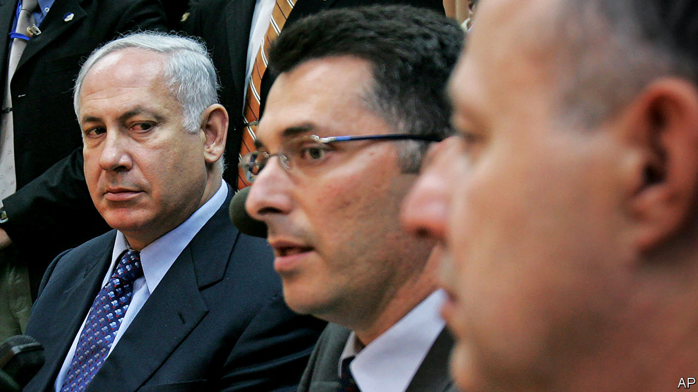

###### Sa’ar wars: a New Hope

# Binyamin Netanyahu faces a challenge from the right 

##### Israel holds yet another election 

 

> Jan 2nd 2021 


FOR 15 YEARS Binyamin Netanyahu has been the undisputed leader of the Israeli right. In 2009 he guided his nationalist Likud party to power, becoming prime minister. He has held the office ever since. Challengers from the centre and left have tried mightily, and failed, to unseat him. They pose little threat as Israel gears up for an election on March 23rd. Now, though, Mr Netanyahu (pictured, left) faces a challenge from former allies on the right.


The election was triggered by the failure of the Knesset (Israel’s parliament) to pass a budget by a deadline on December 23rd. Mr Netanyahu had ordered the finance minister, a member of Likud, to take his time preparing the budget. This was a political move—an effort to time the government’s collapse for when the polls looked best for the prime minister. But enough MPs were fed up with his manoeuvring that they were able to block any more delays.


It will be Israel’s fourth election in two years. The previous three ended in draws. The stalemate was broken only when Benny Gantz, the leader of the centrist Blue and White party, agreed to share power with Mr Netanyahu. Mr Gantz was to take over as prime minister in November 2021, though many Israelis doubted that Mr Netanyahu would honour the deal, which is now dead. Both leaders urged their members to vote for extending the budget deadline and preserving the coalition, largely because they fear the electoral threat posed by Gideon Sa’ar (pictured, right).


Mr Sa’ar resigned from the Knesset and left Likud in December. The former education minister had previously challenged Mr Netanyahu for the party’s leadership, and lost badly. Now he has his own party, New Hope, which is drawing other Likud defectors. The urbane lawyer, a DJ in his spare time, is at home in the liberal circles of Tel Aviv. But make no mistake, he is a man of the right. He backs West Bank settlements and wants to reform a judicial system perceived by some as having a liberal bias. On ideology he hardly differs from Mr Netanyahu, whom he once served as cabinet secretary.


Mr Sa’ar rails, however, against the “cult of personality” that Likud has fostered around the prime minister. The party, he says, has become “a tool” to serve Mr Netanyahu’s interests, “including those related to his criminal trial”. Mr Netanyahu has been charged with bribery, fraud and breach of trust stemming from three corruption cases. Replacing him is “the order of the hour”, says Mr Sa’ar, who also supports limiting the tenure of prime ministers to eight years (Mr Netanyahu has served for 11 years straight and 14 in total). New Hope has soared in the polls.


Two other parties led by erstwhile allies of the prime minister—Naftali Bennett and Avigdor Lieberman, both former defence ministers—are expected to do well. Mr Sa’ar will probably cut into their support, but together they may draw enough nationalist and religious voters, Mr Netanyahu’s base, to deny him the share he needs to stay in power. Israel’s centrist and left-wing parties would probably join a coalition led by Mr Sa’ar if it meant getting rid of Mr Netanyahu.


The centrist and left-wing parties stand little chance on their own. Labour, the party of the state’s Zionist-Socialist founders, will be lucky to win a handful of seats. Mr Gantz, meanwhile, largely discredited himself by joining Mr Netanyahu in government after promising voters he would not. The centrist ex-general claimed he had to so that the country could fight covid-19. But most voters think he was outwitted by the prime minister.


Mr Netanyahu, for his part, hopes at last to gain a majority that may grant him immunity from prosecution. His popularity has plummeted thanks to his government’s shoddy handling of covid-19 and its effect on the economy; polls show him and his allies falling short of a majority. But they also show Mr Sa’ar with a difficult path to forming a government without Likud. “Under no scenario will I join a government led by [Mr Netanyahu],” says Mr Sa’ar.


Is more stalemate in the offing? On December 27th Israel became the first country in the world to enter a third nationwide lockdown to stop the spread of covid-19. But 500,000 Israelis, 6% of the population, have already received the first dose of the vaccine. Israel is moving faster than most of the world. Mr Netanyahu, who on December 19th became the first Israeli to get the jab, is hoping the vaccination drive will also give his campaign a shot in the arm. ■

