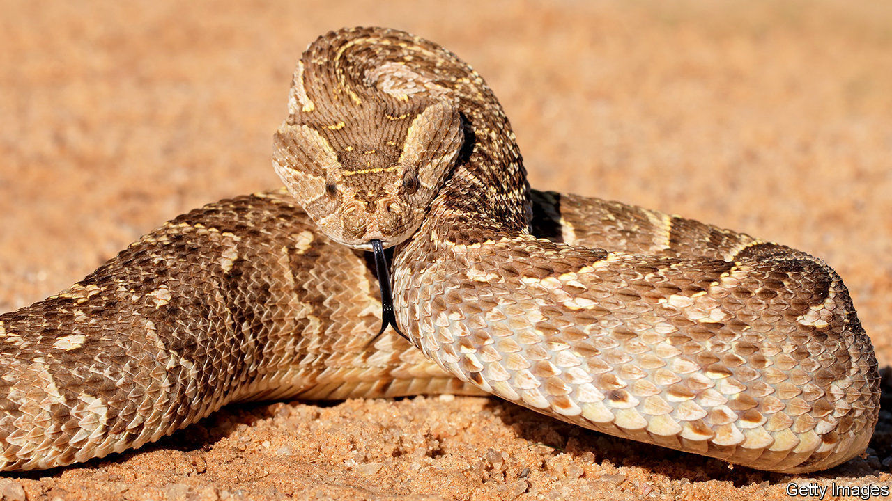

###### Toxicology

# How to simplify the treatment of snake bites 

##### A new drug combination may protect against viper toxins 

 

> Jan 2nd 2021 


SNAKE VENOM kills around 140,000 people a year and debilitates roughly 400,000 others. One reason for these large numbers is that every venom needs a specific antivenin to treat it. In places with rich ophidian faunas, dozens of antivenins may therefore need to be kept to hand.


Even if these are available, though, they are no guarantee of success. Someone who has been bitten may not have seen the assailant, or may be an unreliable witness. Only if the snake itself has been caught or killed can medics be sure what they are dealing with.


To make things worse still, administering the wrong antivenin may not merely be useless, but dangerous, for incorrect treatment sometimes provokes a further adverse reaction. In addition, antivenins themselves, which are made by injecting snake venom into large, robust animals such as horses and then collecting serum containing the antibodies generated, have to be kept refrigerated. Unfortunately, many of the tropical areas in which venomous snakes are abundant and diverse are also those where continuous supplies of electricity for refrigeration cannot be taken for granted. And, to cap things off, antivenins must be injected rather than being taken orally, so the person doing the injecting requires at least a modicum of training.


This, then, is a field that seems ripe for disruption. An ideal antivenin should be universal, thermally stable and orally administered. All three of these desiderata suggest abandoning the antibody approach and trying instead to find small-molecule drugs that will do the job. And disruption may be at hand in the person of Nicholas Casewell of the Liverpool School of Tropical Medicine, in Britain. As he reports in Nature Communications, Dr Casewell thinks he has found an antidote that is indeed stable and orally administered. It is not, admittedly, universal. But it does seem to work against the toxins of an entire family of snakes—the Viperidae, or vipers—that are responsible for more than half of snakebite deaths.


Though viper venoms, like those of other snakes, vary between species, they have a common theme. Roughly half the toxins in them belong to one of two groups of enzymes—the Zn metalloproteinases or the phospholipase A2s. It is these enzymes in particular that seem responsible for the extensive tissue damage and haemorrhaging which make viper bites so deadly. Drugs that mop up or neutralise Zn metalloproteinases and phospholipase A2s might thus act as effective antivenins for viper bites. So Dr Casewell and his colleagues decided to look for some.


A search of the literature yielded three promising candidates. One, varespladib, is an inhibitor of phospholipase A2s used to treat a range of inflammatory diseases. The second, marimastat, was once tested as an anticancer agent. It proved ineffective for that purpose, but did inhibit circulation of Zn metalloproteinases. The third, 2,3-dimercapto-1-propanesulfonic acid (DMPS), is employed to treat heavy-metal poisoning and is good at eliminating Zn metalloproteinases.


To test their findings, Dr Casewell and his team injected a group of mice with venoms from a range of Viperidae that often kill people. These included saw-scaled vipers from west Africa and South Asia; Russell’s viper, also from South Asia; the African puff adder; and the fer-de-lance from Central America. They left some mice to their fate, as controls. The others received one or more of the putative antivenins.


The control mice all died within an hour. Those receiving a single drug did little better. Most keeled over within six hours. Combinations containing DMPS were patchily effective, protecting against some venoms but not others. But mice dosed with a combination of varespladib and marimastat lived on indefinitely.


That is encouraging. And both varespladib and marimastat are thermally stable and have passed human safety trials as lone prescriptions, so testing them in combination on people should be easier than if they were fresh out of a laboratory.


There is still, however, a fair amount of lab work to be done before any such trial might be contemplated. In particular, the experiments so far have injected the drugs rather than administering them orally. Though they are given by mouth when offered to people for other purposes, their efficacy against snake venom when delivered this way would need to be established. But if the therapy Dr Casewell and his colleagues hope they have discovered does prove effective in people, then it will greatly simplify the treatment of snake bites. In the meantime, they are looking to simplify things still further by doing for another snake family, the Elapidae, what they have done for the Viperidae, and ransacking the pharmacopoeias for promising broad-spectrum treatments. The Elapidae include such charmers as the king cobra and the black mamba. More power, then, to the researchers’ elbows.■

