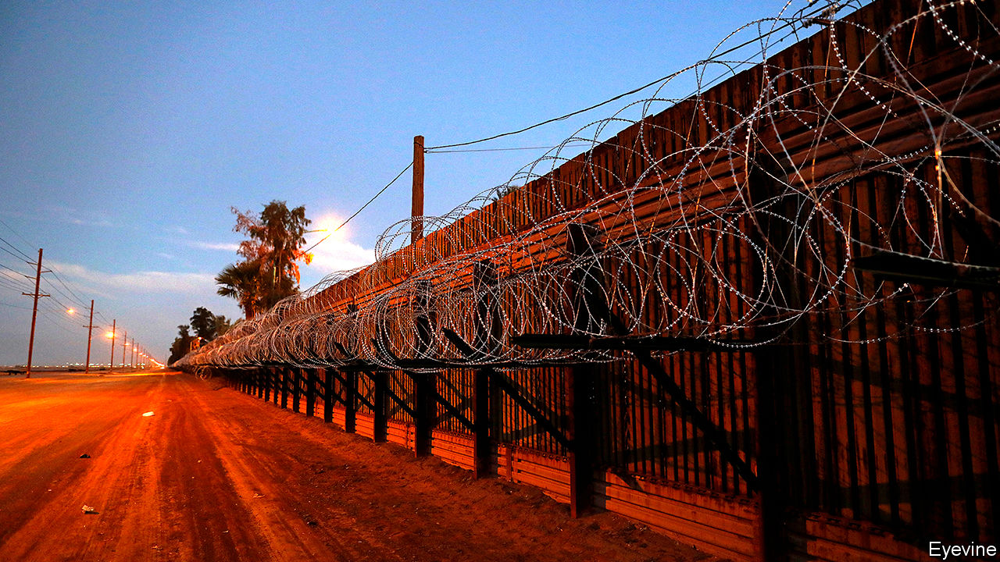

###### Insecure

# A new law might hobble the US-Mexican fight against drug cartels 

##### US agents fear sharing more information in case their sources are murdered 

 

> Jan 2nd 2021 


MEXICO CAN be relieved to finish the Trump era in one piece. Swingeing tariffs and border closures, ever threatened, never came. Nor did the bill for a wall on America’s southern border which Donald Trump promised to build at Mexico’s expense. The president’s attack on the North American Free Trade Agreement, which includes Canada, catalysed advocates of trade and integration. One could almost conclude that Mr Trump will leave relations between the two countries sturdier than he found them.


But the Trump show always has a twist. On October 15th Salvador Cienfuegos, Mexico’s defence minister from 2012 to 2018, was arrested in California on drug-trafficking charges, which he denies. Mexico was furious to learn that the United States had investigated him in secret for years.


On November 18th, in a shocking reversal, the United States dropped the charges against Mr Cienfuegos, who returned swiftly to Mexico. Court documents cite “sensitive and important foreign policy considerations”, implying that Mexico threatened to halt cross-border security co-operation if Mr Cienfuegos did not go free. Prosecutors in the United States cannot recall any other occasion where a foreign government has appeared to snatch its own citizen from the jaws of America’s criminal-justice system so brazenly.


The episode, described by one American official as “a total shitshow”, has complicated the Mexican-American relationship just as it had at last seemed to be getting simpler. The lack of trust shown by the United States has awoken anti-yanqui sentiment among left-wing supporters of Andrés Manuel López Obrador, Mexico’s populist president. The backlash was sharp: by December 15th Mexican legislators had rushed through a law that wraps red tape round foreign agents on Mexican soil, complicating American anti-narcotics work. It serves as a warning to Joe Biden that no love-in awaits when he assumes the presidency on January 20th.


In fact, Mr López Obrador, known as AMLO, seems sad to see Mr Trump go. He has spent two years schmoozing his counterpart. As president-elect, Mr López Obrador, a keen writer, sent a letter to Mr Trump observing that they had both risen to “displace the political establishment”. Although relations under Mr Trump were always one tweet away from a crisis, Mexico kept calm. AMLO sent troops to patrol the border, publicly praised Mr Trump and waited six weeks to congratulate Mr Biden.


For all that, AMLO could not abide the arrest of Mr Cienfuegos. “Do you think Canada, France or Great Britain would be OK if the Americans detained their defence secretary without telling them?” wonders a Mexican official. But sovereignty is not the only concern. A foreign trial of Mr Cienfuegos might have unearthed various scandals. A stain on Mexico’s army would cast doubt on the wisdom of AMLO’s strategy to put it in charge of new infrastructure.


The case against Mr Cienfuegos was initiated not by Mr Trump but by prosecutors in New York’s Eastern District (EDNY). In a letter to a federal judge, they explained that the investigation was built around a wiretap of Mr Cienfuegos’s Blackberry, in which he allegedly conspired with leaders of H-2, a lesser-known Mexican cartel.


The prosecutors who would have tried the case—had charges not been dropped—have become familiar with Mexico’s underworld over the past decade, applying tricks they honed against the Italian mob. In 2019 they secured the conviction of Joaquín “El Chapo” Guzmán, a drug lord who was extradited after twice escaping from his Mexican prison cell. The same year they charged Genaro García Luna, Mexico’s security minister in 2006-12, with accepting bribes from El Chapo’s Sinaloa cartel (AMLO has also asked the United States to extradite Mr García Luna back to Mexico, where charges await). The district has no plans to stop chasing big fish abroad; the cases are as prestigious as they are consequential.


But such cases rely on precisely the kind of evidence that will be tougher to gather under Mexico’s new national-security law. It requires foreign agents to share all information gleaned from activities on Mexican soil with the authorities there. All Mexican officials who speak to agents must file written reports. And agents themselves have no immunity if Mexico deems them to have overstepped their bounds.


Cases painstakingly built against past kingpins would have been severely hampered had this law existed at the time, says one of the EDNY prosecutors in the El Chapo case: to share intelligence on a cartel from a confidential source is to risk that source’s life. Mexican officials scoff at the notion that the United States deems their government trustworthy enough to receive weapons, but not information.


The security relationship is at a critical juncture. American agents will have to choose between violating Mexico’s trust by ignoring the law and conducting feebler investigations from American soil. Cartels are trafficking ever deadlier drugs, such as fentanyl, to American consumers. Mexico is on track to notch up a record murder rate for the fourth year running. The United States has allocated $3.1bn since 2007 to improve Mexican law enforcement, but AMLO has stopped spending those funds and wants them redirected to “development” of Mexico’s poorest states.


Though erratic and obsessed with migration and trade, Mr Trump was incurious about Mexico. Benign neglect suited AMLO. A Biden administration will act methodically and show more interest. Mexican officials fear future tiffs over labour rules, human rights and the environment. Even if Mr Biden is able to put crime-fighting collaboration on a stable footing, the post-Trump era will not be easy. ■

