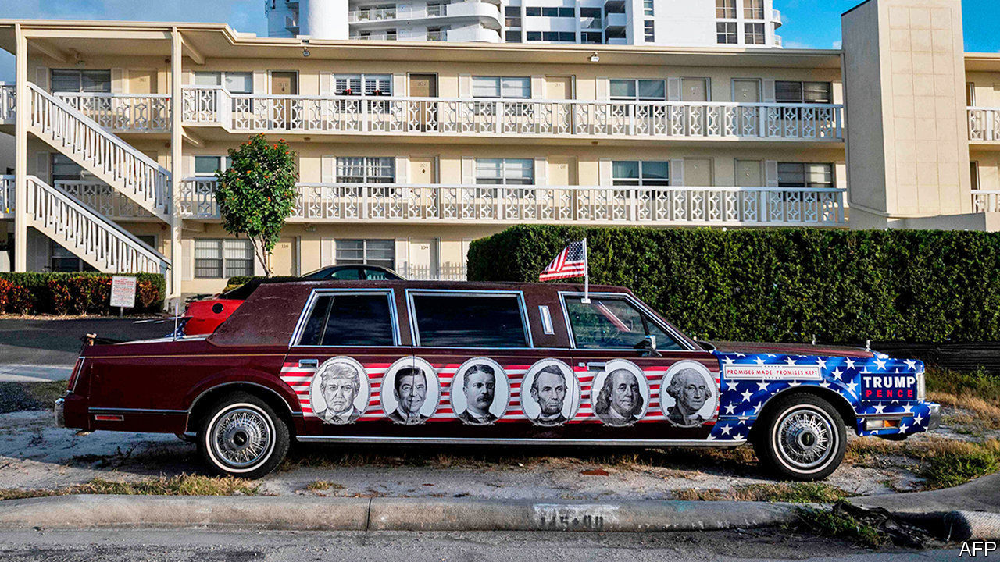

###### Trump the merciful

# All the president’s pardons 

##### How many norms can Donald Trump break before he leaves office? 

 

> Jan 2nd 2021 


WHEN AMERICA’S founders included in the constitution the power to “grant reprieves and pardons for crimes against the United States”, they sought to hand presidents a “benign prerogative” to show mercy to repentant law-breakers and “restore the tranquillity of the commonwealth”, as Alexander Hamilton put it in Federalist 74; without such a tool, he fretted, “justice would wear a countenance too sanguinary and cruel”. Opponents worried that it would tilt the nation towards “vile and arbitrary aristocracy or monarchy”.


The anti-federalists, it seems, were right to be concerned. On December 22nd and 23rd President Donald Trump put his signature on nearly 50 eyebrow-raising pardons and commutations. The beneficiaries included his longtime confidant, Roger Stone; his former campaign manager, Paul Manafort; and several others prosecuted as part of Robert Mueller’s investigation into Russian interference in the 2016 election. Others were Charles Kushner, Ivanka Trump’s father-in-law, who spent two years in prison for witness-tampering and tax evasion; three former Republican members of Congress convicted of fraud and financial misdeeds; and military contractors responsible for killing unarmed civilians during the Iraq war.


Removing these figures from the naughty list sets the 45th president apart from his predecessors. In the eyes of Ben Sasse, a Republican senator from Nebraska, the pardons are “rotten to the core”.


Article II, section 2, clause 1 of the constitution affords presidents latitude in granting clemency. The only limit noted in the text is a bar on pardons in the case of impeachments. Over the years courts have leant toward an expansive reading of the power: in 1866, the Supreme Court said pardons may be offered before an individual’s conviction or even indictment, and no ruling has prohibited presidents from extending mercy to friends or family members.


But protocols and norms have guided the process. A body within the Department of Justice—the office of the pardon attorney—assists presidents in deciding to whom they should extend mercy. The pardon attorney assesses candidates according to criteria such as “post-conviction conduct, character and reputation”, “acceptance of responsibility, remorse and atonement” and “official recommendations and reports” from federal prosecutors or judges. Yet Mr Trump has taken on the task largely by himself, bypassing the office for all but a few of his pardons.


Presidents have often employed the pardon power in line with Hamilton’s hopes. George Washington pardoned the Whiskey rebels (spirits producers who rioted against a tax on their goods) in 1795. Abraham Lincoln pardoned many Confederates during the civil war to encourage them to give up their drive towards secession and chart a path for the union’s reconstruction. Gerald Ford’s pardon of Richard Nixon after he resigned the presidency and Jimmy Carter’s pardon of Vietnam draft-dodgers were in a similar mould: helping the nation heal after a period of trauma. Barack Obama commuted the sentences of more than 1,000 inmates serving time for mostly non-violent drug offences.


Mr Trump’s pardons are different. In July Mr Stone received a commutation of his prison sentence for lying to Congress and obstructing the Russia investigation to protect Mr Trump; he got a full pardon on December 23rd. Mr Manafort, who at first co-operated with the Mueller investigation before lying to prosecutors, showed enough loyalty to attract Mr Trump’s sympathy. George Papadopoulos, an early target of Mr Mueller’s investigation, admitted his crimes and acknowledged to a judge that his lies to federal agents “could have harmed our nation”. In justifying his pardons of these and other figures pursued by Mr Mueller, Mr Trump referred to the Russia investigation as a “hoax” and as the “greatest witch hunt in American history”.


He offered a similarly thin rationale for coming to the rescue of four former contractors at Blackwater, a private security company founded by Erik Prince, the brother of Betsy Devos, Mr Trump’s education secretary. The men had been found guilty of killing at least 14 Iraqis, including two children, in 2007. The indiscriminate shooting, grenade-throwing and sniper fire into Baghdad’s crowded Nisour Square was dubbed the “My Lai massacre of Iraq” by FBI investigators. Mr Trump praised the quartet for their “long history of service to the nation”, and noted support for their pardons by fringey Republican congressmen like Steve King and Louie Gohmert.


Mr Trump is hardly the only recent president to take liberties with the pardon power. George H. W. Bush pardoned six people involved in the Iran-contra scandal he had tolerated as Ronald Reagan’s vice-president. Bill Clinton drew criticism across the political spectrum when he pardoned Marc Rich, a fugitive tax-evader who raised millions for the Democratic Party and whose wife contributed nearly $500,000 to Mr Clinton’s presidential library. But no president comes close to Mr Trump’s ratio of self-serving pardons to those issued in the interest of mercy or national welfare.■


Dig deeper:

Read our , and then sign up for Checks and Balance, our  and  on American politics.

