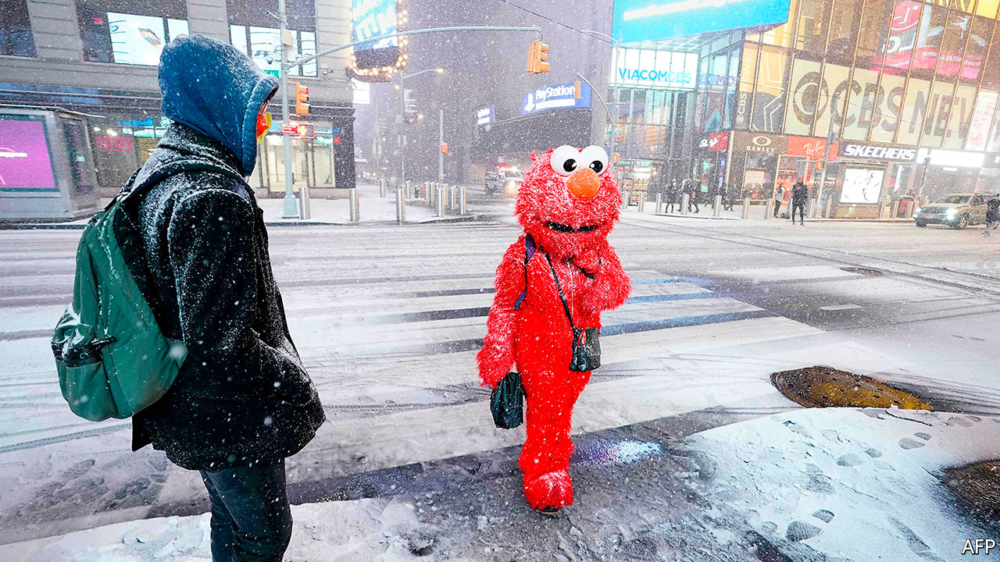
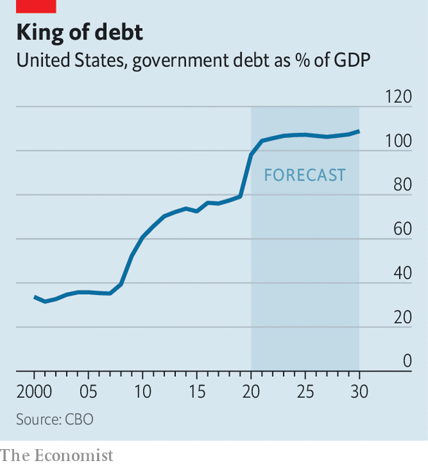

###### A hairy moment

# Congress injects a further $900bn of stimulus into the American economy 

##### Donald Trump has managed to make himself peripheral to the biggest legislative acts of his presidency 

 

> Jan 2nd 2021 


ONE IN EIGHT American adults in December reported going hungry during the previous week. This was, according to the Census Bureau’s regular surveys, the worst result of the final three months of 2020. That tracked other measures of financial distress—the share of Americans estimated to be in poverty or reporting difficulties paying for housing—which have increased as the covid-19 epidemic entered a third, wintry phase and chilled the economic recovery. The burden has been felt most by the disadvantaged: in households with less than $25,000 in income, 32% of adults reported having to miss meals in the past seven days. More than 40% of black and Hispanic renters have little to no confidence in being able to pay for housing in the coming month.


All this—to say nothing of the death toll of the virus, which is now above 330,000—got worse while Congress debated for seven months whether the economy needed more support. The big fiscal stimulus passed in March, costing $2.2trn, made a real and measurable dent in hardship in the first months of virus-induced lockdowns. One-time cheques of $1,200 for most American adults and generous top-ups of $600 a week to unemployment benefits were part of a temporary experiment with a European-style safety-net. Government expenditure in 2020 increased by about 50% compared with the previous year, easily the greatest increase since 1963, when the Congressional Budget Office started counting. The result was that the savings rate among families went up, not down. Poverty was probably cut by 15%, the biggest one-off reduction recorded since measurement began.


Many of the provisions in that first stimulus expired in the summer of 2020, as Democrats and Republicans failed to reach an agreement on a successor stimulus bill. Poverty crept back up beyond its old levels. The impasse was broken only after the presidential election was (mostly) past, and as negotiations were tied to legislation needed to keep the federal government open. At the last possible moment, days before the end of the legislative term, a compromise was reached.

 


Frantic negotiations led to a 5,600-page piece of legislation to spend $900bn released only a few hours before it was passed by large majorities of both chambers. It is more modest than the previous stimulus. The weekly top-up to unemployment benefits will be $300, and these payments will only go on until March. Another round of cheques, worth $600 this time, will be disbursed to most Americans. A moratorium on evictions will be extended, though it is not clear what will happen to the mountain of rent arrears or what compensation is owed to landlords.


President Donald Trump, self-proclaimed master of the art of the deal, will close out his presidency having never abandoned the role of bit-player to the various legislative dramas of his term—from the failed attempt to repeal Obamacare, to the tax cuts passed in 2017, to the spending bonanza triggered by covid-19. Still, his final performance should take the prize for buffoonery. The day after Steven Mnuchin, the treasury secretary and the president’s chief negotiator, called the bill “fabulous” as it passed Congress, Mr Trump decided that it was really a “disgrace” and suggested he would veto it unless the cheques were supersized to $2,000 per American. This red line had not been mentioned by the White House as it was negotiating with Democrats in Congress; the excessive spending on foreign aid that Mr Trump also expressed disdain for was the same amount his budget office had called for in its request to lawmakers.


Having vented his frustration with Congress (and especially with Republicans who are only lukewarmly entertaining his efforts to overturn his election loss), Mr Trump relented and signed the legislation on December 27th, two days before the federal government would have shut down. The deal-master’s tantrum was not without consequence, though. He has put Mitch McConnell in a bind: the Senate Majority leader would rather not have a vote on increasing the cheques to $2,000, as the president is still calling for, making him a target of the presidential Twitter feed.


Only a few more weeks of Mr Trump’s drama remain. For Joe Biden, the president-in-waiting, the new stimulus sets the initial economic conditions for his administration. It is a short window. The enhanced unemployment benefits will expire before his first 100 days are up, and probably before widespread vaccination triggers an economic recovery. Mr Biden has expressed interest in a subsequent round of stimulus, perhaps one tethered to a green infrastructure programme, but his legislative leverage may prove limited.


In approximately three weeks’ time, Republicans are likely to become overwhelmingly concerned with the federal deficit and the national debt (which ballooned during the Trump administration). This will be the main cudgel used to clobber Mr Biden’s policy ambitions. Indeed, this is likely to be the final round of stimulus if Democrats fail to flip two Senate seats in Georgia, which will be decided by a run-off election on January 5th.


In the ideal version of American politics, economic-recovery legislation would be proportionate to crisis indicators, not the partisan affiliations of elected officeholders. Hunger and housing insecurity need to start subsiding before the need for additional support to households is ruled out. As the year of lost learning for many American pupils starts to register in standardised-test results, a programme of tutoring to make up lost ground may be necessary. In reality, the rapidly constructed European-style safety-net is time-limited. Covid-19 has highlighted, again, how desirable it would be to for stimulus measures to kick in automatically when the economy is weak. The seven months of will-they-won’t-they brinkmanship make the current approach suboptimal. But Congress has managed to pass a stimulus, while also showing how poverty might be reduced in future. That is something to cheer. ■


Dig deeper:

Read our , and then sign up for Checks and Balance, our  and  on American politics.

