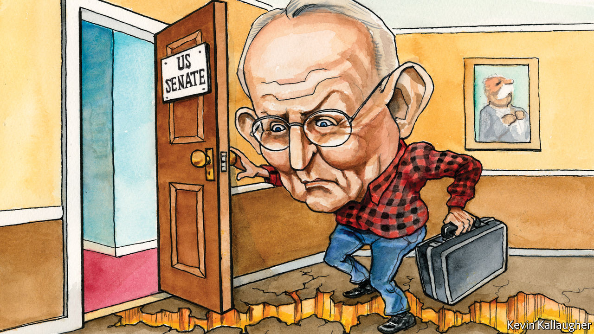

###### Lexington

# The Senate will be worse off without Lamar Alexander 

##### The veteran Tennessean dealmaker was a rare legislator 

 

> Jan 2nd 2021 


ABOUT THE only light note of a grim Christmas season on Capitol Hill was provided, characteristically, by Lamar Alexander. At the end of a gruelling negotiation of the $900bn stimulus that President Donald Trump belatedly signed this week, the 80-year-old Tennessean, who will retire from the Senate in January, took to a piano in the Hart building to play carols.


Bipartisan admirers of Mr Alexander, one of the last reliable dealmakers on the Hill, gathered round. Amy Klobuchar of Minnesota swayed to the performance while Susan Collins of Maine filmed it on her phone. Tim Kaine of Virginia joined his fellow former governor on the harmonica for a rendition of “Go Tell It on the Mountain”. Billing themselves as “The Amateurs”, the two senators once played together at a music festival on the Tennessee-Virginia border. Theirs was a rare bipartisan act in what has been by some length the most unproductive Congress ever. “I’m really going to miss both his friendship and leadership,” said Mr Kaine of his departing co-performer.


The regard for Mr Alexander on the left is not for his moderation, exactly. As he underlined during an interview in his Senate office—amid a clutter of packing-cases and ancient campaign souvenirs—he is fiercely partisan on most issues. He has an A rating from the National Rifle Association and a mediocre one for bipartisanship from the Lugar Centre. He has also capitulated to Mr Trump. Despite speculation last year that he might join Mitt Romney in voting to convict the impeached president, Mr Alexander ended up voting to bar witnesses from his trial. There would be no point, he said, because the charges levelled at the president had been proved. He voted to acquit him anyway.


Yet, unlike many in his party, Mr Alexander hews to the traditional view of the Senate as above all a place to pass laws. And as a former education secretary and two-term governor, he knows how to do so, including by compromising. He has thereby maintained influence both within his party and across the aisle, a rare balancing-act, which has made him unusually effective.


Mitch McConnell, a lifelong friend, choked back tears in praising Mr Alexander as “one of the most brilliant, most thoughtful and most effective legislators any of us have ever seen.” Thus, for example, when he rallied 99 senators behind a package of measures against the opioid crisis in 2018. Or when he united Paul Ryan, Mr McConnell and Barack Obama behind a sweeping education reform in 2015—for which Mr Alexander still praises the former president: “I found him to be a very straightforward, well-informed and effective partner.” It is harder to imagine a genuine moderate Republican such as Ms Collins, or one less trusted by the party leadership, such as Mr Romney, pulling off such feats. Discouragingly for those who hope Joe Biden’s return-to-sanity candidacy might ease the Senate’s deadlock, however, the rarity of Mr Alexander’s performance also suggests how hard that will be.


The retiring senator attributes much of the dysfunction to technological change: “We live in this new internet democracy which pushes everything to the extreme.” But that underplays the structural changes the Senate is undergoing. Following a path trodden by the House of Representatives, the ideological gap between its most left-leaning Republican and most moderate Democrat is growing. And most senators have little incentive to try to bridge it. Hotheads in both parties will brand compromise with the other side as surrender: the president has himself denounced most of the few bipartisan bills he has signed. Oscillating control of the Senate—as illustrated by the all-American drama of Georgia’s looming run-offs—has given a method to that madness. With control of the chamber at stake, the opposition party is rarely willing to help the governing one succeed. The bipartisan stimulus deals, forged amid calamity, shows what it takes to buck this trend. “The political rewards for working in the middle are diminished,” Mr Alexander acknowledged.


The extent to which he has carried on regardless is impressive. Beyond his abilities, it probably owes something to the political tradition of his eastern Tennessee stronghold. A redoubt of “mountain Republicanism”, a strain of Appalachian populism, its voters have long been relaxed about the government-expanding compromises Mr Alexander has sometimes made. Yet not even he could survive the past four years unscathed.


By his own admission, he has not come close to tackling any big national issue—such as immigration or health-care policy—under Mr Trump. The president’s relentless warring has made the necessary compromises impossible. This has in turn made Mr Alexander’s balancing-act between the parties untenable. He is too independent-minded to be trusted by the Trump party. Meanwhile, notwithstanding their old regard for Mr Alexander, Democrats are now likelier to raise his strained apologism for the president than his dealmaking.

Marring Lamar


He gave Lexington a taste of that contortion, by responding angrily to a question about his party’s commitment to electoral democracy. Though he acknowledged that almost two-thirds of Republican House members and state attorneys-general had bent to the president’s demand and signed a motion to invalidate the results in the four battleground states that gave Mr Biden victory, Mr Alexander considered the question not merely provocative but offensive. He suggested, implausibly, that the failure of the Democratic candidate, Stacey Abrams, to concede a gubernatorial race in Georgia two years ago was no less a threat to American democracy.


Your columnist did not enjoy that exchange; but found it revealing. A survivor from a better age, Mr Alexander has found a space to operate between the two parties that few could. Yet not even he can negotiate the current madness. The result is a lesson for Mr Biden. And an unworthy end to a fine career.■


Dig deeper:

Read our , and then sign up for Checks and Balance, our  and  on American politics.

