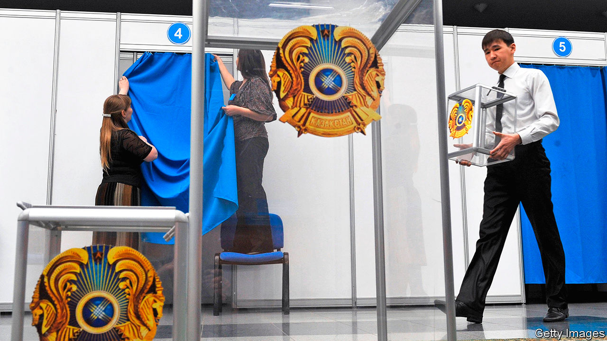

###### Five different ways to applaud

# All the parties in Kazakhstan’s election support the government 

##### The president has not provided the “political competition” he promised 

 

> Jan 9th 2021 


WHEN KAZAKHSTAN’S president came to power two years ago, he made pronouncements that counted as radical in a country that had only just emerged from three decades under a single strongman. Painting himself as a cautious reformer, Kassym-Jomart Tokayev promised “political competition” in the oil-rich Central Asian state. That marked a change from his predecessor, Nursultan Nazarbayev, who won several elections with more than 90% of the vote and seldom faced any opposition from the rubber-stamp parliament. Yet the general election to be held on January 10th—the first since Mr Nazarbayev resigned in 2019—seems even less democratic than the six previous contests since Kazakhstan became independent in 1991. For the first time, no genuine opposition parties will appear on the ballot.


The ruling Nur Otan party will win in the usual crushing landslide. Led by the 80-year-old Mr Nazarbayev, who continues to pull the political strings, Nur Otan has promised to improve public services and create jobs—tasks made all the more urgent since the pandemic induced an economic slump.


Four parties are in theory competing with Nur Otan. All of them are staunch supporters of the government, however. None saw any reason to discuss allegations aired by Radio Liberty, an American-funded website and radio station, that the Nazarbayev family owns a global property empire worth some $800m. One of the parties, Adal, is staffed by several colleagues of Mr Nazarbayev’s son-in-law, Timur Kulibayev, a wealthy investor and chairman of a business lobby group. The Financial Times recently accused Mr Kulibayev of profiting from inflated procurement contracts during the construction of a gas pipeline—a claim he denies.


Voters can also opt for a party campaigning on rural issues or for one of two parties that loyally assisted the government in the outgoing parliament: Ak Zhol, which is led by a former functionary from Nur Otan, and the People’s Party of Kazakhstan. The National Social Democratic Party, a more credible opposition force, declined to run after receiving an unwelcome endorsement from Mukhtar Ablyazov, a Kazakh oligarch based in France whose own political movement is banned. Determined to act as spoiler, Mr Ablyazov is now urging his supporters to back Ak Zhol, which will allow him to depict its voters as fans of his, whatever their true intentions.


Since Mr Tokayev promised greater pluralism, not a single new party has received the necessary government approvals to register. “No one is erecting any obstacles for them,” Marat Beketayev, the justice minister, insisted last month. Indeed, the government claims to have made it easier for new parties to register, by reducing the number of avowed supporters required. The changes were part of a package of reforms billed as creating what the president called a “Listening State”.


Yet the authorities have still found reason to refuse eight applications to form new parties over the past two years. Most recently it turned down Nurzhan Altayev, an ex-MP expelled from the ruling party for questioning the government’s handling of the pandemic, on the ground that some of the people on the list of supporters he provided were dead. “We see that Tokayev’s promised reforms were just idle talk,” complains Zhanbolat Mamay. His attempt to register a party last year failed when several delegates were arrested on their way to its founding conference.


International observers monitoring previous elections have complained of ballot-rigging. This time there will be little scrutiny. The Organisation for Security and Co-operation in Europe is sending a delegation of just 35, even though Kazakhstan covers an area the size of western Europe. Draconian new restrictions have hobbled domestic monitors, leading Maria Lobacheva, who campaigns for greater popular engagement with politics, to label the election an “insiders’ get-together from which observers and voters are excluded”. Some activists are calling for street protests like those that accompanied Mr Tokayev’s election as president in 2019. But this year apathy may trump anger, if the scant turnout at recent demonstrations is any guide. Others are urging citizens to express dissatisfaction by spoiling their ballots. Yet others suggest a boycott. It is all the political competition the country is likely to get. ■

