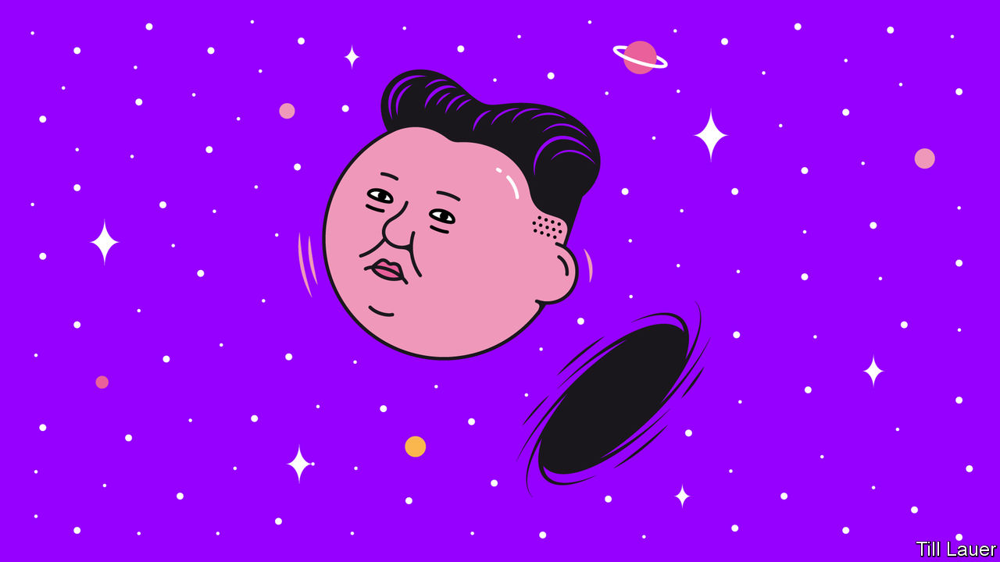

###### Banyan

# Is North Korea’s dictator losing his touch? 

##### Kim Jong Un is neglecting the rituals of leadership as the economy founders 

 

> Jan 9th 2021 


WHEN KIM JONG UN, North Korea’s third-generation despot, penned a short, bland greeting to his people to run as a splash in the year’s first edition of the state mouthpiece, Rodong Sinmun, it triggered an avalanche of speculation among Pyongyangologists—over what Mr Kim did not do. Since the founding of the communist state, a near-annual staple has been a prolix new year’s address by the country’s leader, trumpeting the regime’s accomplishments and the glories to come. Like Chinese emperors conducting Confucian rites, the address confirmed the Kims at the summit of a divinely ordained order. Unlike his father and grandfather before him, Mr Kim, in power since 2011, has typically delivered the speech in person. Yet last year he simply published a long screed, and this year there was no paean at all.


Perhaps Mr Kim was keeping his powder dry for an important congress of the ruling Workers’ Party of Korea, only the second since 1980? That opaque conclave duly opened on January 5th—without any ritual address from the leader. In its place was a bald admission of failure. The goals of his country’s five-year economic plan, launched in 2016 and promising sunlit uplands, were, Mr Kim admitted, “immensely underachieved in almost all sectors”.


Although the Kim dynasty is founded upon myth and mendacity, he could not have easily dissembled. Last year’s economic outcomes in an already broken country were dire. Trade collapsed by an estimated 80% (just $1.6m of goods officially crossed the border with China in October). The informal markets and private enterprise upon which millions of North Koreans now depend have struggled to fill the gap. Shortages are growing, with the prices of vegetables and fruit rising sharply. Even upscale supermarkets in Pyongyang, the pampered capital, have run out of sugar, cooking oil and toothpaste, according to NK News, a website based in Seoul.


Closing the borders in early 2020 in response to the covid-19 pandemic came on top of North Korea’s diplomatic isolation. For both acts of self-harm, the blame lies squarely with Mr Kim. He calculated that provocative missile and nuclear tests would force America to negotiate. For a time this strategy seemed as if it might work on President Donald Trump, who expressed admiration for the North Korean ruler. But Mr Kim overplayed his hand. Talks failed, and sanctions were only tightened. Perhaps Mr Kim hoped that a second term for Mr Trump could get the personal chemistry fizzing again. Instead, he faces a level-headed Joe Biden.


As for the coronavirus, Mr Kim saw it as a threat to his regime and shut the crucial border with China—border guards even shot at storks suspected of carrying the virus. The country’s decrepit health system could surely not handle a pandemic. Meanwhile, as Benjamin Katzeff Silberstein points out on the Australian National University’s East Asia Forum, admitting foreign epidemiologists would have opened the country to the risk of foreign spies and unsavoury ideological influences. But this extreme response comes at an immense human cost. The economy, says Andrei Lankov of Kookmin University in Seoul, seems to be “beginning to fall apart”. Hunger once again stalks the land.


If he cared about his people, Mr Kim would welcome foreign vaccines, even if outsiders helped distribute and administer them. The party congress would also initiate the kind of market reforms that set communist China and Vietnam on the path of growth (and which North Korea briefly appeared tempted to embark on early in Mr Kim’s rule). Far more likely, the congress will herald a new era of state control over private enterprise, harming livelihoods even more.


Mr Lankov reckons the regime faces its greatest test since a famine more than 20 years ago brought on by the incompetence of Mr Kim’s late father and grandfather. The regime survived that test despite the deaths of more than 500,000 North Koreans. Today, though, the people know much more about the outside world. They have grown less deferential to authority. And they are used to coping without the state: they might react angrily to the reimposition of central control.


That is not to say that the Kim dynasty is on the brink of collapse. But even small disturbances may be seen, both at home and abroad, as a sign of unravelling. The regime’s rituals project Mr Kim—morbidly obese, smoking heavily and cosseted in his palaces—as the irreproachable bearer of a heavenly mandate. It is a message he may soon need to reinforce.

