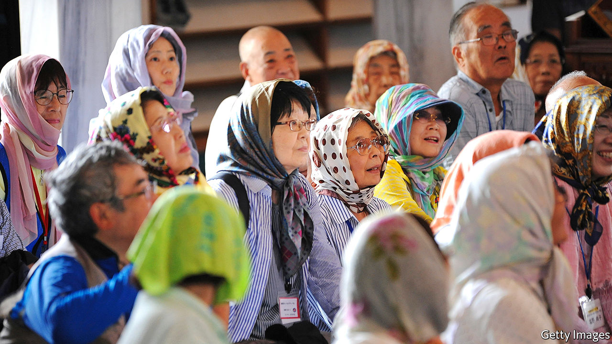

###### Hiji hajis

# The number of Muslims in Japan is growing fast 

##### But locals are wary of building facilities for them 

 

> Jan 7th 2021 


EVERY FRIDAY scores of Muslim men and women stream into a mosque in an unassuming four-storey building in Beppu, a hot-spring mecca on Kyushu, the most southerly of Japan’s big islands. Many are students who study nearby at Ritsumeikan Asia-Pacific University (APU) and work part-time at the hotels around town. Others have come to man the fishing boats and shipyards that the ageing and shrinking local population can no longer fully staff.


The ranks of worshippers have grown in recent years, as the government has sought to attract more foreign workers and students. The number of Muslims living in Japan, though small, has more than doubled in the past decade, from 110,000 in 2010 to 230,000 at the end of 2019 (including as many as 50,000 Japanese converts), according to Tanada Hirofumi of Waseda University. The country boasts more than 110 mosques. That is a welcome change, notes Muhammad Tahir Abbas Khan, a professor at APU and the head of the Beppu Muslim Association (BMA). In 2001, when he first arrived from Pakistan as a graduate student, there were only 24 mosques in the country and not a single one on Kyushu.


Yet while Muslims now have more opportunities to pray, they still struggle to find final resting places. Some 99% of Japanese are cremated, a practice Islam forbids. The central government has no system for catering to the needs of foreigners with different customs, in part because foreign workers are seen as visitors rather than permanent migrants. Most prefectures, including Oita, where Beppu is located, have no Muslim cemeteries. The BMA has spent years trying to construct one in Hiji, a constellation of hamlets in the hills beyond Beppu, but local resistance has stalled the project. “If I die today, I don’t know where I will be buried,” Mr Khan laments.


The dispute over the cemetery has become a proxy for a broader debate about foreigners’ place in Japanese society. Some Japanese have embraced their new neighbours, unfamiliar customs and all. “Since they’re Japanese now, we should start understanding who they are and what their culture is,” argues Kawabe Yumiko, a town councillor who supports the cemetery. “A small town can be international and diverse.” Others disagree. “If they got Japanese nationality, they should follow Japanese customs and cremate the bodies,” says Eto Kiyotaka, another councillor, who initiated a petition against the cemetery.


The BMA began searching for a burial ground nearly a decade ago. The local Catholic church agreed to share its cemetery while the BMA looked for one of its own. Talks with the city government went nowhere, but a friendly Buddhist monk helped the BMA find a plot on an uninhabited hillside in Hiji, not far from a Trappist monastery with a disused cemetery. Mr Khan says the group has sunk ¥60m-70m ($582,000-679,000) and nearly three years into the project. Time has now run out: the Catholic cemetery is full. But as the start of construction approached, residents of nearby hamlets raised fresh concerns. Will the bodies contaminate the local water supply? Might the corpses fall out of the hillside during an earthquake?


The idea of burying bodies strikes many in Hiji as unclean. “It’s not something concrete, just a feeling,” says Mr Eto. “We won’t be able to drink the water with comfort.” Mr Eto has lived his whole life in a small hamlet of traditional homes and terraced rice paddies. So too did his forebears as far back as he can count, at least four generations. Until the hearings over the cemetery began, he had never met a Muslim. He says he has nothing against the religion, but worries that bacteria will leach into a reservoir close to the planned site. He wonders why the city does not allow interment in public cemeteries: “If the government isn’t doing it, there must be some problem.”


Ms Kawabe, in turn, wonders if it is really the water that concerns her compatriots. Scientific evidence about the safety of burials goes ignored. Her support for the cemetery prompted a flurry of angry calls and letters. “They say to me, ‘You’re Japanese, why are you on the side of the Muslims?’” Locals fret about an influx of visitors and the prospect of an Islamic school opening next. “Many people are scared,” she sighs.


That is a shame, Mr Khan says, because Japan is otherwise “a nice place to live”. Muslim migrants appreciate Japan’s security, cleanliness and functionality. “Anzen, anzen,” coo a group of Indonesian fishermen in Tokyo, repeating the Japanese word for “safety” when asked about life in Japan. The people are “so kind”, says Ben Madaliev, who came from Uzbekistan on a scholarship to study business at APU. Colleagues at his part-time job accepted his need to pray five times a day, and now even remind him when he is late for his prayers. Though negative stereotypes about Islam abound, most Japanese have little first-hand experience of it and remain open-minded. “It’s much better than going to the West,” reckons Ali, an Uzbek student living in Tokyo.


In some ways, integration has been progressing. The airport in Fukuoka added a prayer room, notes Mr Khan. Halal shops and restaurants remain few and far between, but more are opening, especially as more Muslim tourists from South and South-East Asia visit Japan. Prefectural officials in Oita asked for the BMA’s help to set up a system of certification for local restaurants. Some hot springs even sell bathing shorts for Muslims. The community in Beppu won over locals by cooking and distributing food to those displaced by a big earthquake in 2016. They host yearly festivals and weekly free dinners at the mosque, aimed at establishing good relations with their Japanese neighbours. “We’re trying to integrate,” Mr Khan says. “We adopted Japan as our home country.” ■

