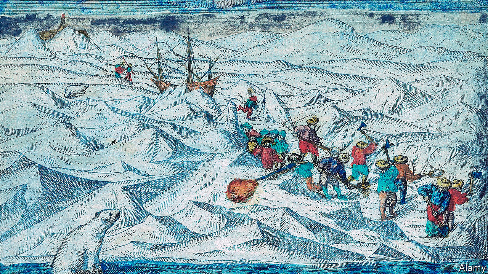

###### Northern exposure

# The Arctic misadventures of William Barents 

##### He and his successors pursued an ancient dream of a polar trade route 

 

> Jan 9th 2021 


Icebound. By Andrea Pitzer. Scribner; 320 pages; $29. Simon &amp; Schuster; £20.


WHEN WILLIAM BARENTS, a Dutch navigator, sailed to the Arctic in 1594, he was pursuing the dream of a warm northern ocean first posited by the Greeks. The idea of a polar trade route to the Orient—above North America or the Russian Far East—enticed European explorers for centuries. Yet it proved a “lethal delusion”, and Barents’s missions a template for many harrowing trials.


Beyond the sea north of Scandinavia that bears his name, Barents and his tale are little known. Considered “the first true polar voyage”, his quest was eclipsed by the 19th-century exploits of Robert Peary and the ill-fated expedition led by John Franklin. Andrea Pitzer, an American journalist, recently sailed the same seas to Nova Zembla to recount this earlier, nail-biting feat of seafaring.


Backed by Dutch merchants keen to make their fledgling state a maritime power, Barents made three journeys north in the 1590s. Ms Pitzer relies not just on a 19th-century translation of the journals of Gerrit de Veer, who accompanied the voyages, but on a previously untranslated account by a merchant representative. The polar ice was insurmountable on the first two expeditions; they were largely uneventful and barely stir a reader’s blood. But once Barents heads for the northern tip of Nova Zembla for the third time in May 1596, the story becomes dramatic, and dire.


He and his crew break away from a companion ship to forge on alone, determined to be first to find the elusive passage. For weeks the 17 men fight off polar bears that rear up from nowhere, attacking until they are slaughtered or driven away. The ship tacks endlessly and desperately to escape floating “mountains of steel”: icebergs so impenetrable that the only way through is to drill holes and pray they will split apart. By mid-September the vessel is frozen fast, and the men resign themselves to overwintering “in great cold, poverty, misery and griefe”. Poorly clad and ravaged by scurvy, they are “phenomenally unprepared” for the ordeal, Ms Pitzer observes. Yet the remains of the shelter they managed to build stood for nearly 300 years.


Of the men themselves, 13 live through this long polar night—eight months of what the author neatly terms “the monotony of survival”. They dig out from continual blizzards, scavenging for fuel and Arctic foxes whose meat contains just enough vitamin C to sustain them. Still, the journey is filled with wonders: optical phenomena and mysteries unravelled, such as where European songbirds go each summer. Ms Pitzer’s descriptions of the region sing. “Bits of floating ice released tiny bubbles of air, hissing like oil in a skillet,” she writes. “The many languages of water surrounded them day and night.”


Barents’s heroism helped make the Arctic explorer a mythically resilient figure. The fantasy that drove him, meanwhile, has nearly come to pass. Arctic ice has been shrinking for several decades, with a sharp drop-off after 2006. Human ingenuity, epitomised by expeditions like his, has in 400 years made the Dutchman’s dream a terrifying reality.

