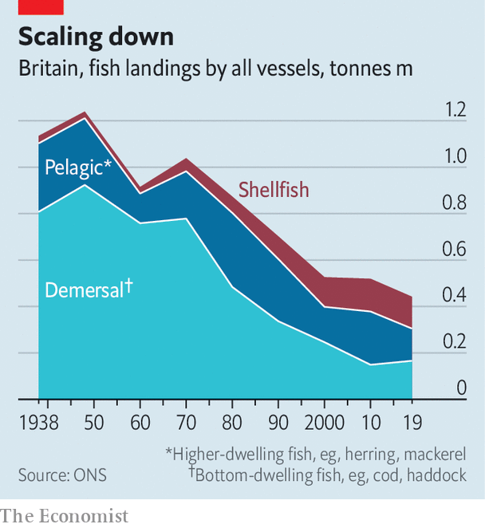

###### Brexit

# British fishermen have not escaped the Common Fisheries Policy 

##### Despite their displeasure, remaining in its net is good news for their future 

 

> Jan 7th 2021 


MANY PEOPLE were disappointed by the deal that Britain signed with the European Union on Christmas Eve, but fishermen were infuriated. “It’s the biggest con to be ever put on,” says John Clark, who catches fish and langoustines off the north-east coast of Scotland. “We have been completely betrayed—the prime minister bottled it.”


Leaving the EU’s single market was always going to be hard. Exporting fish now entails wrapping them in bureaucratic paper. And as far as catching fish goes, the deal fishermen have landed is worse than they expected. Ministers had promised them “hundreds of thousands of tonnes” more fish, and implied that Britain would get its own way in its territorial waters. Yet the deal is better than it could have been. And, oddly, it is better than it might have been if the fishermen had actually got what they wanted.


The expectation that they would do better than they did in the EU’s common fisheries policy (CFP) was not unreasonable. The CFP allocated catching rights around Europe in line with how countries were fishing in the mid-1970s. Unfortunately, many of Britain’s biggest fishing boats happened to be far away in those years, trawling the waters around Iceland, which had not yet banned foreign boats from its vicinity. Britain ended up with only a tenth of the quota for cod caught in the English Channel, for example.


The new deal is better, but only just. Over the next five years, EU fishing boats will give up a quarter of their quota rights in British waters. Domestic boats will be able to catch a larger share of mackerel (the single most valuable fish) and hake, although they will still be entitled to only a tenth of cod from the Channel. Fishermen thought they were going to be allocated exclusive rights over waters 12 miles from the coast, but they have got only six miles, the same as before. They will no longer be able to swap quotas with counterparts in other European countries.


What really annoys fishermen is that Britain will remain closely tied to the CFP. It will have to agree catch limits for every fish species with the EU, following guidance from the International Council for the Exploration of the Seas (ICES), an international outfit based in Denmark. If the two sides cannot agree, ICES limits will be enforced. Although these arrangements lapse in 2026, Britain will probably remain bound to Europe for longer: clauses in the deal allow for broad retaliation if fishing talks break down. Barrie Deas, head of the National Federation of Fishermen’s Organisations, calls it “a colonial or neocolonial arrangement”.

 


Over the long term, though, what really matters is not how the fish around Britain are divided but how many fish there are. Decades of overfishing have denuded the ocean (see chart) and occasionally caused fish populations to collapse. In 2019 landings in Britain of demersal fish such as cod and haddock were only a fifth of the 1970 level. For years the CFP abetted this destruction. British and other European politicians would listen to scientists’ advice about sensible limits, then allow catches well in excess of them.


But the CFP has improved. It now works well in northern European waters—though not in the Mediterranean. Catches are broadly within sustainable limits; discarding fish is banned, in theory. Given the tendency of fish to swim around, it is good for British fishermen in the long run that the deal binds them to the EU and compels everyone to fish sustainably. “People are saying it’s just like the common fisheries policy—we haven’t really left,” says Bryce Stewart, who studies fishing policy at the University of York. “But that is the point.”


In theory, Britain could have become a freewheeling coastal state that heeded scientific advice and co-operated with its neighbours. But in practice it would probably have been a disaster. Iceland, Norway and the Faroe Islands hold sway over their waters, and periodically get into rows with the EU over fish quotas. When talks break down, as they did in 2010 over mackerel and in 2013 over herring, countries revert to setting their own quotas, which generally add up to well above the sustainable level.


As the ocean warms, fish are migrating, making it ever more likely that negotiations will break down. And if Britain had gained full control of its coastal waters it would have been more likely to end up feuding with the EU than Iceland, Norway or the Faroe Islands do, because of the dozens of commercially important fish species that swim the English Channel and the North Sea. Although they resent it, the tighter British fishermen are bound to the EU, the better for them. ■

