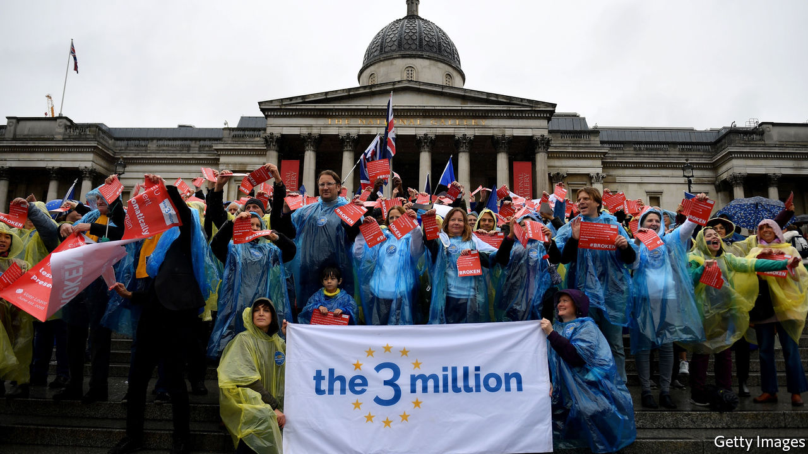
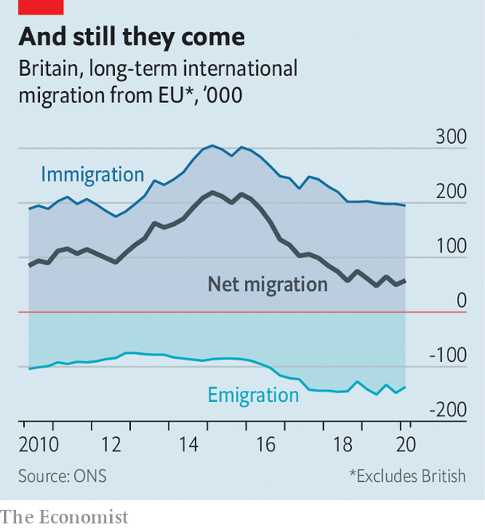
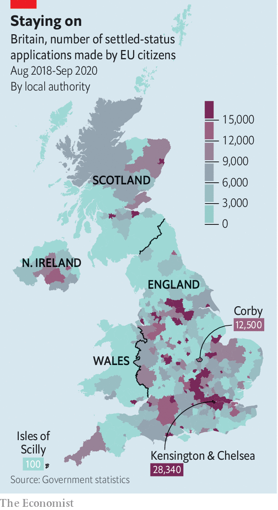

###### Migration

# European remainers will continue to shape Britain 

##### There’s some corner of an English field that is forever Poland 

 

> Jan 7th 2021 


TALK TO ONE of the 4m or so Europeans in Britain, and they will probably tell you the same story. They intended to stay for a year or so—long enough to study, polish their English or save up for a better life back home. And then, somehow, one year became two, which became 20. Maria Torrent-March came from Spain on the Erasmus programme, as part of her five-year degree. In the kitchen of her student lodgings, she met an English fellow student; soon they were dating. “Do I go back to Spain, or do I give the boy a chance?” She chose the boy.


After Britain voted to leave the European Union, many commentators predicted a “Brexodus”. Since Brexit would end free movement, dampen the economic rationale for staying in Britain and had in part been driven by anti-immigration sentiment, might not many Europeans up sticks just as easily as they had come?

 


For the most part, that has not happened. Although the pace of outflows has quickened a lot since the referendum (see chart), at least until the end of 2019—after which covid-19 makes migration data messy—more people were arriving in Britain than were leaving. The number of European nationals living in Britain rose from 3.2m in 2015 to 3.6m in 2019.


The government’s EU settlement scheme has received 4.4m applications, including one from Ms Torrent-March, who married “the boy”; they now have two daughters. Though some applications will have been filed by migrants who have since left or as an insurance policy by Europeans with no current plan to live in Britain, the numbers hardly point to a Brexodus.


Nor are most poised to leave at any moment, should Brexit bear out the direst predictions. The longer a migrant stays in a country, the less likely they are to leave, points out Madeleine Sumption of Oxford University’s Migration Observatory. By 2019, a little more than half of EU nationals had lived in Britain for a decade or more. They may have arrived footloose, but young migrants have a habit of growing older. In those ten years, some will have found good jobs, others will have earned British qualifications, got married or had children—all of which strengthened their ties to Britain. “I think most of these people will stay here for ever,” Ms Sumption says.


This suggests that, long after the last stars have worn off plaques on EU-funded projects, Europeans themselves will remain one of the most tangible legacies of Britain’s 47 years in the European club, just as several generations of Britons with Caribbean or Asian ancestry are reminders of a long-dead empire and the brief period of unrestricted immigration that flourished at its end. In time, a comfortable European-British identity may emerge, says Sunder Katwala of British Future, a think-tank. Schools are already accustomed to enrolling children with at least one European parent; some 730,000 were born to European mothers in England and Wales in 2008-19. Births have slowed since the referendum, but Polish women still head the league table of foreign-born mothers. In another generation, children with two British-born parents may talk of having a Polish grandfather in the same way many are proud of their Irish heritage.

 


This will not only be true of big cities, but also, albeit to a lesser extent, of towns and rural areas (see map). Every local authority in Britain has been listed as a residence in at least several dozen settled-status applications. Even the Isles of Scilly have a band of Poles and Hungarians. Poles are particularly dispersed: they filed more than 500 applications in 298 of the 379 local authorities, compared with the 58 which saw 500 or more French applications.


Consider Corby, a town in Northamptonshire once synonymous with unemployment after the closure of its steelworks. More than 3,000 Poles have registered to stay put, out of the town’s total population of 72,000. Corby is now a popular home for logistics firms, which favour it for its central location and ready supply of labour. Ms Torrent-March runs operations at Europa, one of the firms with a big warehouse in the town. Of her 199 employees, 113 are European, a share that has not dwindled since the referendum. EU migrants make up 24% of the town’s population—the largest share in Britain.


On the second floor of a grey shopping parade in the town, there is now a Polish private medical practice managed by Maciej Kuzma and his partner, Anna. They both worked in a warehouse when they moved to Britain, seven years ago. But they soon found more lucrative jobs and saved enough to buy the surgery in 2017, undeterred by the referendum result. “The information about Brexit was surprising, but it wasn’t something that would stop us realising our plans, our dreams,” says Mr Kuzma. “Polish history is very rich. We’ve had an extremely hard past. Maybe we’ve just got used to being forced to adapt.” They now have 13,000 patients on their books and opened their second practice last year.


But London is always likely to have the greatest number of Europeans. The posh borough of Kensington and Chelsea alone was listed in more than 5,000 applications each by French and Italian nationals. The borough’s Lycée Français Charles de Gaulle remains popular with French parents. One of them, Caroline le Luel, moved from Paris in 2005 with her four-year-old daughter and two-year-old son; in time, she enrolled both of them at the Lycée. Her son is now in his final year and her daughter is at university. Even though they were educated at a French school, “they feel outsiders a bit when they are in France. I don’t think they will settle down there at some point.”


That helps explain why the family applied for citizenship after Brexit, despite finding the vote “very emotional”. “We are out of Europe, but people have settled their lives here,” she says. “We don’t see the United Kingdom as as much of a cool place as it used to be, but we still want to stay here. This is our home.” ■

