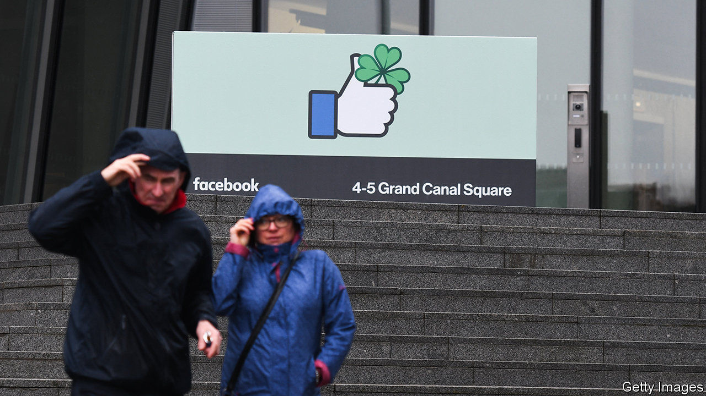

###### Chlorinated data

# Why Google and Facebook are shifting British data to America 

##### Projecting British law into California may prove difficult 

 

> Jan 7th 2021 


GOOGLE AND Facebook collect more data about what people are doing on the internet—the web pages they read, the services they use, the links they click—than any other companies. Those data are used to construct profiles of internet users, against which personalised advertisements may be sold. This year, as a consequence of Brexit, the firms are moving legal responsibility for that data from Dublin, where it has sat for the past few years under European law, to California, where both technology firms have their headquarters.


Bits of data themselves will not physically move—datasets are already copied onto servers around the planet in order to ensure reliable service independent from geography. It is legal responsibility for those bits that is moving, some time in 2021. Google and Facebook users in Britain will be informed of the move through one of the regular, tedious sets of terms and conditions which they are asked to accept.


Google’s and Facebook’s move means that British residents will no longer have recourse to European data-protection law. Rather as American food standards are easier on farmers than European ones, which leads to chicken meat being washed in chlorine, so the absence of national privacy or data-protection law in America means that its digital giants can, for instance, deploy face-recognition technology with relative ease. As long as legal authority for a profile remained in Europe, that person, regardless of location, could bring a complaint under European law. Upon acceptance of the new terms, Britons will lose the protections of European law.


In principle that should not matter. British data-protection law is a close copy of Europe’s GDPR, and Britons will still be protected by that regardless of the jurisdiction that administers their data. But practical concerns mean the transfer will make a difference. First, Britain’s Information Commissioner’s Office will face the task of regulating giant companies some 5,000 miles away, which may be a struggle for a body that has not excelled at regulating activity even on British soil. Trying to project British law, should Facebook or Google ever break it, into California will be messy, even for post-Brexit Britain at its most global. Dublin was more convenient.


Second, America’s large tech companies are now free to lobby Westminster for favourable changes to Britain’s data-protection law, something which would have been pointless while their legal responsibilities lay in Dublin under European law. It is plausible, says Michael Veale, a lecturer in digital rights at University College London, that tech giants may seek to make Britain a regulatory beacon to Europe through this lobbying, working with the newly flexible, newly sovereign British government to demonstrate the benefits of a new deal on data protection.


It is also plausible that Britons’ standards of data protection will be downgraded over time through this lobbying, although that would risk triggering a fight with the EU over adequacy, and threaten the flow of data between Britain and the EU. It is more likely that, when it comes to their relationship with American tech giants, Britons will be stuck in a post-Brexit quagmire, with an under-resourced regulator trying to control powerful companies thousands of miles away. The EU, for all its faults, kept the locus of control closer to home.

