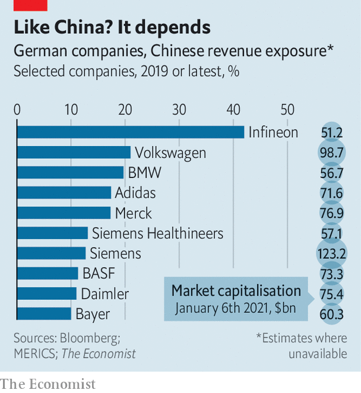

###### German business and China

# Deutschland AG continues to pour billions into China 

##### Never mind the growing geopolitical rift between Beijing and the West 

 

> Jan 7th 2021 


THE IDEA of “political change through trade” has lost its appeal across much of the West as China has grown more, not less, authoritarian under President Xi Jinping. That has not stopped Karl Haeusgen, chairman of Hawe, a maker of hydraulic pumps, from believing in the long-term success of its German version, Wandel durch Handel.


Mr Haeusgen has a self-interested reason for optimism. China accounts for about one-quarter of Hawe’s sales. This will grow substantially once a 25,000-square-metre factory in Wuxi near Shanghai is finished. On January 1st Ye Jiang, an engineer who has worked for the family firm since 1999, joined its management board as its first Chinese member.


Many German bosses are in a similar situation. Goods trade between the EU and China grew eight-fold between 2000 and 2019, to €560bn ($626bn). In 2019 Germany accounted for 37% of that, or €206bn. In the first seven months of 2020 German business helped China edge out America as the EU’s largest trading partner. Between January and September China’s share of German exports rose by one-eighth, year on year, to nearly 8%. China is also Germany’s top supplier; its share of German imports rose to more than 11% in the same period, from less than 10% in 2019.

 


Although the most China-dependent American companies, like its casino operators and chipmakers, get more of their revenues from the Asian giant than the most exposed German firms, German Sino-dependency is concentrated in its biggest and most powerful industries (see chart). Of Germany’s 15 most valuable listed firms, ten derive at least a tenth of revenues from China, according to The Economist’s rough estimates; in America, less than half do.


That is why German business applauded the hasty conclusion last month, in the last days of Germany’s rotating presidency of the EU Council, of an investment treaty between the bloc and China. The deal is meant to grant European firms better access to the Chinese market by, for instance, removing the requirement that they form a joint venture with a local firm and creating a more level playing field for investors.


Deutschland AG’s peculiar reliance on China also helps explain its reluctance to heed the German government’s pleas to diversify markets and supply chains away from the Asian giant. Indeed, many German firms, from medium-sized Mittelstand stalwarts like Hawe to its bluest chips, are doubling down on the Middle Kingdom. Hahn Automation, which makes industrial robots, plans to invest millions of euros in new Chinese factories and boost its revenues in China from 10% of the total to 25% in the next five years. BASF is building a gargantuan $10bn plastics factory in the southern province of Guangdong, the biggest investment in the chemicals giant’s 155-year history. “We have to play ball with the Chinese,” says Joerg Wuttke, the German head of the EU chamber of commerce in China. “If you are not at the table, you are on the menu,” he warns.


The loudest cheerleaders are in Germany’s car industry. “China is the present and the future of German carmakers,” says Noah Barkin of Rhodium Group, a research firm. As the world’s biggest market, China accounts for two in five cars the Volkswagen Group sells globally. Without China it would have been hit harder both by the “Dieselgate” emissions scandal and by the pandemic. China is the biggest foreign market for BMW, a Bavarian rival, whose sales there rose by 31% in the third quarter, year on year. In December Ola Källenius, boss of Daimler (in which two Chinese carmakers hold a combined 15% stake) hailed a “remarkable” recovery in China, the largest and most lucrative market for its Mercedes-Benz brand, whose sales grew by double digits for six straight months.


German carmakers are also becoming more reliant on China for their capacity to innovate, notes the Mercator Institute for China Studies, a think-tank. In September the new iX3 electric car rolled off the production line in Shenyang, where it was also wholly developed by BMW and its Chinese state-run partner, Brilliance Auto. The joint venture also opened a new battery factory in the northeastern city. Volkswagen and its Chinese partners pledged to invest €15bn into e-mobility in China by 2024. VW recently bought a stake in Gotion High-Tech, a maker of batteries, to bolster its “electrification strategy in China”. Daimler’s latest annual report calls China “a significant market for new technologies”.


No wonder carmakers are genuflecting before China’s Communist Party. According to the Süddeutsche Zeitung, a newspaper, in 2012 Volkswagen opened a loss-making plant in the western city of Urumqi, in exchange for permits for new, lucrative factories on the eastern coast. VW denies the accusation. It has kept its Urumqi plant running, despite pressure from activists and politicians in America and Europe to stop doing business in Xinjiang province, where the authorities have been persecuting the Uyghur Muslim minority (see ).


Some voices in corporate Germany are worried that this is short-sighted. Two years ago the BDI, one of the two main German industry associations, published a paper outlining its concerns about high barriers to entry, state subsidies to local firms and other distortions in the Chinese market. Although it now praises the new investment treaty, the BDI warned that its members should be under no illusion: even once the pact is ratified by the European Parliament and implemented, German firms will not have truly free access to the Chinese market.


Chinese firms are also increasingly competing with German ones, particularly in the sort of specialist machinery manufactured in the Mittelstand. China is already the world’s second-biggest exporter of such kit. With high labour costs at home, “innovation is our only competitive advantage”, says Ulrich Ackermann of the VDMA, an association of machinery-makers. And that advantage is being eroded as more Chinese firms follow its electric-car industry in becoming more sophisticated.


German firms’ relationship with China has therefore become “a constant walk on a tightrope between systemic competition and business partnerships”, says Friedolin Strack of the BDI. No one believes in “political change through trade” in the foreseeable future, admits Wolfgang Niedermark, who until last year headed the German chamber of commerce in Hong Kong. But, it seems, German bosses still believe in trade, through all the political change.■

