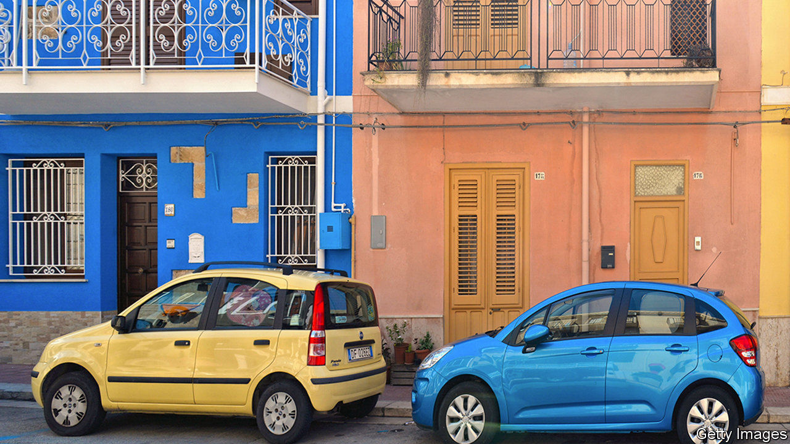

###### A Stellantis is born

# The Fiat Chrysler-PSA mega-merger may give rise to a carmaking star 

##### The new firm’s boss, Carlos Tavares, has work to do to maintain his stellar track record 

 

> Jan 7th 2021 


FIAT CHRYSLER AUTOMOBILES (FCA), an Italian-American carmaker, and PSA Group, the French owner of Citroën and Peugeot, do not like to dwell on their shared past. When PSA acquired Chrysler Europe in 1978 for a nominal $1 it picked up some struggling British and French marques and a heap of debt. That tie-up crashed a few years later with the demise of Talbot, the brand created from these motoring scraps. On January 4th shareholders of both firms voted to give it another go, acceding to a mega-merger agreed in 2019. Hopes seem higher this time. The name of the combined firm, Stellantis, is derived from the Latin for “brightens with stars”.


Stardust is sadly lacking from an industry that, along with many others, has taken a beating in the pandemic. But the creation of the world’s fifth-largest carmaker by vehicles produced (see chart) is well set to deal with the effects of covid-19—and to navigate the other difficulties facing the automotive business.

 


The pandemic has sent screeching into reverse an industry that was already going backwards, as demand slumped in car-mad China. Annual worldwide sales fell from 94m units in 2017 to 90m in 2019. Covid-19 depressed sales by 15% in 2020, to 76.5m, according to IHS Markit, a data firm.


On the bright side, they are expected to rebound sharply this year. The signs are encouraging. Monthly Chinese sales have exceeded last year’s in the second half of 2020. General Motors has led America’s recovery, with sales up by 5% in the fourth quarter, year on year. And electric vehicles are booming, helping Tesla make good on Elon Musk’s pre-pandemic forecast of delivering 500,000 cars in 2020.


Despite the rebound, the industry is not likely to get back to its size in 2019 before 2023. What does that mean for Stellantis (whose largest shareholder, Exor, part-owns The Economist’s parent company)? Size will let it spread the costs of new technology. The savings, forecast at €5bn ($6.2bn) a year, are more important than ever while the industry recovers. Cash reserves will be shored up by the decision of FCA’s investors in September to accept a reduction in the special dividend that was part of the deal, by nearly half, to €2.9bn.


Stellantis also has Carlos Tavares. He has already turned round two loss-making firms: PSA, which he has led since 2014, and then Opel, acquired from General Motors in 2017. His task now is to revive the Fiat brand, which is dependent on Europe and was starved of investment after the merger with Chrysler in 2014. Only the ageing 500 supermini is selling well.


The reticence of both Mr Tavares and Sergio Marchionne, FCA’s late boss, to rush headlong into electrification may also prove wise. Other carmakers had poured cash into electric cars that did not sell well. Now that they are becoming more popular, Stellantis’s plans, including PSA’s new architecture for electric vehicles due by 2023, have more chance of success.


The deal also affords the opportunity to reset strategy, says Jefferies, a bank. The firms are strong regionally, PSA in Europe and FCA in America, but lack global clout. Neither has much presence in China. And in an industry where complexity is now a dirty word, Stellantis will have 15 brands. Volkswagen’s 11 are seen as unwieldy.


Mr Tavares needs to make Jeep a worldwide profit machine like VW’s Audi and Porsche, and to decide what to do about underperforming premium brands. Maserati and Alfa Romeo have defied numerous relaunches to stay peripheral. DS is profitable but has little presence outside France.


Stellantis’s boss must also overcome the clashes of culture that have brought down many a car-industry merger. Marchionne made FCA work through force of personality and the width of the Atlantic, which let him keep the subsidiaries at arm’s length. Mr Tavares does not have that luxury, or Marchionne’s charisma. But his stellar track record shows he has the character to make it happen.■

