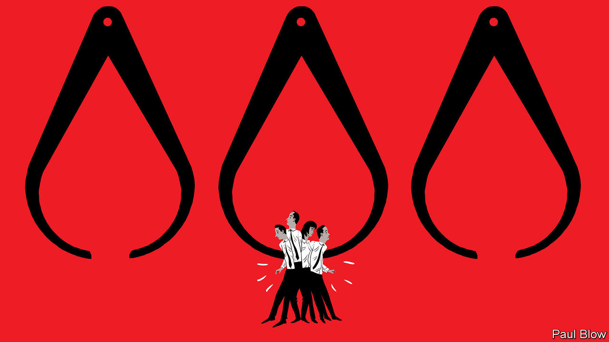

###### Bartleby

# The science of networking 

##### The modern economy depends on how well people connect with others 

 

> Jan 5th 2021 


SUCCESS IN MANUFACTURING depends on physical things: creating the best product using the best equipment with components assembled in the most efficient way. Success in the service economy is dependent on the human element: picking the right staff members and motivating them correctly. If manufacturing is akin to science, then services are more like the arts.


Motivating people has an extra complexity. Widgets do not know when they are being manipulated. Workers make connections with their colleagues, for social or work reasons, which the management might not have anticipated.


Marissa King is professor of organisational behaviour at the Yale School of Management, where she tries to make sense of these networks. She attempts a classification in her new book, “Social Chemistry: Decoding The Elements of Human Connection”.


The term “networking” has developed unfortunate connotations, suggesting the kind of person who sucks up to senior staff and ignores colleagues who are unlikely to help them win promotion. Ms King cites a study which found that two-thirds of newly promoted professionals were ambivalent about, or completely resistant to, thinking strategically about their social relationships.


From the point of view of productivity, the most important networks are those formed by employees from different parts of the company. Diverse viewpoints should lead to greater creativity. They are good for workers, too. A study found that catching up with colleagues in different departments was linked to salary growth and employee satisfaction.


Some employers had the bright idea of encouraging this co-operation by moving to open-plan offices. But research suggests that workers in open-plan layouts are less productive, less creative and less motivated than those in offices with a traditional, room-based design. The quality of interactions is more important than the quantity. The pandemic, by forcing many people to toil away at home, has probably corroded some of these co-operative arrangements.


Ms King says that people tend to construct three types of network. “Expansionists” have a wide set of contacts but their relationships tend to be shallow. “Conveners” have a small number of relationships, but these are more intense. “Brokers” link people from different network types.


On the surface, this categorisation seems reasonable. How useful is it? Readers can take an online test (at assessyournetwork.com) to see which category they fall into. Bartleby did so and found (as he expected) that he did not fit into any of them. Indeed, the author’s research shows that one in three people does not have a clearly defined style and 20-25% could be classed as mixed (for example, they are simultaneously brokers and expansionists). In other words, more than half of people cannot be neatly categorised.


To add to the muddle, Ms King introduces sub-categories: co-operative brokers, arbitraging brokers, tortured brokers, and so on. Some people move from one category to another (like a certain Heidi Roizen, who, in a feat of management jargon, “transitioned from an expansionist to a broker to a convening nucleus”). At this point it seems wiser to admit that, to use an old phrase from the north of England, “there’s nowt so queer as folk”. Fortunately, the book is full of wisdom and entertaining anecdotes which show that stories can give more insight than attempts at scientific categorisation.


Two fun case studies outline a common problem—the tendency for people to have too narrow a focus. In one test, only one in four mobile-phone users noticed a clown who unicycled past them while they were looking at their screens. In another revealing story, Catholic seminarians strode past a distressed bystander while in a hurry to give a lecture on the parable of the good Samaritan. In the right network, the presence of a diverse set of participants may allow the group to see the bigger picture.


Old-fashioned concepts like courtesy can also help, Ms King argues. Simple gestures—a smile, a thank you—make colleagues more likeable and increase co-operation. In contrast, studies of workers who experience incivility find that their effort, time spent at work and commitment to the job all reduce. Ms King invokes the aphorism that “assholes” can be identified by observing how they treat people with less power. “Don’t be an asshole” is not a scientific statement. But it is still a pretty good management motto.

