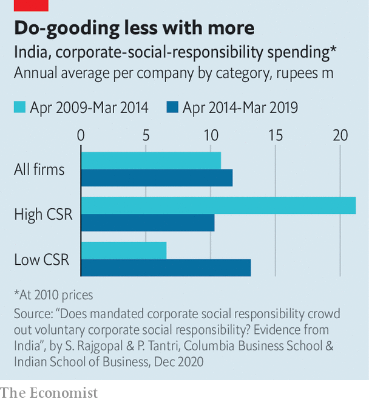

###### Giving and taking

# What happens when firms have to stump up for good causes 

##### An Indian experiment in corporate social responsibility 

 

> Jan 9th 2021 


KITEX GARMENTS is one of the largest private companies in Kerala, a communist-led state in southern India. Its embrace of corporate social responsibility (CSR) is enthusiastic. In the fiscal year ending in March 2020 it allocated 5.3% of its average profit over the past three years to public roads, schools, housing and safe drinking water. That makes it a poster-child for an Indian law passed in 2013, in the aftermath of a corporate fraud scandal, that requires Indian companies to divert at least 2% of annual profits to CSR projects.


Arguments leading up to the law’s approval pitted NGOs and populist politicians, who supported it, against India Inc, which said it merely created a new tax. Several big corporate contributors argued that philanthropy would be damaged by government involvement. A new study by Shivaram Rajgopal of Columbia Business School and Prasanna Tantri of the Indian School of Business suggests that last group has a point.


The researchers sifted through the filings of 39,000 companies to see how behaviour changed. Advocates of the law will be pleased to see that the sum the average company channelled annually to CSR efforts rose slightly in fiscal 2014-19, compared with 2009-14. It was not, however, an unalloyed triumph. Kitex, with its consistently high charitable contributions, turns out to be an exception.

 


Of the 2,152 companies that gave more than 5% of profits before the law went through, average real contributions fell by half (see chart). In place of spending on social causes, Mr Rajgopal and Ms Tantri found increased spending on advertising.


Economists studying CSR spending posit three possible incentives for it: genuine altruism; private interests of managers who enhance their own position with corporate cash; and improved performance and valuations as a consequence of a burnished reputation among customers and better morale among employees.


If the first two were at work, Mr Rajgopal and Ms Tantri speculate, India’s biggest spenders would not have cut back: setting a minimum payment would impede neither altruism nor benefits to managers. Instead, the reduced payments suggest that past spending was mostly about “signalling value”. Once they became obligatory, CSR payments were seen as merely another component of regulatory compliance. Or, as Mr Rajgopal concludes, “The halo was lost.”


The question left open by the study is where CSR money goes and whether that too has been affected by the law. Many Indian businesses are family-controlled. Their CSR contributions often go from the companies to charitable entities also controlled by the families. India’s largest company, Reliance Industries, for example, directed 94% of its 2019 contributions to the Reliance Foundation, chaired by Nita Ambani, the wife of Mukesh Ambani, Reliance’s largest shareholder and boss. To its credit, Reliance discloses these contributions. Many others are less forthcoming.


Where CSR money ultimately ends up is often unclear. Some may flow into India’s political system. Kitex is again the exception. The company’s allied do-gooding arm is quite transparent about supporting political candidates and has spoken out about its efforts to do so in response to past government failures. This, it would argue, is the socially responsible thing to do. ■

