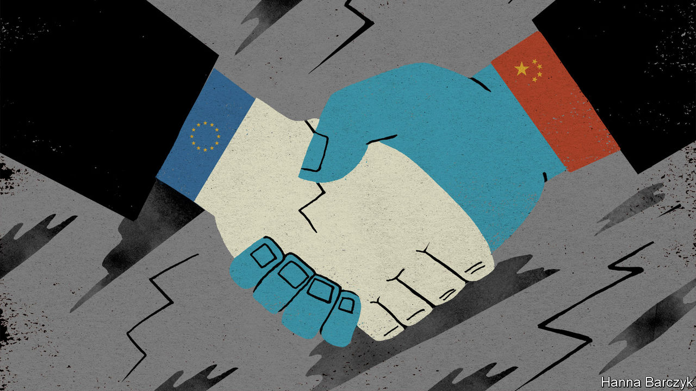

###### Chaguan

# Cynicism explains a flawed new EU-China commercial pact 

##### European officials differ over whether they have just handed China a big, unnecessary, political win 

 

> Jan 7th 2021 


BUOYED BY A growing economy, cheered by a domestic public united by the fight against covid-19, and eager to start shipping vaccines to friends around the world, China’s rulers feel history turning their way. A recurring phrase in their speeches hails “changes unseen in a hundred years”. Bluntly, Communist Party chiefs feel China is rising and democratic countries—battered by recession and racked by partisan disputes—are falling behind.


As 2021 dawned, the European Union offered China a further boost by agreeing to a commercial pact that will bind some powerful European companies still more tightly to China. The deal brushes aside concerns about dependence on Chinese markets. It tackles allegations of forced labour in supply chains by accepting promises that China will make “continued and sustained efforts” to ratify international conventions on workers’ rights.


Politically, China sees the deal—a comprehensive investment agreement whose benefits mostly flow to a few German carmakers, European insurance companies and other well-connected firms—as an early victory over Joe Biden. Aides to America’s president-elect had hinted publicly that Europe might like to wait and co-ordinate efforts to curb China’s worst trade and human-rights abuses. Those hints were ignored. Hosting EU ambassadors for lunch just before Christmas, the foreign minister, Wang Yi, praised Europe’s “strategic autonomy”. The phrase was first dreamed up by French politicians. Mr Wang’s use of it sent a clear message. As envoys at the lunch tell it, China was thanking the agreement’s main backers, notably Germany’s chancellor, Angela Merkel, for refusing to join America in the one alliance that Chinese leaders fear: a global coalition of like-minded nations willing to exclude China from sensitive supply chains or to block investments, in defence of democratic norms and freedoms.


Critics accuse EU leaders of shocking naivety. They were particularly dismayed when the president of the European Commission, Ursula von der Leyen, claimed that the agreement promoted Europe’s “core values”, and that China’s vague commitments provided “a lever to eradicate forced labour”. Actually, it is not fair to call European leaders naive about the investment accord. Rather, their motives are a mix of self-interest, cynicism about Europe’s limited clout and pessimism about the prospects for joint action with Mr Biden’s America. A European summarises the decision-making process: “We had an economic interest in concluding a deal. The Chinese had a political interest in demonstrating that China is not isolated. There was a perception we would get nothing more.”


Views among European ambassadors and business bosses in China have hardened noticeably as the country takes one illiberal turn after another under President Xi Jinping, an austere autocrat. In particular, 2020 was a turning-point. A new national-security law trampled on Hong Kong’s Western-style freedoms. Chinese troops killed Indian soldiers in a border clash. Intent on smothering discussions of China’s disastrous early handling of covid-19, Chinese diplomats threatened governments across the West, and were praised at home as patriotic “wolf warriors”. China banned many Australian imports to punish that country for suggesting an independent probe into the pandemic’s origins.


Early in 2019 the EU published a strikingly honest China strategy, calling the country a partner, a competitor but also a “systemic rival”. Among Europeans charged with managing relations with China, that tripartite view of China has not changed. The investment agreement is best understood as a holdover from a time when Europe was unwilling to acknowledge deep ideological differences with China. The EU’s negotiating mandate for the deal dates from 2013. With its focus on market access and level playing fields, it sets out to manage China as a partner and competitor, says Reinhard Bütikofer, a German Green and chairman of the European Parliament’s delegation for relations with China. “It almost completely ignores systemic rivalry,” he objects, speaking by Zoom from Berlin. He expects the parliament, which must approve the pact, to seek stronger commitments on labour rights, notably in factories using workers from Xinjiang, a western region where Muslim minorities are governed with an iron fist.


Mr Bütikofer’s approach is increasingly popular among Western elected politicians. It is a minority view among European bigwigs in China. Most argue for trade talks that seek whatever concessions are going, then for separate efforts to press China into curbing its worst abuses, and, most important, for work at home on anti-subsidy measures and security-screening of investments.

China is not about to change: time to build better defences


Chinese voices insist that clashes over values are not inevitable, at least when talking to foreigners. Wang Yiwei, director of the EU studies centre at Renmin University, chides Americans for thinking like religious missionaries about engagement with China. In contrast, “Europe is secular; it is not seeking to convert China to a multiparty system or a free press,” he asserts, approvingly.


European sources in Beijing ascribe China’s willingness to cut a deal, after much foot-dragging, to two factors. First, to the belief of Liu He, a deputy prime minister in charge of economic policy, that some European competition is good for state-owned firms. Second, to a decision by Mr Xi to do a deal before Mr Biden takes office.


Ask European envoys if the EU erred by agreeing to a deal now, and they are divided. Some insist that Europe risked irrelevance if it had waited for a new American president. They add that this modest accord does not preclude co-ordinated action later. Others regret the decision to hand China a political win at Mr Biden’s expense. Not one of the diplomats argues that Europe underestimated its leverage, and could have struck a better deal. Among Westerners in Beijing, bleak realism predominates. Mr Biden says he will rally the democratic world behind a new China strategy. He has his work cut out. ■

