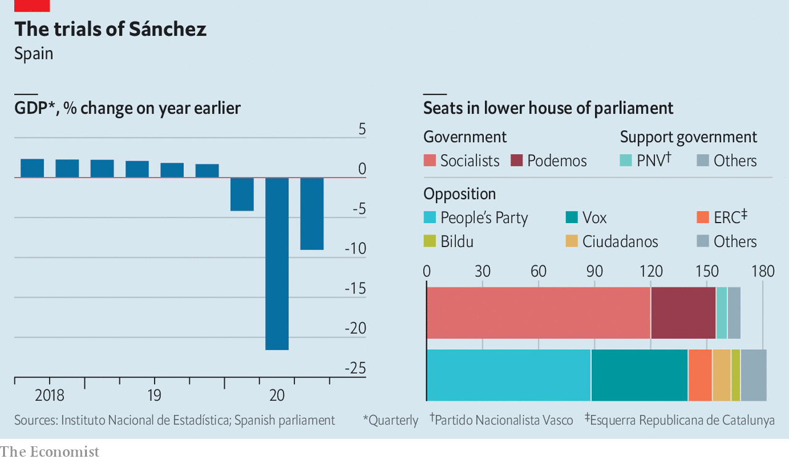

###### Frenemies of the left

# Does Spain’s leftish leader have his far-left allies under control? 

##### The right says the ruling coalition is sliding leftwards 

 

> Jan 9th 2021 


A YEAR AGO Pedro Sánchez embarked on a political experiment. After two indecisive elections, he swallowed his previous qualms and formed Spain’s first coalition government since the 1930s, between his Socialists and Podemos, a hard-left party. Within weeks, this minority administration was faced with the pandemic, which has hit Spain especially hard. Yet it survived. Last month Mr Sánchez secured parliamentary approval for a budget, the first since he came to office in 2018. Spanish budgets can be rolled over, so the government now has a chance of serving out its term, which lasts until 2023. But in a country where politics is deeply polarised, the coalition will not have an easy ride.


Mr Sánchez’s critics argue that he has survived only by lurching far from the mainstream. Take the manoeuvring over the budget. Pablo Iglesias, who is Podemos’s leader and a deputy prime minister, pushed the government to seek the votes of the five parliamentarians of Bildu, a political successor to ETA, the Basque terrorist group. To gain the 13 votes of Esquerra, a Catalan separatist party, the government also omitted from its new education law an old stipulation that teaching should be at least partly in Castilian Spanish in regions with a second official language (though this has long been ignored in Catalonia). Mr Iglesias welcomed Bildu and Esquerra to “the leadership of the state”.


That is anathema to many Spaniards. In most European democracies Bildu would be shunned: its leaders have yet fully to condemn ETA’s long terrorist campaign for Basque independence, which ended only nine years ago. The government’s embrace of Bildu prompted criticism from even some Socialist regional leaders—a rare event in a party dominated by Mr Sánchez.


The prime minister argued that what mattered was the budget, which offers the country “a future of stability and progress”. In fact, its importance is political more than economic. Thanks partly to the weight of tourism and vulnerable small businesses, Spain’s GDP shrank by about 11% in 2020, the worst in the euro zone. Some 750,000 workers are still furloughed. With public debt heading for 120% of GDP, the government has been stingier with emergency aid than many of its neighbours. In these circumstances the budget’s increases in public-sector wages and in pensions, albeit small, look unwise.

 


The pandemic has sunk much of the coalition’s original programme, which featured big tax rises and spending increases and the repeal of a labour reform of 2012 that reduced union power and speeded job creation. The government’s hopes are now pinned on aid from the European recovery fund: it expects to get €27bn in 2021. The European Commission is likely to insist on structural reforms to make the labour market work better and to reduce pension spending—both of which offend Podemos.


The opposition sees the monarchy and the judiciary, as well as Europe, as bulwarks against a leftist surge, but it thinks both are now under assault. Podemos, which wants to get rid of the monarchy, has pounced on financial scandals surrounding Juan Carlos, who abdicated as king in 2014 in favour of his son, Felipe, and is being investigated over a payment in 2008 of $100m from Saudi Arabia, most of which he turned over to a former lover.


Unusually in Europe, in Spain the judiciary’s governing council is chosen by parliament, by a supermajority that requires the two main parties to agree. The council’s term ended two years ago but the conservative opposition Peoples Party (PP) has blocked its renewal, saying that it does not want Podemos to have a say on the body. That prompted Mr Sánchez to propose a bill lowering the necessary majority, only to withdraw it after the European Commission objected: it smacked of the rigging of judiciaries, as in Poland and Hungary.


Mr Sánchez’s alliances have provoked the hard right. In November more than 100 retired military officers signed open letters to the king complaining that the “social-communist government, supported by ETA-lovers and separatists” is threatening national unity. The defence ministry insists the malcontents are only a small minority. They have been encouraged by the rise of Vox, a hard-right party.


“We’re not seeing irreparable damage to the constitution,” says Pablo Simón, a political scientist at Carlos III University in Madrid. Much of the disquiet, rather, stems from the power dynamics within the coalition. Podemos “is eating the Socialist Party” which is more and more influenced by its junior partner, according to Pablo Casado, the PP’s leader. Socialist sources retort that Mr Sánchez has tamed Podemos. His own people run economic and foreign policy, whereas Podemos’s portfolios, with the exception of the labour ministry, are decorative. But Mr Iglesias and his team, fearing irrelevance, make a lot of noise in the media. Mr Sánchez responds with tactical ambivalence. “One day he talks left, the next day he returns to an institutionalist discourse,” says José M. de Areilza, a law professor.


Opinion polls are starting to show a shift towards the right as well as disillusion with politics. With the budget approved, Mr Iglesias’s value to Mr Sánchez has diminished. But it has not disappeared. The prime minister is unlikely to want to face the voters again until they can feel economic recovery. If so, he may be condemned to his turbulent political marriage for at least another year. ■

