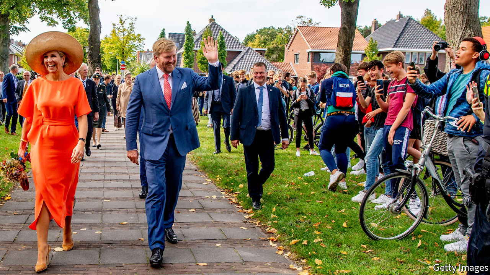

###### Bruised Oranges

# The Dutch royals are botching covid-19 etiquette 

##### After an ill-judged holiday, the House of Orange has lost a bit of juice 

 

> Jan 9th 2021 


POLITICALLY, COVID-19 has been good for Mark Rutte, the Netherlands’ prime minister. Polls show his party’s support has risen from about 15% to 25% since March. Not so for his sovereign, King Willem-Alexander. In April 76% of Dutch said they trusted the king; in December that had dropped to 47%, according to Ipsos, a pollster. Support for the monarchy as a whole fell from 74% to 60%. The main cause seems to be two disastrous holidays. In August Willem-Alexander and Queen Maxima were photographed breaking social-distancing rules in Greece. In October the family returned there during the Dutch autumn break, even as the Netherlands headed towards a lockdown. The trip was cut short by public outrage.


The House of Orange has been one of Europe’s most popular royal families. Its history is unusual. When the Netherlands won independence from Habsburg Spain in the late 1500s, it started out as a republic. The descendants of William of Orange, the nobleman who led the revolt, were given the odd title of “stadtholder”. They tussled for power with the provincial delegates of the States-General. In 1795 Dutch progressives backed by revolutionary France drove out the Oranges, who took refuge in England. It was not until 1815, when they returned after Napoleon’s defeat, that they became royalty, with the help of the anti-republican British and their allies.


By the 1900s they were typical constitutional monarchs. They won kudos in the second world war, since Queen Juliana fled to London rather than accept Nazi occupation. Though Willem-Alexander signs all laws, his main job is to meet business groups and charities and to give an annual speech (written by the government). Like other modern royals, they appeal to the people by mixing pomp and folksiness.


This year’s shenanigans upset that balance. The royals disregarded covid-19 rules while flaunting their wealth: the king brought along his new yacht worth €2m ($2.5m). “The Netherlands has a culture of ‘Stick your head up and get mowed down’, so the Oranges usually try to seem normal,” says Kysia Hekster of NOS, the national news broadcaster. The royals cost the state €46m a year for salaries, events, palace upkeep and so on. But their private fortune is secret. The Oranges are still well liked, but many Dutch think they have a right to know what is beneath the peel. ■

