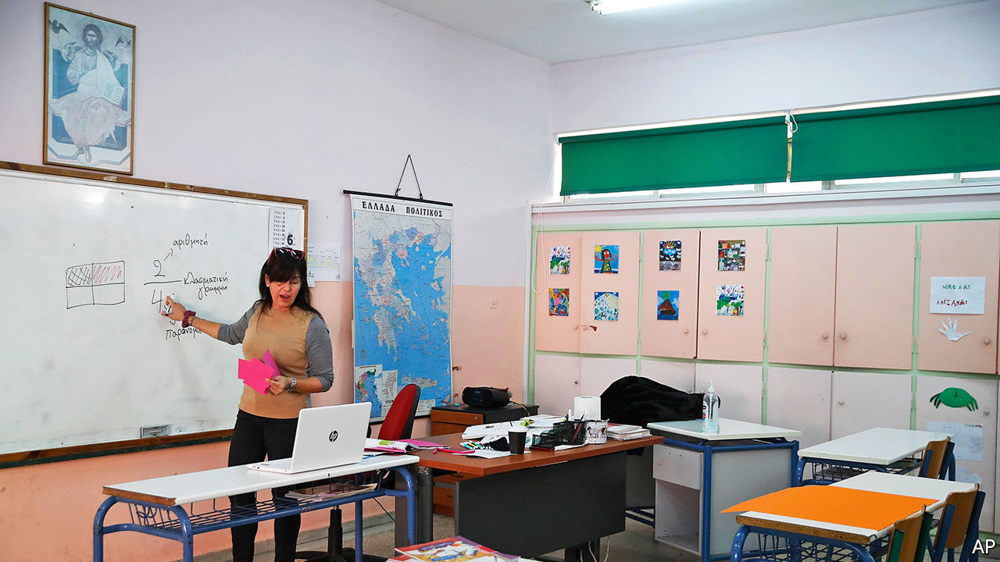

###### Laptops at the ready

# The lockdown has helped Greece to digitise 

##### It used to be a laggard 

 

> Jan 9th 2021 


GREECE RANKS at or near the bottom of the EU class on digitisation, whether you measure it by high-speed internet connections, ownership of laptops and tablets, or online shopping. The government’s digital-transformation “bible”, a scheme to catch up with European peers by 2025, which includes 400 separate projects, is months behind schedule. Yet the country’s second lockdown in November (now set to last until at least January 11th) has spurred an unexpected leap forward in one important area: distance learning.


Under a new law passed in the summer, schoolteachers can be required to hold all classes online, from pre-school nurseries to sixth forms preparing for university-entrance exams. When the spread of coronavirus shut down schools across the country in March, maths and science teachers had little difficulty moving lessons online. But some history and literature specialists without digital skills refused to co-operate.


“Now distance learning is mandatory and a new curriculum is being rolled out online,” says Niki Kerameus, the no-nonsense education minister in the right-of-centre government of Kyriakos Mitsotakis, which took office in 2019 after four years of rule by the radical left-wing Syriza party. Teachers who fail to show up for an online class face disciplinary action.


Ms Kerameus, a high-flying New York lawyer before she entered politics, says that Greek schools had only 4,500 portable devices when the government came to power last year. Now more than 90,000 tablets and laptops have been handed out, paid for by EU funds, local government and private donations. Cisco, a telecoms-equipment company, set up a Webex platform which can provide simultaneous access for the country’s 1.4m pupils and 180,000 teachers. Teachers have attended online training sessions; some began Facebook groups to provide continuous tech support. Even when normal life resumes in classrooms, digital learning will remain a big part of the syllabus, Ms Kerameus says.


Schools shut down again in November after a second coronavirus wave hit Greece. The new online teaching system went live two days later. When a chaotic first session triggered a social-media storm of protests from angry parents, glitches were quickly smoothed out. “We’re feeling very encouraged,” says Eleni Hatzi, deputy head of a secondary school that serves Greece’s Muslim minority in Thrace, an impoverished region close to the border with Turkey. “We have a record number of students taking university entrance this year and they have many new resources because of the digital programme.”


A pilot pre-school programme for four- to six-year-olds launched in 2019 in Larisa, in central Greece, can now continue digitally with the help of parents, despite the lockdown. Stella Boura, who runs it, says her pupils are enjoying distance learning. “They feel comfortable because they can interact with their teacher as usual. They’re keeping up with early-learning English classes, shopping games and singing.”


Ms Kerameus admits that her task of keeping education on track during the pandemic was made easier because of Greece’s old-fashioned centralised school system. At present the education ministry keeps a tight grip on everything, from details of the curriculum to timetables and even school excursions. “Our aim is to decentralise the system,” she says. “But right now [the old system] has actually been a help.” ■

