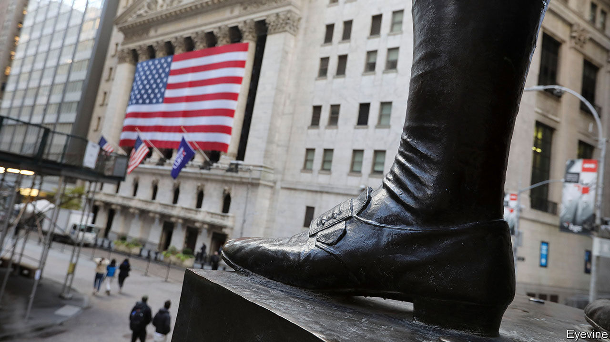

###### Burying the dead

# China wants to delist its own companies: the bad ones 

##### New rules to clear the dregs off its stock exchanges 

 

> Jan 9th 2021 


LIKE MANY Chinese companies on the stockmarket, Gangtai Holding, a jewellery-to-property conglomerate, flaunts its listing. It displays its ticker number, 600687, prominently on its website and in its ads. But not for much longer. On January 7th Gangtai began a 30-day period almost certain to end with its ejection from the Shanghai Stock Exchange. It is one of a growing number of Chinese companies to face delisting at home.


In recent months all the delisting talk has been about the removal—or not—of Chinese companies from American exchanges (see ). Within China, though, a potentially more important kind of delisting is on the agenda: regulators have made it easier to strip lousy firms of their listing status. It is the latest in an array of reforms aimed at modernising the stockmarket, long seen more as a casino than an efficient allocator of capital.


Delistings are a staple of healthy stock exchanges, a mechanism for clearing out the dross. In America a few dozen companies are typically forced off its exchanges every year, often because of low market values. In the early 2000s, after the dotcom bust, annual delistings climbed to nearly 400. China, by contrast, has averaged seven delistings a year over the past decade, despite having more than 4,000 listed companies, nearly as many as America.

 


Delistings have been so infrequent in China mainly because, relative to demand, listings themselves were hard to come by. “Even if a company is nearly bankrupt, the shell value of being listed is really high. Just by staying alive it can find a buyer,” says Lu Fangzhou of the University of Hong Kong. This has made for perverse incentives. Listed firms in financial trouble in China are classified as “special treatment”, abbreviated to ST before their ticker name, to warn off investors. Instead, however, it is often an invitation to bid up their prices, as buyers might emerge. ST stocks are volatile, but their returns have occasionally beaten the overall market (see chart).


That has recently begun to change. Regulators relaxed controls over initial public offerings, paving the way for hundreds of new listings. The value of being a shell diminished. The delisting reform, introduced on the final day of 2020, attacks the problem from the other end. Companies with share prices below 1 yuan ($0.15) for 20 consecutive days will now face automatic delisting. Those that fraudulently overstate their earnings by 100% for three years are on the chopping block, too.


The process will also become much faster, eliminating an intervening trading suspension—when troubled companies could find buyers. China’s delistings could increase to about 50 a year. Some investors complain the rules are still too lenient. For example, Luckin Coffee, a Chinese would-be rival to Starbucks, was kicked off Nasdaq for fabricating transactions; in China its listing probably could have survived. But Zhou Maohua of China Everbright Bank counsels patience, saying the rules will be adjusted over time.


In Gangtai’s case, the company overstretched itself. The gold-miner and jewellery-maker got pulled into property, even planning a skyscraper, and bought Buccellati, an Italian jeweller. But as it racked up huge losses, it defaulted on bonds and sold its best assets. Delisting is its latest humiliation. At least it can console itself that it will soon have plenty of company. ■

