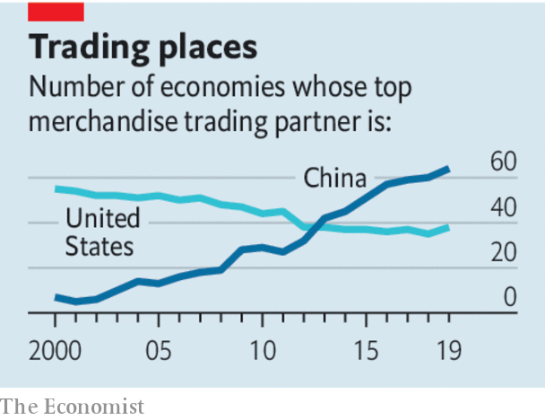

###### Global trade

# How to deal with China 

##### Arrests in Hong Kong and Europe’s trade deal show the West is on the back foot 

 

> Jan 9th 2021 


THE WORLD’S democracies desperately need a coherent approach to dealing with China. It is the 21st century’s ascendant power, but also an autocracy that mistrusts free markets and abuses human rights. However, recent events show how ineffective Western policy has become. On December 30th the European Union agreed on an investment pact with China that secured puny gains and gave China a diplomatic coup. The EU did so despite doubts among Joe Biden’s team (see ). New York’s stock exchange banned several Chinese firms’ shares, only to change its mind twice in a few days. Congress has so far failed to pass a bill to protect Uyghurs from forced labour (see ).


As the West stumbles, China is busy cracking down at home and expanding its influence abroad. On January 6th more than 50 democracy activists were arrested in Hong Kong (see ). In November China signed a trade pact with 14 Asian countries, including American allies such as Japan and Singapore. It continues to threaten Australia with its thuggish diplomacy and a partial trade embargo.


The pattern of Chinese assertiveness and Western disarray has become all too familiar. All democracies are struggling to reconcile the conflicting objectives of doing business with a huge and vibrant economy, and protecting national security and human rights (see ). The Trump administration skewered Western complacency about China’s state-led model, but then detonated the global trading system without proposing an alternative. Rich countries have failed to act together, reducing their clout. America’s negotiators identified structural reforms that China should enact, and that other Western powers might have supported, but in the end President Donald Trump won only small concessions in the “phase one” trade agreement struck with China in January 2020. Western policy has become a muddle of deals, rebukes, ad hoc bans and tariffs. The system of rules that has been the backbone of global commerce for decades—featuring open trade and capital markets, and impartial legal systems—thrived because it was predictable. Not any more.


China is exploiting the disarray even as its economy comes roaring back from the pandemic: year-on-year growth was 4.9% in the most recent quarter. Beijing’s rulers expect Mr Biden’s administration to be preoccupied with America’s troubles at home, not least covid-19. Europe has welcomed Mr Biden’s conciliatory noises, but worries that his policies are laced with protectionism, including “Buy American” clauses and ambiguity over whether tariffs will be removed. Faced with an introspective superpower, the EU decided to speed up its long-standing effort to strike an investment deal with China. When it acts in isolation, however, it doesn’t have much sway. The new deal features assurances over Chinese state meddling in industry that will be tricky to enforce and platitudes on human rights that China will ignore.

 


What might a coherent policy look like? It has to start by acknowledging China’s power. Unlike the Soviet Union, China is too big and interconnected to contain. It accounts for 18% of world GDP. It is the largest merchandise trading partner of 64 countries, including Germany (see ). America’s tally is just 38. Chinese capital markets are becoming important, too. Foreigners now own up to 10% of all government bonds. Yet for all China’s size and sophistication, relations will remain riven with mistrust. It is hard for outsiders to tell if private firms are acting independently of the Communist Party. And it is foolhardy to rely on Chinese government promises, whether on subsidies for industry or the rule of law in Hong Kong. The result is that in some domains the West should seek to confront China (human rights), while in others it should compete (most areas of trade) or co-operate (health and climate change).


The sheer complexity of trading without trust amplifies the need for the West to act in unison to maximise its influence. Together, America, Europe and other democracies still account for over half of world GDP. In order to limit the perimeter of trade tensions, they should define sensitive industries, such as technology and defence. In these areas they should subject Chinese participation in Western markets to much tighter scrutiny and restrictions. In other industries trade can flourish unhindered. Democracies should draw up a common framework for human rights, including verifying that supply chains are ethical and penalising people and firms involved in abuses. Finally, any new alliance to deal with China has to have predictable rules and enforcement. It cannot be run from the White House on the fly.


Even before Europe’s snub this was a daunting task for the incoming Biden administration, on a par with the creation of NATO or the world trading system after the second world war. And unlike back then, America’s prestige has been battered. Yet public opinion in the rich world is now wary of China. Mr Trump failed to deal with it partly because of his incompetence and contempt for allies. Mr Biden will take office on January 20th on a wave of global goodwill. It should be possible to create a grouping of democracies, for example an enlarged G7, that will act on China. There is a still a chance to reassert the values of open societies and free markets, but it will not last for ever. Faced with an assertive autocracy, dithering and division are not enough.■

