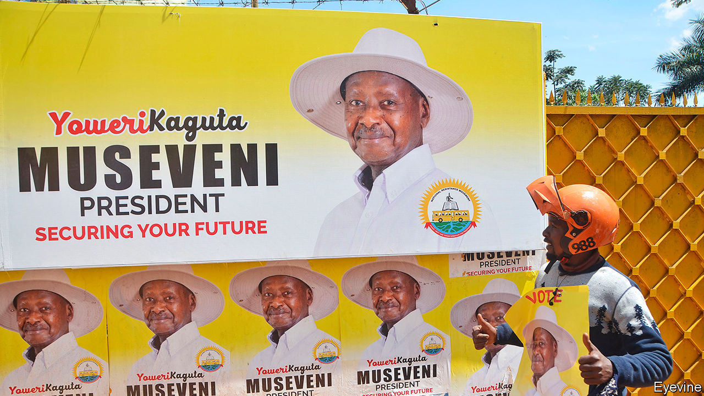

###### Time out

# Too many African countries are letting presidential term limits slip 

##### Few presidencies improve with time 

 

> Jan 9th 2021 


THE PASSING of time improves many things. Friendships mature and deepen with the years. Fond memories become sweeter and bitter ones mellow. Presidential terms, however, rarely get better the longer they last.


Take the case of Yoweri Museveni, who has run Uganda since 1986. Not content to retire to his farm, the 76-year-old is standing for yet another term in elections scheduled for January 14th. Mr Museveni is not the longest-serving president in Africa. That dubious record is held by family dynasties such as the Gnassingbés in Togo, the Obiangs in Equatorial Guinea and the Bongos in Gabon, who have ruled their countries for more than five decades, or by men such as Paul Biya, who has held the reins in Cameroon for nearly four decades (and was prime minister before that). Mr Museveni is not far behind. His 35 years in office show how leaders who start with much acclaim can look soiled when they stay too long.


After Mr Museveni took power he was applauded by Western governments and donors for bringing peace, holding elections, liberalising the economy and promising free speech. His candour and willingness to admit mistakes were especially refreshing. Yet after more than three decades in charge he has become a caricature of the thin-skinned autocrat. In 2017 he jailed an academic, Stella Nyanzi, for taking to social media to call him “a pair of buttocks”. His police arrest, shoot and torture opposition activists and journalists. Repression is intensifying ahead of the election, as he faces a popular young musician-turned-politician who goes by the stage name Bobi Wine. There is no chance of a fair election. Uganda is a compelling example of why it is so important that countries set term limits and then stick to them.


In 1990 almost no country in Africa had set a constitutional limit to the length of time a president could serve. When Nelson Mandela stepped down after his first term as president of South Africa he hoped to set an example for the continent. It was widely followed. Of almost 50 new constitutions passed during Africa’s wave of democratisation in the 1990s, more than 30 limited the number of terms a president could serve. On paper more than three-quarters of sub-Saharan African countries now have such limits. But a depressingly large number of leaders have backtracked. Uganda under Mr Museveni dropped the law in 2005 and lifted an age limit in 2017. Since 2015 the leaders of no fewer than 13 African countries have sidestepped or weakened term limits, according to the Africa Centre for Strategic Studies, which comes under America’s Pentagon.


Many Africans say it is racist to lecture them about term limits when countries such as Russia and China have abolished theirs recently, too. Many Western leaders, including Angela Merkel, Germany’s chancellor since 2005, face no restrictions. Democracies everywhere might well be healthier if they insisted on periodic changes of the person in charge. But many African countries risk seeing incumbents accumulate too much power and then refuse to be dislodged at the ballot box. The danger is severe there because the checks and balances that reinforce democracy, such as electoral commissions, independent courts and free media, are often weak and easily subverted. The consequences of leaders who overstay their welcome are starker in Africa, too. Nine of the ten countries involved in civil wars in Africa lack term limits, says the Africa Centre. Those without them tend to be more corrupt.


That is why most African countries chose to put limits into their constitutions, even if many current leaders now wish to ignore them. Peer pressure could help keep them honest. In the past 20 years Africa has had far fewer coups than in the preceding decades, partly because plotters know they will face sanctions from the African Union if they grab power illegally. If the union also imposed sanctions on leaders who break term limits or rig elections, democracy in Africa would have more of a chance. ■

