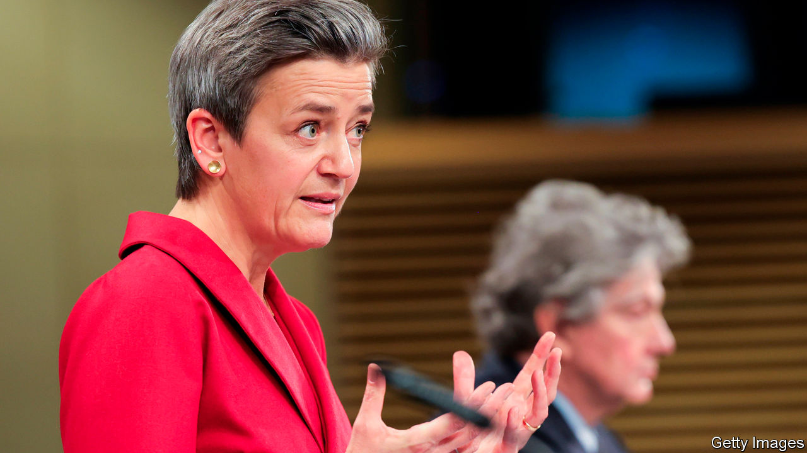
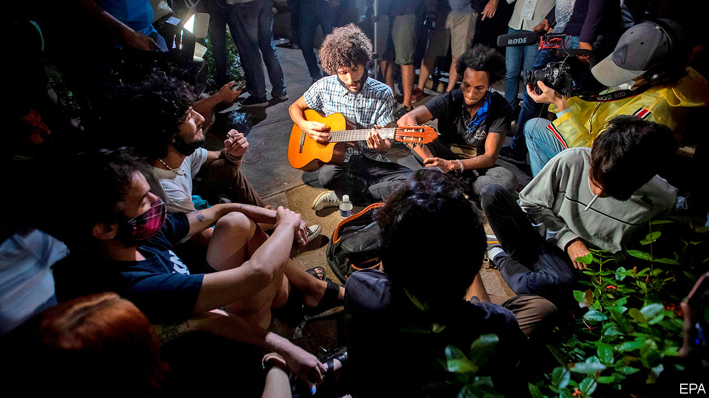

###### On military deception, Singapore, Christian Democrats, big tech, Cuba, accents, banking

# Letters to the editor 

##### A selection of correspondence 

> Jan 9th 2021 


 


The usefulness of subterfuge


Military deception is indeed a lost art in democracies, and more’s the pity (“”, December 19th). Yes, it exists at a tactical level (“I’ll make the enemy think that I’m attacking from the right but actually my main force will be on the left”), but this is entirely predictable in its repetitiveness. At the more strategic level, military deception has withered. D-Day succeeded because of the trickery you mentioned: reinforcing Hitler’s conviction that Pas-de-Calais, 300km from Normandy, was the target for the Allied landing. Such deception would be impossible now. Modern armed forces are not nearly large enough to have the flexibility for such a duplicitous task. Conversely, headquarters’ staffs are too bloated, making it more probable that deception strategies would leak out.


Advances in reconnaissance technology need to be matched by advances in deceptive thinking. For example, radio silence makes an object stand out in a cluttered electronic background, rather than be hidden, in the same way that a soldier wearing camouflage is obvious on a city street. And some thinking needs to come full circle. Dazzle-painting ships in the first world war, to mask their aspect and thereby hinder attacking submarines, can have the same effect against new electro-optic anti-ship missiles. But nobody is doing this.


The clearest word goes to Arthur Ransome’s “Swallows and Amazons”. One of the children says that the key to success is knowing exactly what we want to achieve, and doing it in the way the enemy least expects. The problem with democracies now is not knowing exactly what it is that they want to achieve.


CHRIS CLOUGH

Paris


Churchill described the fall of Singapore in February 1942 as the “worst disaster” in the history of British warfare. General Arthur Percival erred in concentrating British defences along the broader north-eastern side of the island, disregarding warnings that it would be attacked from the north-west where the Straits of Johor were narrowest. Percival was bluffed by General Yamashita when the Japanese invaded through the causeway into Singapore. His humiliating, unconditional surrender painfully marked the beginning of the end of the British Empire in Asia.


JOHN DRISCOLL

Singapore

Protesting in Singapore


It was to be expected. A man is charged in Singapore for staging a protest without a permit, and your headline proclaims: “” (November 28th). But here are some inconvenient facts. The activist, Jolovan Wham, could have protested at Speakers’ Corner in March 2020 without a police permit, but chose not to do so. You are mistaken that Speakers’ Corner was closed at the time; it was closed from April because of the pandemic. And urging action against climate change is not deemed “subversive” in Singapore. One of the largest demonstrations held in Singapore in recent years was the Climate Rally in September 2019. This occurred at Speakers’ Corner, without incident. Mr Wham’s protest did not elicit mass sympathy. He succeeded only among his small target audience, which includes The Economist. His aim was to underline Singapore as a punching bag in the Western media.


Singapore is not reeling though. Citizens appreciate an orderly and safe city where they regularly express their views within the law. The Economist may wish that Singapore becomes more like its former colonial master Britain, which, however, also has its own difficulties. Singapore’s system is not flawless, but we will find our own path forward.


T.K. LIM

High commissioner for Singapore

London

 


Europe’s centre-right parties


Charlemagne missed a crucial point about Christian Democrats (), which is their appreciation of Catholic social teaching’s subsidiarity principle. What the family can handle should be left to the family. What local government can handle should be decided at that level. National governments should have jurisdiction over only those things that lower level authorities cannot handle. The implication is that there are things that supranational authorities may be useful for. Accordingly, it makes sense to pool sovereignty for purposes of that kind.


That is Christian Democrats’ real difference with Britain’s Tories, who have centralised national power, weakened subnational institutions and left the EU. The Johnson government has no serious proposals for how the world can provide and safeguard international public goods. We face daunting global challenges: global warming, covid-19, trade relations, financial stability, terrorism, dwindling biodiversity, mass migration, and so on. Insisting on undiminished national sovereignty does not help. By contrast, sensible application of the subsidiarity principle could work, at least in theory.


HANS DEMBOWSKI

Frankfurt

 


Regulating big tech


* As the proposals tabled last week by the European Commission made clear, Europe must conclude a digital deal with what I call ‘systemic tech’, the digital platforms that present both huge opportunities and substantial risks to our economy and society (“”, December 15th). This deal should leverage the benefits of having integrated platforms capable of internalising the massive network effects of connecting users and their data, whilst mitigating the risks of anti-competitive and unfair corporate conducts. To do so, systemic tech should be allowed to remain big and active across many different markets in exchange for opening their infrastructures to potential competitors.


Such bargaining is not new in the digital industry. For example, in 1913, the Kingsbury Commitment between the US Department of Justice and AT&amp;T. AT&amp;T were allowed to keep its long-distance network so long as it opened this network to independent telephone companies. In 1987, when Europe’s telecommunications sector started to be liberalised, the European Commission’s Open Network Provision Programme allowed telecommunication operators to remain vertically integrated in exchange for opening their networks to smaller entrants.


The enforcement of an open platform deal will be complex, but effective enforcement is the key to its success. The best way forward is a European regulator along the lines of how the ECB’s single supervisory mechanism has regulated systemic banks since the 2008 financial crisis.


ALEXANDRE DE STREEL

Academic co-director at the Centre on Regulation in Europe

Brussels

 


Courageous Cubans


“” (December 5th) provided an excellent overview of the clash between the state and a growing civil society in Cuba. One quibble. You suggest that Cubans show little interest in supporting dissidents or demanding more freedoms because they are too busy scavenging for food, then imply that a more lenient American embargo might ease shortages and encourage Cubans to be braver. That is rather simplistic.


Shortages of food in Cuba are as chronic as political repression, a consequence of domestic policies that always prioritise political power over all else. For six decades Cubans have been terrorised by a totalitarian state that is as efficient in its repression as it is incompetent in its handling of the economy. Cubans are wary not because they are hungry or busy, but because they are afraid. As the San Isidro Movement shows, this is beginning to change regardless of scarcity or American policy.


SEBASTIAN ARCOS

Associate director

Cuban Research Institute

Florida International University

Miami

 


Is it the way I talk?


Johnson’s suggestion that accent snobbery is irrational and would be cured by more education betrays a curious conception of both reason and education (). Like all kinds of snobbery, accent snobbery sends a signal that one is an insider. Nothing irrational about that in a world where people respond to signals and being an insider can make all the difference. And like that most refined form of snobbery—looking down on others because they are not as egalitarian as you—accent snobbery is entirely the product of education.


JOHN SEXTON

Chicago

Financial giants


We all know what happened to Goliath when he encountered a kid with a slingshot. So I hope when you referred to JPMorgan Chase as “a banking Goliath” (“”, December 12th), you really meant Gargantua, who was rich. If not, it would cause Jamie Dimon no end of distress. Me too, since I hold some of their debt.


BUDD WHITEBOOK

Washington, DC


*Letters appear online only

