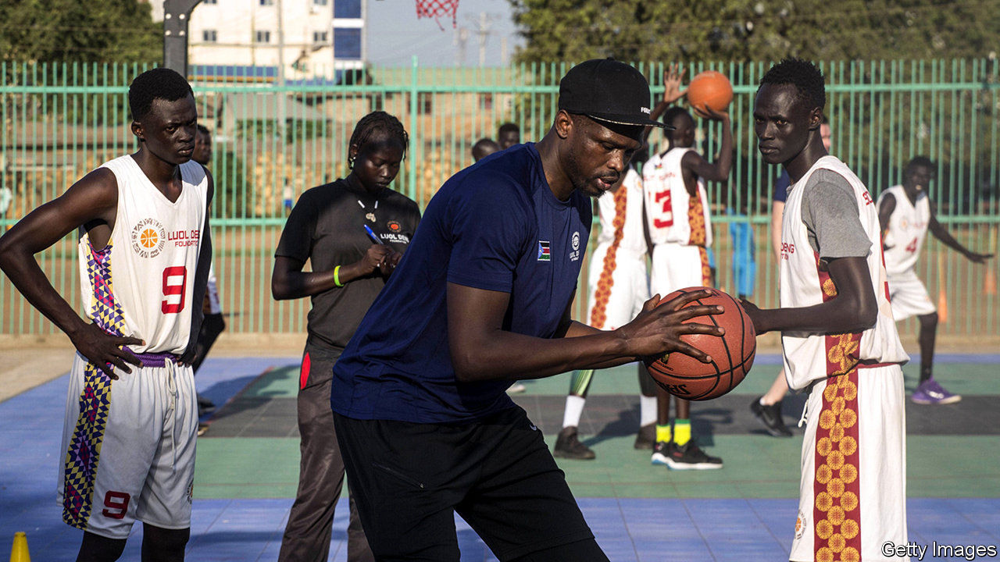

###### Hopeful hoops

# Can basketball heal South Sudan? 

##### Luol Deng, a star in America, has high hopes for the game 

 

> Jan 9th 2021 


THE PEOPLE of South Sudan are among the tallest in the world. That helps explain why several of them have had stellar careers playing basketball abroad. One is Luol Deng, a former all-star in America’s National Basketball Association (NBA). Mr Deng, who retired in 2019 after 15 seasons on the hardwood for the Chicago Bulls and other teams in the NBA, took over as coach of South Sudan’s national team in November. Now he is using the sport to try to mend his war-torn motherland.


In December, for the first time in its history, South Sudan won enough games to qualify for the African basketball championship, known as AfroBasket. That is no small feat for a team that is relatively new to international competition. For five of the ten years that South Sudan has existed as a country, it has been beset by civil war. Of its 12-member squad, all but one player grew up abroad.


The war has directly led to the deaths of almost 200,000 people, and perhaps caused twice as many deaths indirectly through hunger and disease, according to a study in 2018 by researchers at the London School of Hygiene and Tropical Medicine. Mr Deng, who also funds the national squad, hopes it will help bring the country together and change its image abroad. “We’re doing something that’s bigger than basketball,” he says. “There are people that are depressed and hungry and struggling… That two-hour game gives them pride to keep going.”


The young minister of youth and sports, Albino Bol Dhieu, is a believer. He hopes that what has been “spoiled by politics can be fixed by sports”. He plans to build a sports complex and at least one basketball court in each of the country’s ten states and three administrative areas. Quite how he will pay for this is not clear. The government’s budget set aside the equivalent of just $5.3m, or less than 1% of spending, for his ministry. By contrast, nearly $130m was allocated for security.


With its recent performance the national team has risen a remarkable nine places (to 98th) in the rankings of the International Basketball Federation, known as FIBA, the sport’s global governing body. Locals hope that when AfroBasket tips off in August, it will provide more than just national pride. They hope that the team’s success will inspire young men to put down their guns and start shooting hoops. ■

