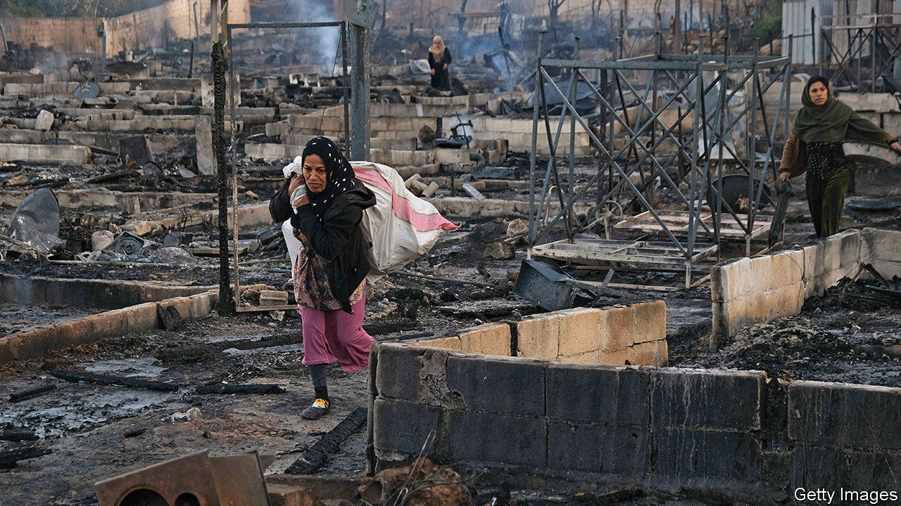
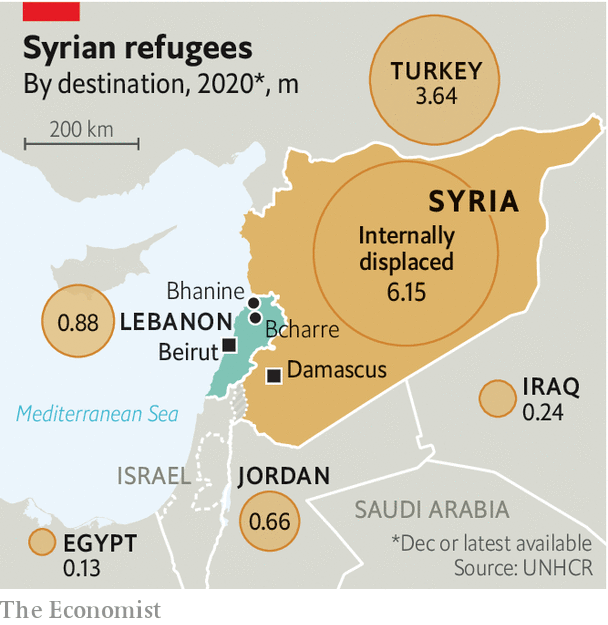

###### Here to stay, however miserable

# Making life hard for Syrian refugees will not compel them to leave 

##### Not until real change occurs in Syria 

 

> Jan 7th 2021 


ON DECEMBER 26TH a scuffle broke out between Syrian refugees and residents of the Lebanese town of Bhanine, north of Tripoli. That night the row, allegedly over unpaid wages, turned ugly. Shots were fired. Armed villagers then set fire to the refugees’ tents, causing them to flee and sleep rough in nearby fields. When they returned the next morning their makeshift camp was little more than a patch of charred debris.


The past year has been difficult for everyone in Lebanon. The country has endured covid-19, the collapse of its currency and a huge explosion at Beirut’s port in August. But the consequences of all this have been particularly bleak for the 884,000 Syrian refugees living there. The United Nations estimates that 89% of them live in extreme poverty (up from 55% in 2019). That means they make under 309,000 Lebanese pounds a month—a sum that is less than half the minimum wage and worth a mere $36 at unofficial exchange rates.


Some Lebanese politicians, including a former foreign minister, Gebran Bassil, have whipped up public anger towards refugees, blaming them (wrongly) for Lebanon’s economic collapse. The outrage in Bhanine was not an isolated incident: in November, after a Syrian refugee killed a Lebanese man in the northern town of Bcharre, hundreds of Syrians fled amid calls for their expulsion.


Yet for all their difficulties, Syrians in Lebanon are not clamouring to return home. The number of registered refugees has fallen by 23% from its peak of 1.1m in 2014, a decrease of 263,000. Only 55,000 of those have returned to Syria, though. At the average pace over the past five years, it will take until around 2041 for the last Syrian refugee to leave Lebanon.


Eager to speed their exodus, the Lebanese government has increased pressure on refugees, stepping up deportations and restrictions. In November, when Bashar al-Assad’s regime in Syria hosted a garish conference urging refugees to return to his shattered country, Lebanon was the only Arab state to send a delegation.


Researchers from the Immigration Policy Lab at Stanford University and ETH Zurich, a Swiss university, argue that such measures will fail. In a working paper published in November, they found that 63% of Syrian refugees in Lebanon hope to return home one day. Just 5%, however, expected to do so within the coming year, a stark gap between what refugees intend to do and what they are actively preparing to do. Moreover, they found no correlation between the well-being of refugees in Lebanon and their desire to return home.

 


What matters, they argue, are the conditions not in Lebanon, but in Syria—and those are increasingly bleak. Extortion starts at the border, where the Syrian government requires every citizen returning home to convert $100 into the debased local currency. Once inside, Syrians encounter queues in which people wait for hours, sometimes days, to obtain essentials such as bread and fuel. Those returning face the threat of forced conscription by a regime starved of manpower, and of arbitrary detention by a regime starved of cash. A Syrian activist group, founded by a former inmate in the notorious Sednaya prison, reckons the government has squeezed $900m in bribes out of detainees’ families since the war began.


The trend is similar in Egypt, Jordan and Turkey, which together host two-thirds of the 6.6m registered Syrian refugees (see map). Turkey has been the most hospitable, offering access to education and social services, though official and public hostility is mounting. Egypt and Jordan have been less generous, but still offer more support than Lebanon. Regardless of conditions, the results are the same: in all three countries the number of registered refugees has stayed roughly the same since 2017. Without a real change in Syria, the refugees scattered across the region (and in Europe) are probably there to stay. And as long as Mr Assad is in power, no real change is expected. ■

