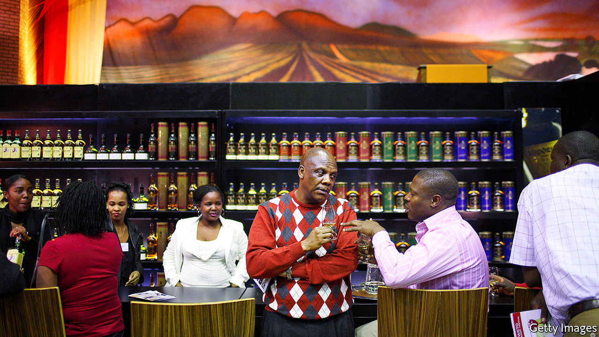
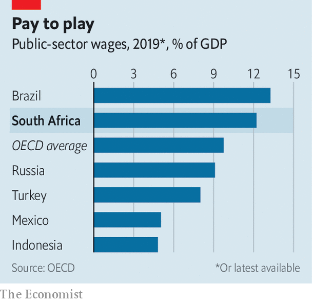

###### Bourgeois blues

# South Africa’s black middle class has prospered under democracy 

##### But fiscal austerity may make it poorer 

 

> Jan 7th 2021 


THE HEADY years after apartheid gave rise to what advertisers and the press called “black diamonds”. Portrayals of newly rich black South Africans were often crass, highlighting their flashy cars and fancy homes that had been out of reach in the era of white rule. Many of the gaudiest examples involved people close to the ruling African National Congress (ANC). In 2010 Kenny Kunene, a businessman and convicted fraudster who later starred in “So What: Big Money, Big Dreams”, a TV show, was criticised for spending 700,000 rand (then worth $47,000) on a party where he ate sushi off scantily clad women. His response: “It cost more than that.”


Such tales were entertaining, but they were not the norm. More representative of the milieu of middle-class black South Africans is the Reeds, a suburb in Centurion, near Pretoria, full of Toyotas and modest homes roofed with terracotta tiles. Under apartheid its position near the administrative capital made it popular among Afrikaners (whites of mainly Dutch descent) with government jobs. Today it is mostly home to black South Africans, who joined the public sector en masse after the first democratic elections in 1994.


Shortly after that vote Ayanda (not her real name) and her husband got good jobs in the civil service. In 1995 they moved to the Reeds with their two children. They were the first black family on the street. Her white neighbours were initially hostile, but “we were just so happy to have our own house,” she says. “We’re here in the suburbs because of the ANC.”


That kind of loyalty may soon be tested. South Africa is in a fiscal crisis. The share of public debt to GDP has risen from 22% in 2008-09 to an estimated 82% in the current fiscal year, 2020-21. The treasury forecasts a deficit of 15% of GDP. The share of tax revenues spent on servicing debts was 10% in 2010. It was about 22% in 2020, and will keep rising. The pandemic brought forward the reckoning, but the more important causes were a decade of slow growth and reckless spending by the ruling party.

 


To try to close the deficit Tito Mboweni, the finance minister, is targeting the public-sector workforce. South Africa does not have an especially large one, but it is well paid (see chart). Public-sector pay went up by an average of two-thirds in real terms between the fiscal years ending in 2007 and 2019, far faster than the rise in the private sector. Mr Mboweni has proposed cutting the public payroll by 160bn rand (25% of the total in 2019-20) over “the medium term”. It is the first salvo in a battle over the budget that will profoundly affect the country—and the ANC’s relations with the black middle class it helped to create.


South Africa’s black middle class predates democracy. In the first half of the 20th century there was a smattering of black professionals, including mission-educated doctors, teachers and lawyers, such as Nelson Mandela. In 1965 Leo Kuper, a sociologist, wrote “An African Bourgeoisie” about the middle class under apartheid. From the late 1970s, as white rule began to unravel, the government made cursory efforts to encourage the growth of a black bourgeoisie that might dampen the ANC’s revolutionary fervour. As early as 1988 Time magazine wrote about what it saw as black yuppies, or “Buppies”.


Yet they still made up a minority of middle-class families in a country where three-quarters of people were black (today the share is more than four-fifths). Academics differ over how to define the middle class, but agree that blacks have become a clear majority within it. Ronelle Burger and her colleagues from Stellenbosch University reckon that their share doubled from 32% in 1993 to 64% in 2012. A more recent paper by the economists Rocco Zizzamia, Simone Schotte and Murray Leibbrandt estimated that the share rose from 47% in 2008 to 64% in 2017.


Most black South Africans, however, are not middle-class. According to the economists’ paper, which categorised people based on their income stability over many years, just 18% of black South Africans are secure enough to be deemed middle-class. Almost half are “chronically poor” and nearly all the rest move in and out of want. Many deemed middle-class support extended families and have large debts.


The key to middle-class stability, points out Mr Zizzamia, is a job. And the most secure jobs are in the public sector, where blacks have climbed through the ranks more successfully than they have in business. Some 66% of senior public-sector managers and 56% of those in state-owned firms are black, according to the Commission for Employment Equity, a watchdog, compared with 16% in the private sector.


“The black middle class is overwhelmingly rooted in public-sector employment,” argues Roger Southall, an academic. He points out that the ANC has blurred the line between party and state. It has passed affirmative-action laws (as well as policies of “black economic empowerment” that have enriched a few) and “deployed” party members in government positions.


Mr Mboweni’s proposals have been met with fierce opposition. A legal challenge by trade unions was dismissed in December, but they may yet call for strikes. This dispute is just the first in what may be a long fight over who bears the brunt of austerity.


It is a battle that could fray the ties between the ANC and the black middle class, which is not homogenous. Honest civil servants are angry with the ruling party because its corruption has given anyone working in government a bad name, notes Ivor Chipkin, the author of “Shadow State”. Nevertheless, because of its role in creating jobs, support for the ruling party has remained “pragmatic” and “sustained”, says Amuzweni Ngoma, a researcher.


Writing in 2016, Mr Southall speculated about what would happen to this conditional loyalty to the ANC if there were a “financial meltdown”. He made a comparison with Zimbabwe, where the middle class at first did well under Robert Mugabe’s regime. But as he ran the country into the ground and destroyed its economy, these Zimbabweans either emigrated or voted in greater numbers for the opposition.


There is another salutary story. The National Party, which ran South Africa from 1948 to 1994, used its control of the state to increase the Afrikaner middle class. But the madness of apartheid eventually undermined the economy and, in turn, weakened support for the party among its middle-class base—the sort of people who once lived in the Reeds. If the ANC impoverishes the class it helped to build, it too will struggle to hold on to power. ■

