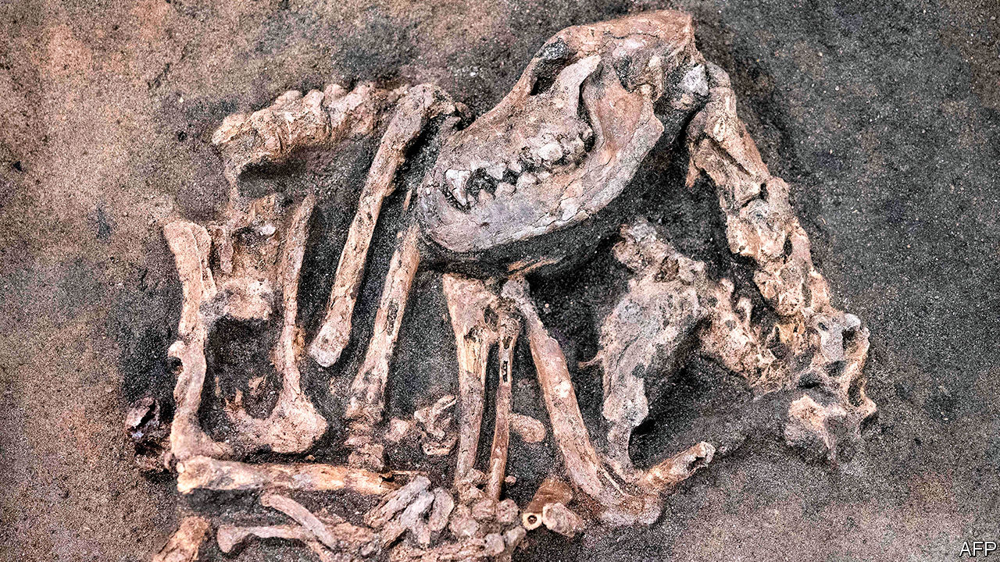

###### The origins of dogs

# A new idea about how dogs were domesticated 

##### They were beneficiaries of early human largesse 

 

> Jan 9th 2021 


MAN’S BEST friend is also his oldest. The partnership between dogs and people may go back as much as 40,000 years—long predating any other domestication. And it is based not, as is the case with many subsequent domestications, on a human desire to eat the animal concerned, or to consume some associated product such as milk or eggs, but rather on genuine companionship, albeit with a little work- and hunting-related exploitation on the side.


How this partnership got going, though, is debated. In particular, unlike other domestications, which involved groups of people who had taken up farming, the domestication of the wolves that became dogs happened while all human beings were still hunter-gatherers. The two species were, in other words, competitors. Yet they managed to become soul mates.


One popular theory is that the wolves which became dogs acted as rubbish-disposal agents for groups of people, by eating their waste, possibly including their faeces. That, though, would be a service more useful to settled farmers than mobile hunter-gatherers. As she writes in Scientific Reports, however, Maria Lahtinen of the Finnish Museum of Natural History thinks she might have the answer as to how wolves and people squared the competitive circle while both species were still hunters. It was, she and her colleagues suggest, simply a matter of surplus calories.


The archaeological evidence suggests that wolves were domesticated in woodlands fringing the ice sheets of the last ice age, since that is where almost all Palaeolithic dog remains have been found. Dr Lahtinen calculates that, given the large size of prey animals in this environment, and humans’ need to eat a balanced diet with plenty of plant matter in it as well as flesh, there would have been a lot of surplus meat around from kills. What better way to use some of it than to feed a few wolf cubs to provide entertainment and companionship? And thus, she suggests, were dogs born.

