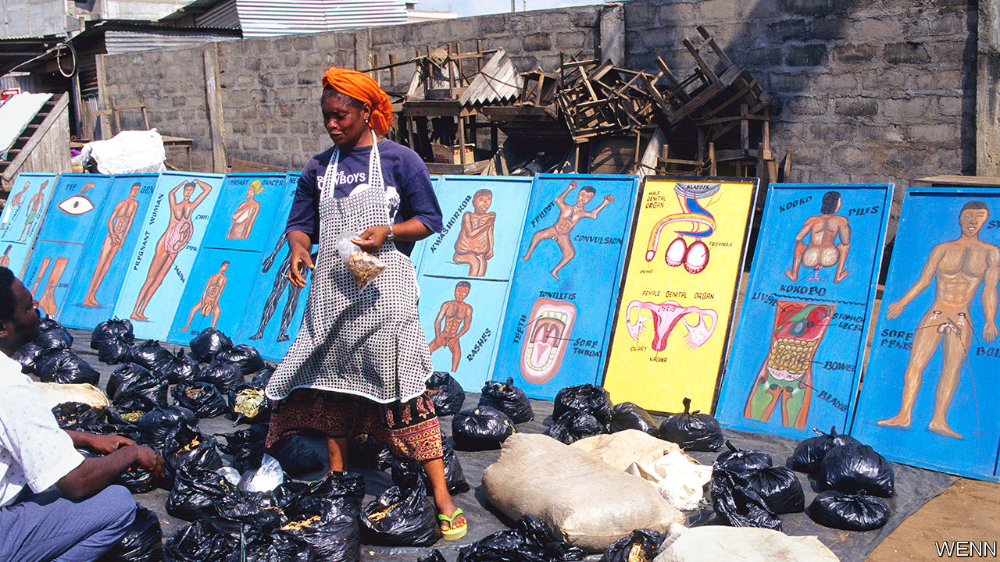

###### Global health

# Herbal remedies can help to treat neglected tropical diseases 

##### And a scientific approach will identify the best of them 

 

> Jan 9th 2021 


“WHAT DO YOU call traditional medicine that works?” “Medicine.” This old joke contains more than a milligram of truth. When, for example, Tu Youyou, a Chinese chemist, began testing the sweet wormwood used in local herbal remedies as a cure for malaria, her isolation of artemisinin saved millions of lives and earned her the Nobel prize for medicine in 2015.


But not every folk cure is so closely examined—nor is every condition. Over 1.7bn people, most living in the world’s poorest countries, are affected by a group of 20 illnesses known as Neglected Tropical Diseases (NTDs). These often lead to disability and place a heavy burden on health-care systems badly equipped to deal with them.


They are referred to as “neglected” for a reason. A study published in 2009, in International Health, estimated that they received only 0.6% of the money given by rich countries to poor ones for health purposes. Things have not improved since then. A recent report by Policy Cures Research, an international think-tank, estimates the cash available for treating NTDs has been flat for a decade, with less allocated to all of them collectively than either malaria or tuberculosis receives alone.


This lack of resources has consequences. In Ghana, though estimated rates of lymphatic filariasis (also known as elephantiasis) dropped by 88% between 2010 and 2018, those of schistosomiasis (also known as bilharzia) and onchocerciasis (also known as river blindness) rose by 39% and 81% respectively. However, Dorcas Osei-Safo of the University of Ghana has a plan to fight back. Herbal medicine is important in the country. Indeed, its Food and Drugs Authority has already approved several herbal remedies for use against diseases including malaria. She intends to build on this approach.


To do so, she and her team first contacted several practitioners of traditional medicine and obtained samples of 15 treatments employed against a range of NTDs. Some were mixtures of dried herbs, others watery concoctions. Her goal was to test their effectiveness against laboratory cultures of a variety of disease-causing parasites, with the aim of isolating any active principles they might contain.


Nearly all the samples had some effect against one or more parasites. But one stood out in particular when used against the trypanosomes that cause sleeping sickness. This was a dried mix of Aloe vera, a short-stemmed succulent, and Taraxacum officinale, the common dandelion. Intrigued by that discovery, the team put the crude sample they were working on through two rounds of chromatography, to split it into its constituents, and repeated the tests on these. Their analysis, just published in PLOS Neglected Tropical Diseases, revealed an oil which proved 30% more effective at killing trypanosome parasites than did diminazene aceturate, the standard anti-trypanosomal drug.


For many researchers, that would have been the cue for a trip to the patent office and negotiations with a drug company about further rounds of testing. But for Dr Osei-Safo the point is not to make a refined pharmaceutical, but rather to direct those who are ill towards the best treatments available from herbalists. Her next move, funding permitting, will be to try to understand better why the newly discovered oil is effective, and to establish in what circumstances the herbal remedy from which it is derived should be recommended.■

