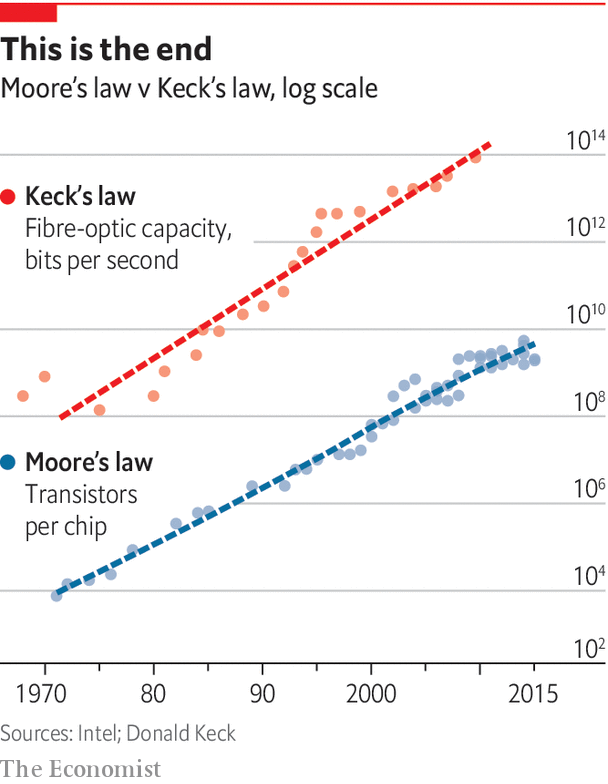

###### Information technology

# From the universe to the dataverse 

##### How light becomes information, and information becomes light 

 

> Jan 7th 2021 


AMERICA’S BIGGEST spread of silicon for turning photons into power sits in the Mojave desert about 100km north of downtown Los Angeles. The Solar Star facility consists of 1.7m solar modules on 13 square kilometres of land. On sunny days it can feed more than half a gigawatt into the grid. In a nice inversion of the old solar-booster’s saw that the Sun provides enough energy in an hour to power civilisation for a year, Solar Star provides enough energy in a year to power civilisation for about an hour.


Such installations are changing the world. Other photon-driven technologies, those concerned with the gathering and transmission of information, have already done so.


Five-and-a-half hours’ drive north-west from Solar Star, at a national laboratory in Silicon Valley called SLAC, you can find the world’s biggest spread of silicon for turning photons into information. It consists of 189 specialised chips arranged in a disk about 64cm across which will occupy the focal plane of the world’s largest digital camera. Over ten years it will produce a database in which the positions and behaviours of hundreds of billions of celestial objects will be stored.


This array is remarkable in various ways, including its size, the fidelity of its electronics and the precision of its alignment. But in its essence is not that different from the heart of a 1980s camcorder. Just as it is possible to produce a chip with millions of transistors on it, it is possible to produce a chip with millions of photon receivers on it. Fitted with the right lenses and mirrors, such chips can take pictures.


Later this year the array now at SLAC will be shipped to the Vera C. Rubin Observatory, a new facility in the Chilean Andes named after an American astronomer who pioneered research into “dark matter”. There light from distant galaxies will bounce off the three mirrors of the observatory’s telescope and pass through three huge camera lenses so as to form a pin-sharp image on the array’s perfectly flat 189-chip surface. On each of those chips sit 16m “charge-coupled devices” (CCDs), each containing a p-n junction where incoming photons can knock loose electrons. Each time a far-flung photon does so, the liberated electron is stored in a tiny capacitor. During the 15 seconds of a typical exposure some of these capacitors will store dozens of electrons. Some will store none.


At the end of the exposure, each of the array’s 3.2bn CCDs will pass its electrons on to the element next door like a string of emergency workers passing sandbags. Circuits at the end of the sandbag line will count the electrons from each element, and use their number to establish the brightness of the corresponding pixel in the resultant 3.2 gigapixel image. These images will contain 50 times more data than those produced by the best digital cameras used in cinema. They will capture patches of sky 40 times the apparent size of the Moon at a level of detail that would pick out a golf ball 25km away; the faintest of the millions of things seen in each frame will be 25m times fainter than the dimmest stars that can be seen with the naked eye.


But single frames are not enough. The telescope will scan the whole sky every few days for a decade, producing hundreds of images of every part of it. Comparing each new image with its predecessors will reveal celestial change: bodies moving, brightening, vanishing. Unusual changes will need to be swiftly followed up to see if they reveal something fundamentally new, which means data must be got off the mountain as fast as possible. That will be done with photon-based technology as remarkable, in its way, as the CCD array—but as ubiquitous as the great camera is unique.


The information that comes into the observatory as a drizzle of photons from the far reaches of the universe will leave it encoded on a stream of photons pulsing down an optical fibre. A Chilean outfit which provides connectivity for science and education, REUNA, gets the data from the observatory to Santiago. Another data-service provider, Ampath, provides a link to Miami using either an undersea cable in the Pacific or one in the Atlantic, depending on traffic. From Miami the data flash to SLAC. If the software which checks for changes sees something exciting the world will receive breaking news from the most distant of elsewheres less than a minute after the relevant photons arrived at the camera.


And while en route to and from California, the data will be surrounded within optical fibres by vastly more, vastly more mundane data travelling from person to person or from device to cloud. In terms of astronomy the Rubin observatory’s 60,000 terabyte database will be the biggest thing ever. In terms of the data that today’s world produces and moves around it is a drop in the ocean.


Optical-fibre networks are the backbones of every national telecoms system; they connect six of the seven continents to each other and link the phone masts which serve billions of smartphones to the clouds where their data can be processed and stored. Big data can only be usefully big because these narrow highways provide so much data-transfer capacity.

Through a glass, brightly


The light which goes into those fibres is made in semiconductors. There are various sorts of device which can reverse what goes on in a photovoltaic cell, turning current into light by means of a p-n junction, though typically in a mixture of gallium and arsenic, rather than in silicon. The simplest, light-emitting diodes (LEDs), are increasingly used to illuminate the screens of televisions, computers and phones, as well as the rooms in which people use those devices. LEDs’ ability to make light without heat—unlike a star or an incandescent bulb—makes them much more efficient than a light based on a hot filament can be, and also much longer lasting. They have thus continued the trend, first discerned by William Nordhaus, an economist, for ever less of the cost of living to be spent on light, a significant and absolute gain in human welfare delivered through wave after wave of innovation.


The light used in optical fibres mostly comes not from LEDs but from semiconductor lasers (of which more in the next chapter) that are built a bit differently; they squirt their light out along the plane of the p-n junction, which is to say out of the side of the chip. At the far end this light is met by a photodiode—a device like a CCD, but in which the electrons knocked free by the incoming photons are processed immediately rather than stored. Between them is a thread of glass of staggering transparency.

 


When researchers began to wonder, in the 1960s, whether light shone through glass fibres could be used for communications the idea seemed more than quixotic. Even a thin layer of glass absorbs a fair amount of the light which passes through it; just half a centimetre of plate glass reduces brightness by 20%. The most transparent glass in the world, that used in endoscopes, was 200 times better—you could pass a light beam through a metre of it and only lose 20%. But that still meant that, over 20 metres, 99% of the light would be absorbed. If you fed all the photons with which the Sun provides the Earth into one end of such a fibre, every single one of them would be absorbed before they had travelled a kilometre (and the fibre would have vapourised, but that’s another problem).


The one thing that the fibre aficionados had on their side was that no one had ever really tried to push the absorption barrier in glass, because glass rarely needed to be more than a couple of centimetres thick. Given good reason to try, what had seemed impossible was quite quickly achieved. In 1965 Charles Kao, a researcher at STL, a British telecoms company, set the bar for practical communication at a loss of 99% of the incoming light over a kilometre of glass: that is, performance 50 times better than endoscope glass. Within five years a researcher at Corning Glass, Donald Keck, had cleared that bar with a fibre which lost only 96% of light over a kilometre.


The development was not exactly smooth. As well as technical hurdles there were cultural differences—telecoms researchers, mainly electronic engineers, did not understand glass, and glassmakers did not understand electronics. Though in retrospect the technology’s promise seems obvious, many in telecoms remained convinced that microwaves guided by metal tubing were the future of high-data-rate communications; Bell Labs sidelined its optical-fibre team for years. The economic downturn of the 1970s hit corporate investment plans.


But by the early 1980s the technology was becoming good enough to compete with microwaves beamed from antenna to antenna. And in 1982 the break-up of AT&amp;T created a competitive market for long-distance telephony in America. The newcomers, with no legacy technology, went for optical fibres. In the mid-1980s a team at the University of Southampton developed optical amplifiers: stretches of fibre doped with erbium, a rare-earth element. If you pump energy into the erbium atoms through the side of the fibre, they will produce new photons when hit by those coming down the length of the fibre, boosting the signal. Such amplifiers made it possible to create optical fibre cables that could cross oceans. The first, TAT-8, was laid in 1988. Its 280 megabit-per-second (Mbps) capacity was ten times that of the previous link, which passed radio waves along coaxial cable. Some thought it would take a decade for the cable to fill up; it reached full capacity in just 18 months.


Part of that capacity was a dedicated 1.5Mbps link between CERN, a European particle-physics lab, and Cornell University in upstate New York, one of the hubs of NSFnet, the scientific network which was then the backbone of the internet. That link made it possible for Tim Berners-Lee, a researcher at CERN, to demonstrate his ideas about “browsers” and “HTML” to American colleagues. TAT-8 put the “worldwide” into the world wide web.

 


From then on, optical-fibre capacity and the internet grew hand in hand. As computers have improved, fibre capacity has kept up. It follows what Jeff Hecht, the doyen of laser journalists, calls Keck’s law, after Donald Keck (see chart).


The innovation is mostly at the ends of the fibres, rather than in the fibre itself. The Rubin observatory’s brand new system uses equipment from Infinera, an American company, which allows many different lasers with slightly different wavelengths to share the same fibre; “dense wave-division multiplexing” of this sort can now allow up to 80 wavelengths to be used at a time. Once content to send information in “symbols” of just one bit—dim the laser for 1, brighten it for 0—engineers now use systems in which the phase of the laser’s light (the rise and fall of its peaks and troughs) encodes information, too. Single symbols can now carry two or four bits of information, rather than just one.


The latest transatlantic cable, Dunant, commissioned in 2020, contains 24 fibres and uses such tricks to carry 300 terabits per second—more than a million times what TAT-8 could cope with. It was paid for not by a phone company, but by Google, and the tech giant plans to lay another in just two years’ time. This is how information, whether from TikTok or a distant galaxy, girdles the Earth. ■

