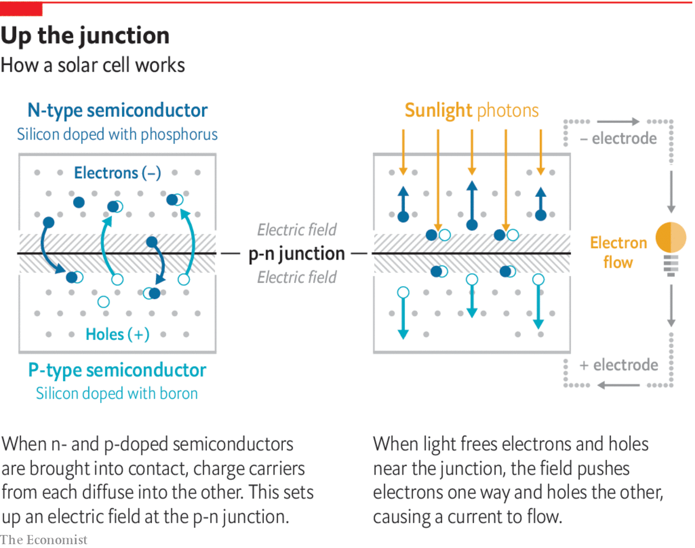
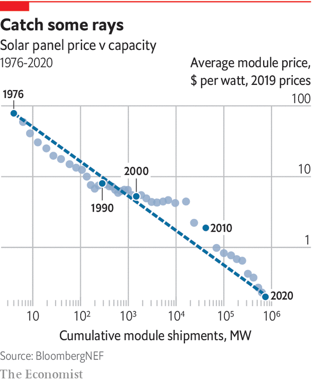

###### Solar power

# How governments spurred the rise of solar power 

##### In many places solar panels are now by far the cheapest way to produce electricity 

 

> Jan 7th 2021 


IN 1954 AT&amp;T’s Bell Labs announced, with some fanfare, a “solar battery”—a device which would supply electricity constantly, with no need for recharging, whenever it was illuminated. At a time when scientific miracles were much in vogue, the New York Times thought this gadget front-page news: the conversion of sunlight into electrical power might herald “the realisation of one of mankind’s most cherished dreams—the harnessing of the almost limitless energy of the Sun for the uses of civilisation.”


One could quibble with the idea that industrialising solar power was one of humankind’s most cherished dreams—search for it in Shakespeare and you search in vain—but it had certainly had its enthusiasts. As they were and remain keen to inform all and sundry, sunlight delivers more energy to the Earth in an hour than humankind uses in a year. Until 1954, though, the heliophiles could offer no better way of using that bounty than as an agent for warming water and generating steam—tasks that coal and gas performed much more readily. The solar battery offered instead a direct route to solar power; light went in, current came out. There were no moving parts to wear out or break down; just little sheets of silicon the size of razor blades.


It was this directness that justified the Times’s ideas about harnessing unlimited energy; it was proper journalistic prudence that added the crucial qualifier “eventually”. The adverb cashed out at a bit more than half a century. Solar cells spent 50 years getting cheaper and better in a variety of marginal niches. Then, in the space of little more than a decade, they became both widespread and cheap. In 2020, 132bn watts of new solar generating capacity were installed around the world; in many places solar panels are now by far the cheapest way to produce electricity. This transformation was not brought about by a technological breakthrough in the way that photons arriving from the Sun deliver energy to electrons waiting in the panels. It was the result of a decisive shift in German government policy happening to coincide with China becoming the dominant force in global manufacturing.


The origin of AT&amp;T’s solar battery lay in a discovery made 14 years earlier. On February 23rd 1940 Russell Ohl, a researcher at Bell Labs who bore a distinct resemblance to the actor Wallace Shawn, shone a bright light onto an odd rod of silicon he was investigating. A current immediately began to flow between the electrodes stuck to the rod’s ends. When Ohl put a fan in between the light and the rod the current started oscillating to the shadow-light-shadow-light rhythm of the fan’s eclipsing blades. The rod’s odd electrical behaviour was demonstrably down to the light.


That light could drive currents in some materials had been known since the 19th century; it was one of the things for which Einstein’s paper of 1905 provided a general explanation. What distinguished Ohl’s observation was that at Bell Labs he and his colleagues had the right tools, physical and conceptual, to make sense of how it was happening and how to improve its efficiency.


They discovered that the odd rod contained what came to be called a “p-n junction”—an internal electric field created by two slightly different types of silicon abutting one another. It sounds like a minor defect, but today it is more or less as fundamental to civilisation as the wheel. Applied in the field of electronics, the p-n junction changed AT&amp;T’s world from one of vacuum tubes, physical switches and operators working telephone exchanges to one embodied in slivers of silicon. Configured to make use of light, it is now helping to free the world of the need for fossil fuel.


Making such junctions is a matter of “doping” silicon by adding traces of other elements. Atoms in crystals are tied together by chemical bonds made of shared outer electrons. In a crystal of pure silicon, each atom uses its four outer electrons to make four such bonds to four neighbours. Since electrical conductors depend on free-flowing electrons, pure silicon, with all its electrons tied up, is an electrical insulator.


Dope the silicon with phosphorus and that changes: the insulator becomes a semiconductor. Phosphorus has five outer electrons, compared with silicon’s four. When a phosphorous atom finds itself in a silicon lattice, four of those electrons will form bonds with its four silicon neighbours. But the fifth will be free to roam, and thus to conduct current. Doping which adds electrons in this way is known as n-type. For p-type doping you add an atom like boron, which has only three outer electrons. Now the lattice has holes in it. Those holes can also, like spare electrons, move through the lattice carrying current.


By an accident of its manufacture, Ohl’s sample had layers of p- and n-type silicon right next to each other. While normally both types of doped silicon would pass some current, in conjunction, surprisingly, they could not—at least, not without light. This was because electrons in the n-type silicon had diffused into the p-type, with holes going the other way. These displaced charge carriers created an electric field, and that electric field formed a barrier no further electrons could pass.


Shine a light on such a junction, though, and the photons will knock loose fresh electrons—which, if in the junction, will flow in response to the electric field. If you put a metal electrode on the surface of the n-type silicon, another on the surface of the p-type silicon, and run a wire between them, the electrons will flow along that wire to the p-type silicon, where they will recombine with holes moving in the opposite direction: behold, a current.

 


Though its sensitivity to light brought the p-n junction to Ohl’s attention, it was not its initial claim to fame. Bell Labs wanted to find a way of replacing the vacuum tubes and other paraphernalia on which AT&amp;T’s business depended. The p-n junction proved just the ticket. In 1947 colleagues of Ohl’s came up with a device in which the insulating effect of a p-n junction could be manipulated with a second electric field, thus creating an on/off switch: the transistor. Transistors became the basis of new, cheap “solid-state” electronic circuitry. Technology which crammed many of them on to a single piece of semiconductor spawned the silicon chip.


Solar cells are made in a similar way to silicon chips but are much less complex. Their junctions just sit there, always on, turning energy from photons into electricity. This was not, at first, a mass-market proposition. In 1954 Bell Labs calculated that using its “photovoltaic” batteries to power an American home would cost $1.5m. But history shows that, in general, new energy technologies do not compete on price; they flourish by serving a market where there are no other options. For photovoltaics this hang-the-expense, has-to-be-you niche turned out to be in orbit. Demand for power on board satellites drove a lucrative early market for solar cells. In time remote terrestrial locations started to find uses for them, too, and the oil shocks of the 1970s saw governments get interested. An industry rule of thumb held that for every doubling of cumulative production, the unit price dropped by almost 30%—a pretty typical “experience curve”. And early on, when installed capacity was low, repeated doubling was feasible even with limited demand.


By 2000 there was almost one gigawatt (1bn watts, or 1GW) of photovoltaic capacity installed worldwide—quite a lot of it on Japanese roofs, courtesy of a subsidy programme aimed at the country’s semiconductor industry—and the price per watt was less than a tenth what it had been in the 1970s. It was against this background that the Social Democrats and strongly pro-solar Greens running Germany beefed up a subsidy system previously geared to encouraging solar power on a village-by-village or roof-by-roof basis. As of 2004, installations of any size could sell any amount of solar energy to the grid for €457 ($567) per megawatt-hour—about five times what it cost to generate electricity from coal at the time. The price was guaranteed for 20 years. The touchpaper was lit.

 


And the rocket took off. By 2012 Germany had paid out more than €200bn in subsidies. It had also changed the world. Between 2004 and 2010 the global market for solar panels grew 30-fold as investors in Germany and the other countries which followed its lead piled in. Initially, and alarmingly for the exchequers involved, prices did not fall; there were worries that the experience curve had gone flat. But the plateau was an artefact of almost unlimited demand meeting a bottleneck in silicon supply. After Spain’s subsidy system collapsed in 2008 solar-panel prices plummeted even as installations continued. By 2012 the price of a panel was a sixth what it had been in 2004, and it has gone on falling ever since. The experience curve may even have steepened (see chart). In sunny places new solar-power installations are significantly cheaper than generating electricity from fossil fuels. Installed capacity is now 776GW, more than 100 times what it was in 2004.


That does not mean Germany got exactly what it wanted. Solar power is not the decentralised, communal source of self-sufficient energy the Greens dreamed of; its provision is dominated by large industrial installations. And the panels on those installations are not made by the German companies the Social Democrats wanted to support: Chinese manufacturers trounced them. But they do provide the world with a zero-carbon energy source cheaper than fossil fuels, and there is room for many more of them. By striking at a time when the state of the art had evolved enough for a massive scale-up to be just about affordable, Germany forced prices down enough for less expansive subsidies elsewhere to ease them down even further, to the point that subsidy was no longer necessary.


It is a striking contrast to the history of nuclear power. Introduced in 1954, like the solar battery, civilian nuclear-power plants were seen as hugely promising. But since the 1970s nuclear experience has grown only slowly, and prices have risen rather than fallen. Of the many reasons for this, one is the benefit brought by extended small-scale experimentation. Energy technologies cannot be magicked into being fully formed, as was attempted in the case of nuclear; they need an adolescence. Jenny Chase of BloombergNEF, a data provider, says that in the company’s “economic transition” scenario solar starts to deliver more kilowatt-hours than nuclear by 2031. In practice she expects it to pull ahead sooner.


Yet solar’s success is of a peculiar sort. The sector’s bankruptcies are legion. The German panel manufacturers that went public in 2005 and the Silicon Valley startups generously funded over the following years all fell victim to cheaper silicon and the ambitious, subsidised Chinese manufacturers that now dominate supply. And those firms are hardly huge. The industry boasts no giants comparable to those in aircraft manufacture or pharmaceuticals, let alone computing; no solar company has a market capitalisation of more than $10bn, and no solar CEO is in danger of being recognised on the street. It is a commodity business in which the commodity’s price moves in only one direction and everyone works on very thin margins. Good for the planet—but hardly a gold mine. ■

