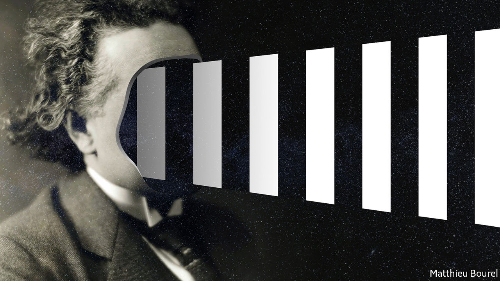
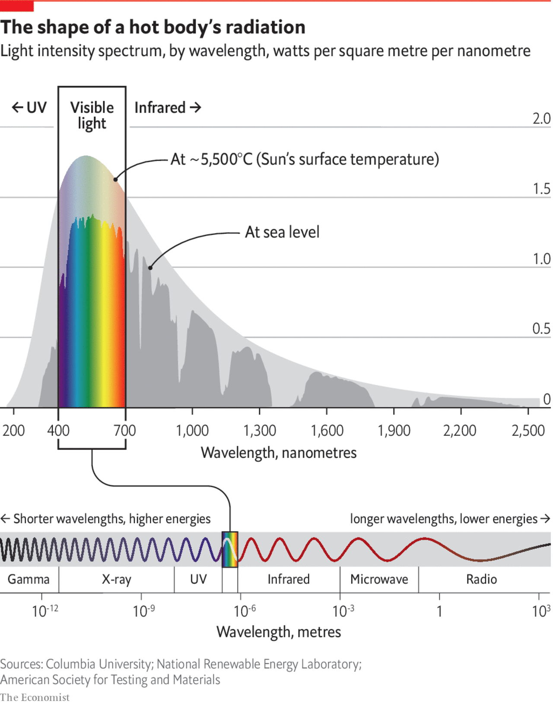

###### A hundred years of bright ideas

# How understanding light has led to a hundred years of bright ideas 

##### The revolutionary theory of the nature of light which won Albert Einstein the 1921 Nobel prize for physics went on to remake the world. Oliver Morton surveys a century of innovation 

 

> Jan 7th 2021 


ALBERT EINSTEIN won the 1921 Nobel prize for physics in 1922. The temporal anomaly embodied in that sentence was not, alas, one of the counterintuitive consequences of his theories of relativity, which distorted accustomed views of time and space. It was down to a stubborn Swedish ophthalmologist—and the fact that Einstein’s genius remade physics in more ways than one.


The eye doctor was Allvar Gullstrand, one of the five members of the Nobel Committee for Physics charged with providing an annual laureate for the Swedish Royal Academy of Sciences to approve. Gullstrand thought Einstein’s work on relativity an affront to common sense (which it sort of was) and wrong (which it really wasn’t). Every year from 1918 on, the committee received more nominations for Einstein than for any other candidate. And every year, Gullstrand said no.


By 1921 the rest of the committee had had enough of settling for lesser laureates: the only decision which could be made unanimously was not to award the prize at all. Amid great embarrassment the academy chose to delay the 1921 prize until the following year, when it would be awarded in tandem with that of 1922. This gave Carl Wilhelm Oseen, a Swedish physicist newly appointed to the committee, time for a cunning plan. He nominated Einstein not for relativity, but for his early work explaining light’s ability to produce electric currents. Though Gullstrand was still peeved, this carried the day. In November 1922 Einstein was awarded the 1921 prize “for his services to theoretical physics, and especially for his discovery of the law of the photoelectric effect”.


This adroit bit of face-saving also seems, a century on, fully justified. Einstein’s first paper on the nature of light, published in 1905, contained the only aspect of his work that he himself ever referred to as “revolutionary”. It did not explain a new experiment or discovery, nor fill a gap in established theory; physicists were quite happy treating light as waves in a “luminiferous aether”. It simply suggested that a new way of thinking about light might help science describe the world more consistently.


That quest for consistency led Einstein to ask whether the energy in a ray of light might usefully be thought of as divided into discrete packets; the amount of energy in each packet depended on the colour, or wavelength, of the light involved. Thus the “law” mentioned in his Nobel citation: the shorter the wavelength of a beam of light, the more energy is contained in each packet.


Eight years earlier, in 1897, experiments carried out by J.J. Thompson had convinced his fellow physicists that the “cathode rays” produced by electrodes in vacuum tubes were made up of fundamental particles which he called “electrons”. Over time, Einstein’s energy packets came to be seen as “photons”. The electron showed that electric charge was concentrated into point-like particles; the photon was a way of seeing energy as being concentrated in just the same way. Work by Einstein and others showed that the two particles were intimately involved with each other. To get energy into an electron, you have to use a photon; and when an electron is induced to give up energy, the result is a photon. This mutualism is embodied in some of today’s most pervasive technologies; solar cells, digital cameras, fibre-optic datalinks, LED lighting and lasers. It is used to measure the cosmos and probe the fabric of space and time. It could yet send space probes to the stars.


The settled view of light which provided a context for Einstein’s work dated from 1864, when James Clerk Maxwell rolled everything physics knew about electric and magnetic forces into a theory of electromagnetic “fields” produced by objects carrying an electric charge. Stationary charged objects created electric fields; those moving at a constant speed created magnetic fields. Accelerating charged objects created waves composed of both fields at once: electromagnetic radiation. Light was a form of such radiation, Maxwell said. His equations suggested there could be others. In the late 1880s Heinrich Hertz showed that was true by creating radio waves in his laboratory. As well as proving Maxwell right, he added the possibility of wireless telegraphy to the range of electrical technologies—from streetlights to dynamos to transatlantic telegraph cables—that were revolutionising the late 19th century.


Scientists have since detected and/or made use of electromagnetic waves at wavelengths which range from many times the diameter of Earth to a millionth the diameter of an atomic nucleus. The wavelengths of visible light—380 nanometres (billionths of a metre) at the blue end of the spectrum, 700nm at the red end—are special only because they are the ones to which human eyes are sensitive.


The reason Einstein found what he called “Maxwell’s brilliant discovery” incomplete was that Maxwell’s fields were described, mathematically, as “continuous” functions: the fields’ strength had a value at every point in space and could not jump in value from one point to the next. But the material world was not continuous. It was lumpy; its molecules, atoms and electrons were separate entities in space. Physics described the material world through statistical accounts of the behaviour of very large numbers of these microscopic lumps; heat, for example, depended on the speed with which they vibrated or bumped into each other. It was a mathematical approach quite unlike Maxwell’s treatment of electromagnetic fields.

 


Yet matter and electromagnetic radiation were intimately associated. Every object emits electromagnetic radiation just by dint of having a temperature; its temperature is a matter of the jiggling of its constituent particles, some of which are charged, and the jiggling of charged particles produces electromagnetic waves. The spread of the wavelengths seen in that radiation—its spectrum—is a function of the body’s temperature; the hotter the body, the shorter both the median and highest wavelengths it will emit. The reason the human eye is sensitive to wavelengths in the 380-700nm range is that those are the wavelengths that a body gives off most prolifically if it is heated to 5,500°C, the temperature of the surface of the Sun. They are thus the wavelengths that dominate sunlight (see chart).


If wavelengths and temperature were so intimately involved, Einstein believed, it had to be possible to talk about them in the same mathematical language. So he invented a statistical approach to the way entropy—a tendency towards disorder—varies when the volume of a cavity filled with electromagnetic radiation changes. He then asked, in effect, what sort of lumpiness his statistics might be explaining. The answer was lumps of energy inversely proportional to the wavelength of the light they represented.


In 1905 Einstein was willing to go only so far as suggesting that this light-as-lump point of view provided natural-seeming explanations of various phenomena. Over subsequent years he toughened his stance. His work on relativity showed that Maxwell’s luminiferous aether was not required for the propagation of electromagnetic fields; they existed in their own right. His work on light showed that the energy in those fields could be concentrated into the point-like particles in empty space. Light was promoted from what he called “a manifestation of some hypothetical medium” into “an independent entity like matter”.


This account was not fully satisfying, because light was now being treated as a continuous wave in some contexts—when being focused by lenses, say—and as something fundamentally lumpy in others. This was resolved by the development of quantum mechanics, in which matter and radiation are both taken to be at the same time particulate and wavy. Part of what it is to be an electron, or a photon, or anything else is to have a “wave function”; the probabilities calculated from these wave functions offer the only access to truth about the particles that physics can have.


Einstein was never reconciled to this. He rejected the idea that a theory which provided only probabilities could be truly fundamental. He wanted a better way for a photon to be both wave and a particle. He never found it. “All these 50 years of conscious brooding”, he wrote to a friend in 1951, “have brought me no nearer to the answer to the question, ‘What are light quanta?’ Nowadays every Tom, Dick and Harry thinks he knows it, but he is mistaken.”


Though Einstein was probably not thinking of him specifically, one of those Dicks was Richard Feynman, one of four physicists who, in the late 1940s, finished off the intellectual structure of which Einstein had laid the foundations: a complete theory of light and matter called quantum electrodynamics, or QED. It is a theory in which both matter and radiation are described in terms of fields of a fundamentally quantum nature. Particles—whether of light or matter—are treated as “excited states” of those fields. No phenomenon has been found that QED should be able to explain and cannot; no measurement has been made that does not fit with its predictions.


Feynman was happy to forgo Einstein’s brooding and straightforwardly assert that “light is made of particles”. His reasoning was pragmatic. All machines made to detect light will, when the light is turned down low enough, provide lumpy it’s-there-or-it’s-not readings rather than continuous ones. The nature of quantum mechanics and its wave functions mean that some of those readings will play havoc with conventional conceptions of what it is for a particle to be in a given place, or to exist as an independent entity. But that is just the way of the quantum, baby.


The precise manipulation of photons has shed much light on “non-locality”, “decoherence” and other strange quantum-mechanical phenomena. It is now making their application to practical problems, through quantum computation and quantum cryptography, increasingly plausible. But this Technology Quarterly is not about such quantum weirdness (for that, see our Technology Quarterly of ). It is about how photons’ interactions with electrons have been used to change the world through the creation of systems that can turn light directly into electricity, and electricity directly into light.


That light and electricity were linked was known long before Einstein. In the 1880s Werner von Siemens, founder of the engineering firm that bears his name, attached “the most far reaching importance” to the mysterious “photoelectric effect” which led panels of selenium to produce trickles of current. Einstein’s theory was taken seriously in part because it explained why a faint short-wavelength light could produce such a current when a bright longer-wavelength light could not: what mattered was the amount of energy in each photon, not the total number of photons.


Technology built on such ideas has since allowed light to be turned into electricity on a scale that would have boggled Siemens’s mind. It lets billions of phone users make digital videos and send them to each other through an infrastructure woven from whiskers of glass. It lights rooms, erases tattoos, sculpts corneas and describes the world to driverless cars. Ingenuity and happy chance, government subsidies and the search for profit have created from Einstein’s suggestion a golden age of light—a burst of innovation that, a century on, is not remotely over. ■

