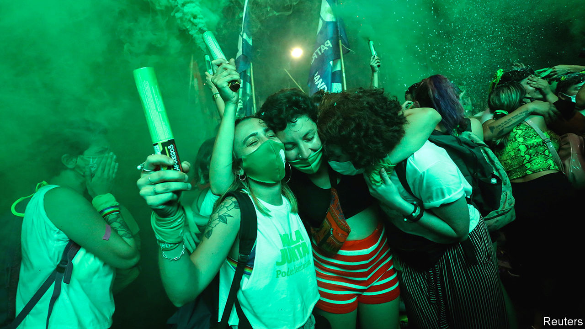
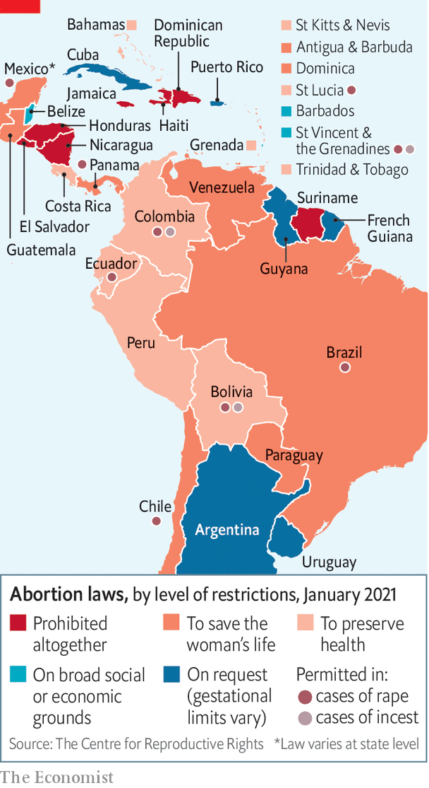

###### Green wave, blue breakwater

# Argentina’s legalisation of abortion will provoke a backlash 

##### The country’s decision will encourage campaigners for more liberal laws but may invigorate their opponents, too 

 

> Jan 9th 2021 


WITHIN DAYS Argentina’s president, Alberto Fernández, is expected to sign a law making abortion legal. Argentine women will be able to terminate their pregnancies within the first 14 weeks for any reason. The measure is a big deal. With 45m people, Argentina is the fourth-most-populous country in Latin America, a predominantly Catholic region, and the native country of the current pope. It is now the largest of the few Latin American countries that allow abortion on demand (see map). Argentina’s new law will see the share of women in the region with such access rise from 3% to 10%.


Pro-abortion groups hail it as part of a marea verde (green wave), named for the verdant scarves worn by women’s-rights campaigners, not all of whom advocate greater access to abortion. Argentina’s decision has inspired discussion in Peru, says Susana Chávez, an obstetrician and congressional candidate for the centrist Purple Party. There is “an opening, and parties and politicians are starting to talk about it”, she says. Mexico’s left-wing president, Andrés Manuel López Obrador, who has tried to avoid the issue, seemed to grant the possibility of liberalisation after Argentina’s decision. Women should decide whether the law should be changed, he said.

 


But Argentina’s decision will also invigorate abortion’s foes, many of whom are women. “It sets up a battlefield,” says José Miguel Vivanco of Human Rights Watch (HRW), a pressure group. Anti-abortion activists in Argentina, who have adopted sky blue as their colour, say the new law is unconstitutional. As the health ministry rushes to deliver misoprostol, a medication that can terminate pregnancy, to the country’s provinces, abortion’s foes are preparing challenges in the courts.


By global standards, abortion laws in Latin America and the Caribbean are unusually restrictive. Cuba, Guyana and Uruguay allow abortions on demand within the first trimester. (In Britain they are elective until 24 weeks.) Belize allows terminations on social or economic grounds. Most other countries allow a woman to end her pregnancy in narrow circumstances. Some in Central America, including El Salvador and Nicaragua, impose an absolute ban, with harsh penalties for women and doctors who breach it. The region has been less conservative on other social issues. Many countries that ban most abortions allow same-sex civil unions. Bolivia, which has a restrictive abortion law, had its first gay union in December.


Before Argentina’s leap, other countries had taken small steps towards liberalisation. In 2017 Chile passed a law allowing a woman to terminate a pregnancy if it endangers her life, or she has been raped, or if the fetus has a fatal impairment. A number of Latin American countries, including Colombia since 2006, have similar provisions. In 2019 the Mexican state of Oaxaca became the second federal entity, after Mexico City, to allow elective abortion in the first 12 weeks of pregnancy. 


Politicians and courts in several other countries are considering looser restrictions. Peru’s Purple Party says it will promote “reproductive rights” if it wins the presidency in elections to be held in April. The issue may come up this year in Chile when it drafts a new constitution. The current one “protects the life of the unborn” (as does Guatemala’s). In September Causa Justa, an NGO, filed a lawsuit that seeks to change Colombia’s penal code to decriminalise abortion. 


Still, failures to liberalise, both through parliaments and the courts, are as numerous as successes. Criticism of Argentina’s law has been widespread. Paraguay’s Congress marked it with a minute’s silence. Brazil’s far-right president, Jair Bolsonaro, said that under his government “abortion would never be approved in our land”. Such backlashes are common. After Mexico City legalised abortion in 2007, 20 Mexican states tightened restrictions.

Reproductive resistance


The Catholic church, which teaches that life begins at conception, remains powerful in Latin America. In places where it has weakened, evangelicals have taken up the cause with equal zeal, if less institutional clout. Under the Trump administration the United States has backed resisters. It ended or reduced funding of organisations that provide abortions or advocate liberal laws. Last year it reduced financing for the Organisation of American States for supporting easier access to abortion. Although a large share of politicians are women, including more than half of MPs in Cuba and Bolivia, many do not press for greater access to abortion. Some rights groups that are vocal about issues such as femicide do not campaign to make abortion legal. 


Most Latin Americans are still conservative on the issue. A recent poll found that only 35% of Argentines and 16% of Peruvians thought women should be allowed to terminate early pregnancies without restrictions, compared with more than 60% in several western European countries. In cases where a woman has been a victim of rape, support for abortion rises to 72% in Argentina and 49% in Peru. 


Bans do not prevent abortion. Worldwide, in any year, 39 women out of 1,000 aged 15-49 have abortions. In Latin America the rate is slightly lower, at 32. But in the United States, Canada and Europe, where rules are more permissive, the rate averages just 17. 


What bans do, point out campaigners for liberalisation, is make abortion unsafe and lead to harsh penalties, including prison sentences, for women and medical professionals. In Venezuela maternal mortality rose by 66% between 2015 and 2016, according to its health ministry. A rise in the number of abortions, which are thought to cause a fifth of maternal deaths in the country, contributed to the increase. Women who miscarry or have stillborn children can be accused of having had an abortion. In Colombia denunciations by hospital staff initiated 73% of abortion investigations between 1998 and 2019, according to the country’s attorney-general. These breach patient confidentiality.


In Nicaragua Silvia (not her real name) began bleeding profusely after taking misoprostol to end a pregnancy a few years ago. She went to hospital, but after two nurses examined her and told her to wait for a doctor to perform an ultrasound she fled for fear of being handed over to the police. Such cases are not uncommon.


Simply making abortion legal does not make it available. In Argentina rural women and poor city-dwellers who were entitled to an abortion under the country’s old law could rarely get one, according to a recent report by HRW. In Costa Rica the exceptions to the country’s ban were so vague that many doctors refused to perform abortions. The president, Carlos Alvarado, published a 13-page clarification last year to provide “legal certainty”. Last August in Brazil a hospital refused a legal abortion to a ten-year-old girl who had been raped by her uncle. She had to be smuggled through the back door of a hospital 1,400km (900 miles) away in another state, which performed the procedure. Anti-abortion protesters had gathered there after her name was leaked on social media.


Prosperous women in Latin America, which has the world’s highest level of income inequality, rarely have such troubles. A popular saying holds that “las ricas abortan, las pobres mueren”—rich women abort, poor women die. Those who wear green scarves hope that Argentina’s new law will at least lead to fewer women dying. ■

